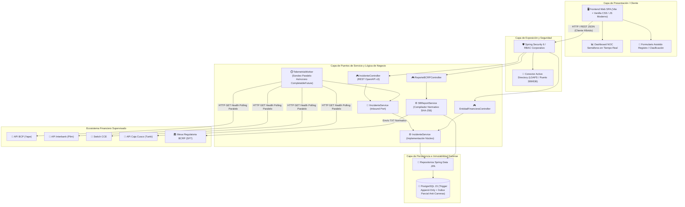
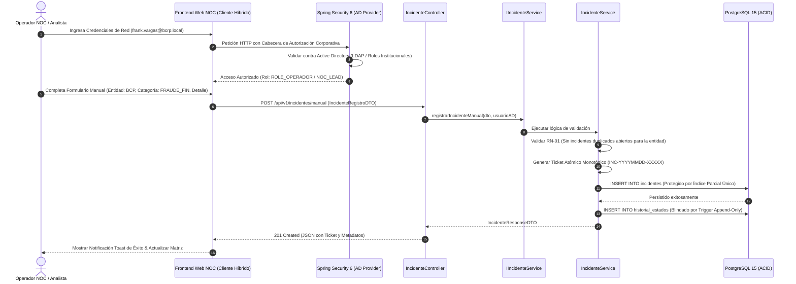
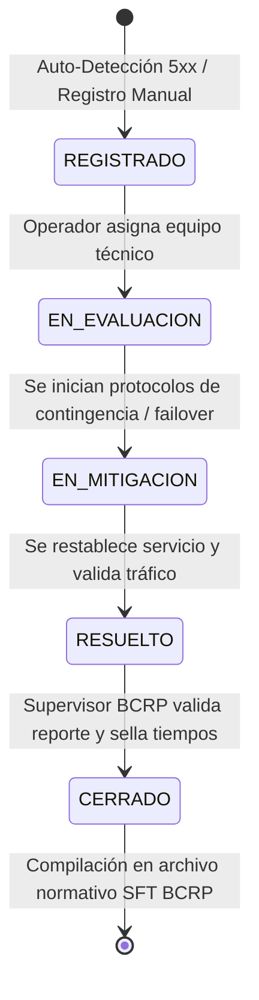
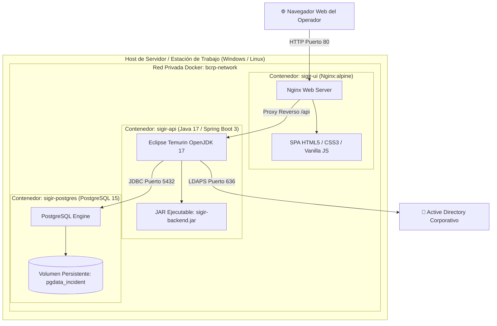

# ARQUITECTURA Y DISEÑO TÉCNICO DEL SISTEMA
**Proyecto:** Sistema Integral de Gestión de Incidentes Regulatorios (SIGIR - BCRP)  
**Curso:** Curso Integrador I: Sistemas Software (Sección 57524)  
**Docente:** Ing. Yony Zamata Condori  
**Estudiante:** Frank Emiliano Vargas Huamán  

---

## 1. ESTILO ARQUITECTÓNICO: ARQUITECTURA HEXAGONAL (PORTS & ADAPTERS)

El sistema **SIGIR - BCRP** está fundamentado en los principios de la **Clean Architecture** y la **Arquitectura Hexagonal (Puertos y Adaptadores)** formulada por Alistair Cockburn. Este diseño garantiza que el núcleo de las reglas de negocio (entidades, ciclo de vida del incidente, validación de formatos BCRP) permanezca completamente aislado e independiente de los frameworks, bases de datos, protocolos de red y detalles de infraestructura.

```
       +---------------------------------------------------------------+
       |                      CAPA DE ADAPTADORES                      |
       |                                                               |
       |  +--------------------+             +----------------------+  |
       |  | Adaptador Web REST |             |  Worker Telemetría   |  |
       |  | (Spring MVC Cont.) |             | (Health Check Poller)|  |
       |  +---------+----------+             +----------+-----------+  |
       |            |                                   |              |
       |            v [Puerto de Entrada]               v              |
       |  +---------------------------------------------------------+  |
       |  |                CAPA DE APLICACIÓN                       |  |
       |  |   - IncidenteService     - EntidadFinancieraService     |  |
       |  |   - SftReportService     - ActiveDirectoryAuthService   |  |
       |  +----------------------------+----------------------------+  |
       |                               |                               |
       |                               v                               |
       |  +---------------------------------------------------------+  |
       |  |                  CAPA DE DOMINIO                        |  |
       |  |   - Incidente (Entity)   - EntidadFinanciera (Entity)   |  |
       |  |   - CategoriaIncidente   - HistorialEstado (Value Obj)  |  |
       |  |   - EstadoIncidente      - Severidad, OrigenDeteccion   |  |
       |  +----------------------------+----------------------------+  |
       |                               |                               |
       |            +------------------+------------------+            |
       |            | [Puerto de Salida]                  |            |
       |            v                                     v            |
       |  +--------------------+             +----------------------+  |
       |  |   Adaptador JPA    |             |  Adaptador AD / LDAP |  |
       |  | (PostgreSQL Repo)  |             |  (Spring Security)   |  |
       |  +--------------------+             +----------------------+  |
       +---------------------------------------------------------------+
```

---

## 2. DIAGRAMA DE COMPONENTES DEL SISTEMA (UML)



---

## 3. DIAGRAMA DE SECUENCIA: CLASIFICACIÓN MANUAL DE INCIDENTES

Describe el flujo en el que un operador humano tipifica una contingencia no detectable por sondas (fraude financiero o manipulación de información):



---

## 4. DIAGRAMA DE ESTADOS DEL CICLO DE VIDA DEL INCIDENTE

El ciclo de vida se rige por una máquina de estados finita determinística:



---

## 5. DIAGRAMA DE DESPLIEGUE FÍSICO (DOCKER / INFRAESTRUCTURA)


