# 🎤 GUÍA MAESTRA DE PONENCIA Y SUSTENTACIÓN ORAL — APF2 (HITO SEMANA 8)
**Proyecto:** SIGIR - BCRP (Sistema de Gestión de Incidentes Regulatorios para Pagos Digitales)  
**Asignatura:** Curso Integrador I: Sistemas Software (Sección 57524)  
**Docente Evaluador:** Ing. Yony Zamata Condori  
**Institución:** Universidad Tecnológica del Perú (UTP) — Facultad de Ingeniería  

---

## 👥 Equipo Oficial de Exposición (3 Integrantes)

| Integrante | Rol Oficial en el Proyecto | Bloque Asignado | Tiempo |
| :--- | :--- | :---: | :---: |
| **Fernando Alber Alfredo Romero Requejo** | Ingeniero de Requisitos & Procesos | **Bloque 1:** Contexto Institucional, Problema y BMC | 00:00 – 03:00 (3 min) |
| **Frank Emiliano Vargas Huamán** | Líder Técnico & Arquitecto de Software | **Bloque 2:** Alternativas TIC, DER, Clases y Arquitectura Hexagonal | 03:00 – 07:00 (4 min) |
| **Joel Leonardo Olaya Vivas** | Ingeniero de Software & QA | **Bloque 3:** Live Demo, Falla 503, Pruebas JUnit 5 y Compilador SFT | 07:00 – 10:00 (3 min) |

---

## ⏱️ CRONOMETRÍA GLOBAL DE LOS 10 MINUTOS

```mermaid
gantt
    title Distribución de los 10 Minutos de Exposición Oficial (Rúbrica UTP)
    dateFormat  X
    axisFormat %s min
    section Bloque 1
    Fernando Romero (Contexto & Problema) :active, 0, 3
    section Bloque 2
    Frank Vargas (Alternativas & Arquitectura) :crit, 3, 7
    section Bloque 3
    Joel Olaya (Live Demo & QA) :done, 7, 10
```

---

# 🎯 BLOQUE 1: CONTEXTO, PROBLEMÁTICA Y MODELO BMC (00:00 - 03:00)
**Expositor:** Fernando Alber Alfredo Romero Requejo (3 Minutos)  
**Diapositivas Clave:** Diapositivas 1 a 4 y 6 a 8.

### 🎙️ Guion Pedagógico de Fernando (Palabras Clave)
1. **Apertura Formal:**
   > *"Buenos días, profesor Ing. Yony Zamata y compañeros. Hoy presentamos el avance del Sistema Integral de Gestión de Incidentes Regulatorios del BCRP, conocido como SIGIR-BCRP."*
2. **El Problema Real (La Asimetría Informativa):**
   > *"Hoy en el Perú, millones usamos Yape, Plim o transferencias interbancarias a diario. Pero cuando un switch financiero se cae, el Banco Central tarda entre 45 y 180 minutos en enterarse, dependiendo de reportes manuales tardíos o quejas en redes sociales. Esa demora genera incertidumbre económica y vulnera la Circular BCRP N° 0011-2023."*
3. **La Solución y Propuesta de Valor:**
   > *"Nuestro sistema erradica esa asimetría: implementamos telemetría continua para detectar caídas en menos de 30 segundos, con trazabilidad inmutable y reportes regulatorios automatizados."*
4. **Pase a Frank (Técnica de Entrega):**
   > *"Para explicarnos cómo logramos esto a nivel de arquitectura de software, base de datos y diseño de ingeniería, le cedo la palabra a nuestro Líder Técnico y Arquitecto, Frank Vargas."*

---

# 🚀 BLOQUE 2: PONENCIA MAESTRA DE FRANK VARGAS (03:00 - 07:00)
**Expositor:** Frank Emiliano Vargas Huamán (Líder Técnico & Arquitecto) — 4 Minutos  
**Diapositivas:** Diapositivas 5, 9, 10, 11, 12, 13, 14 y 17.

### 💡 Estrategia Pedagógica de Frank
- **Tono:** Seguro, ejecutivo, pedagógico y con vocabulario técnico limpio.
- **Regla de Oro:** Usar analogías sencillas para que los conceptos complejos (Arquitectura Hexagonal, Triggers Inmutables, SLA y Hash) se entiendan al instante sin saturar al docente.

---

### 🗣️ GUION PALABRA POR PALABRA DE FRANK

#### 1. Recepción y Selección de Alternativas TIC (Minuto 03:00 - 04:00)
> *"Muchas gracias, Fernando. Buenos días, profesor Zamata.*  
> *Para cumplir estrictamente con la rúbrica del curso, formulamos **tres alternativas de solución tecnológicas**, asegurando que cada una posea **más del 50% de desarrollo en el ecosistema Java** y cuente con el diseño completo de **5 pantallas de usuario** (15 mockups en total):*
> 
> 1. *La **Alternativa 1** es un **Monolito Modular con Spring Boot y Thymeleaf** (75% Java), ideal para entornos simples.*
> 2. *La **Alternativa 3** es una arquitectura distribuida basada en **Microservicios con Apache Kafka** (80% Java), potente pero con un sobrecosto de infraestructura innecesario para supervisar cinco switches principales.*
> 3. *Por ello, mediante una matriz multicriterio rigurosa, seleccionamos la **Alternativa 2 (Clean API + Consola Reactiva NOC)** con una calificación de **4.97 sobre 5.00 puntos**.*
> 
> *Esta alternativa balancea un backend 100% robusto en Java 17 con Spring Boot 3 y una interfaz ligera y reactiva que permite a los operadores del NOC visualizar incidentes al instante."*

---

#### 2. Arquitectura Hexagonal y Clases de Diseño (Minuto 04:00 - 05:00)
> *(Apuntando a la Diapositiva 12 y 14 - Arquitectura y Clases de Diseño)*  
> 
> *"A nivel de ingeniería de software, implementamos **Arquitectura Hexagonal (o Puertos y Adaptadores)**.*  
> 
> *¿Por qué Hexagonal? Imaginen el núcleo del negocio bancario como un smartphone: el teléfono funciona igual sin importar qué cargador o audífono le conectemos.  
> Aquí, nuestras reglas de negocio en **Java 17 puro** (`Incidente`, `EntidadFinanciera`) están completamente aisladas en el centro, sin depender de librerías externas.*
> 
> - *En los **Puertos de Entrada**, tenemos contratos claros como `IIncidenteService` y `ITelemetriaPort`.*
> - *En los **Adaptadores Primarios**, se conectan los controladores REST y nuestro **Worker de Telemetría**, un hilo asíncrono que sondea cada 30 segundos la salud de cada entidad financiera.*
> - *En los **Puertos de Salida y Adaptadores Secundarios**, usamos Spring Data JPA para comunicarnos con la base de datos y un conector de archivos normativos.*
> 
> *Esto nos brinda desacoplamiento total, alta cohesión y permite que el sistema sea 100% testeable sin necesidad de levantar una base de datos real."*

---

#### 3. Base de Datos PostgreSQL 15 e Inmutabilidad Matemática (Minuto 05:00 - 06:00)
> *(Apuntando a la Diapositiva 13 - DER Físico/Lógico y Seguridad)*  
> 
> *"En la capa de datos, diseñamos un modelo relacional en **PostgreSQL 15** normalizado en **Tercera Forma Normal (3FN)** con 6 tablas maestras.*
> 
> *Pero un sistema para el BCRP requiere un estándar de auditoría no negociable: **la inmutabilidad.**  
> Si un banco sufre una caída a las 2 de la mañana, ningún administrador de base de datos puede entrar después a alterar o borrar ese registro.*
> 
> *¿Cómo lo garantizamos? Implementamos un **Trigger SQL estricto (`fn_prohibir_mutacion_historial`)** que convierte la bitácora en una estructura **Append-Only** (solo inserciones). Si alguien ejecuta un `UPDATE` o un `DELETE`, el motor de base de datos dispara una excepción `23505` y aborta la transacción.*
> 
> *Además, protegemos la concurrencia con un **índice parcial único** para evitar condiciones de carrera, y aplicamos el principio de mínimo privilegio con un usuario de aplicación `app_sigir_user` y conexiones seguras vía TLS."*

---

#### 4. Reportes Normativos SFT y Fórmulas SLA (Minuto 06:00 - 06:45)
> *(Apuntando a la Diapositiva 17 - Reportes e Indisponibilidad)*  
> 
> *"Finalmente, el sistema no solo detecta caídas, sino que traduce esos datos en cumplimiento regulatorio bajo la **Circular BCRP N° 0011-2023**.*
> 
> - *Calculamos la **Disponibilidad Mensual** sobre la base 24/7 de 43,200 minutos al mes, alertando si baja del umbral legal del **99.90%**.*
> - *Medimos el **MTTD** (tiempo medio de detección), demostrando que bajamos de 180 minutos a **menos de 30 segundos**.*
> - *Y nuestro compilador normativo genera el **Archivo Plano SFT BCRP**, estructurado en Cabecera, Detalle y un **Pie Criptográfico con firma digital SHA-256 de 64 caracteres**. Si alguien modifica un solo dígito del archivo de texto, el hash cambia y el BCRP rechaza el reporte por alteración.*
> 
> *Todo esto se expone mediante APIs REST documentadas con OpenAPI 3.0."*

---

#### 5. Pase Impecable a Joel Olaya (Minuto 06:45 - 07:00)
> *"Para evidenciar que esta ingeniería no se queda en planos, sino que está 100% construida, operativa y validada con pruebas unitarias, le cedo el control a **Joel Olaya**, quien realizará la demostración en vivo inyectando una falla en tiempo real y corriendo nuestra suite de pruebas."*

---

# 🧪 BLOQUE 3: LIVE DEMO, QA Y COMPILACIÓN SFT (07:00 - 10:00)
**Expositor:** Joel Leonardo Olaya Vivas (3 Minutos)  
**Diapositivas:** Diapositivas 15, 16, 18, 19 y 20 + Consola Web / Terminal.

### 🎙️ Guion Pedagógico de Joel
1. **Demostración de la Consola NOC Web:**
   > *"Gracias, Frank. Aquí observamos la Consola NOC en tiempo real, conectada al backend Spring Boot. Vemos a los 5 participantes (BCP-Yape, Interbank-Plim, Tunki, Caja de los Andes y la CCE) en estado VERDE (Saludable)."*
2. **Inyección de Contingencia (Simulación 503):**
   > *"Simulamos ahora una caída en el switch de transferencias de Interbank con error HTTP 503. Observen cómo el worker detecta la anomalía en menos de 30 segundos, el indicador cambia a ROJO y se genera automáticamente el ticket regulatorio correlativo `INC-202610-00001` sin intervención humana."*
3. **Pruebas Automatizadas JUnit 5 (Suite 8/8):**
   > *"En la terminal ejecutamos `mvn test`. En tan solo 4.8 segundos, los 8 tests unitarios corren con 100% de éxito, validando transiciones de estado, inmutabilidad y cálculo de penalidades con Mockito."*
4. **Generación del Archivo SFT BCRP:**
   > *"Damos clic en 'Compilar Reporte SFT'. El sistema genera el archivo normativo `.TXT` delimitado por pipes y calcula al instante su firma SHA-256."*
5. **Cierre Oficial del Equipo:**
   > *"Con esto demostramos el cumplimiento cabal de todos los criterios de la rúbrica del curso. Profesor Zamata, quedamos atentos a sus preguntas. ¡Muchas gracias!"*

---

# 🛡️ BANCO DE RESPUESTAS RELÁMPAGO PARA EL JURADO (ING. YONY ZAMATA)

Si el profesor pregunta:

### ❓ Pregunta 1: *"¿Por qué eligieron Arquitectura Hexagonal y no el MVC tradicional de tres capas?"*
> **Respuesta de Frank:**  
> *"Excelente pregunta, profesor. En un MVC tradicional, los servicios de negocio suelen quedar fuertemente acoplados a las anotaciones de Hibernate o Spring Data. Si mañana el BCRP decide migrar de PostgreSQL a Oracle, o cambiar REST por gRPC, en MVC tendríamos que reescribir la lógica de negocio.  
> Con la Arquitectura Hexagonal, nuestro Dominio es Java 17 puro: no tiene una sola dependencia de Spring ni de base de datos. Solo cambiamos el adaptador de salida, y el núcleo de negocio bancario permanece intacto y 100% seguro."*

### ❓ Pregunta 2: *"¿Cómo garantizan que un banco no manipule su registro de caídas en la base de datos para no pagar multas?"*
> **Respuesta de Frank:**  
> *"Lo garantizamos en dos niveles complementarios:  
> Primero, a nivel de base de datos con nuestro Trigger `fn_prohibir_mutacion_historial`, que vuelve la tabla de historial estrictamente **Append-Only**; cualquier intento de `UPDATE` o `DELETE` arroja error de base de datos.  
> Segundo, a nivel de aplicación con el **Pie Criptográfico SHA-256** del reporte SFT: cada lote de incidentes se firma con un resumen hash único. Cualquier edición manual posterior en el texto alterará el hash y el BCRP detectará inmediatamente el fraude."*

### ❓ Pregunta 3: *"¿Por qué descartaron los Microservicios con Kafka (Alternativa 3) si hoy en día todo el mundo habla de microservicios?"*
> **Respuesta de Frank:**  
> *"Por un criterio de ingeniería fundamental: **evitar la sobreingeniería y el desperdicio de recursos**.  
> El sistema supervisa 5 switches financieros principales en el país con sondeos cada 30 segundos. Montar un clúster de Kafka con Zookeeper y cuatro microservicios implicaba una sobrecarga operativa y de memoria (más de 4 GB de RAM en reposo) injustificada para este volumen transaccional.  
> La Alternativa 2 (Clean API modular) atiende la demanda con una latencia inferior a 50 milisegundos y consume menos de 400 MB de memoria, resultando técnica y económicamente superior."*

### ❓ Pregunta 4: *"¿La solución realmente tiene más del 50% de desarrollo en Java como exige la rúbrica?"*
> **Respuesta de Frank:**  
> *"Absolutamente. El 100% de la lógica de negocio, los daemons de telemetría multihilo, la seguridad Spring Security, los repositorios JPA, los controladores REST, los cálculos de SLA y la compilación criptográfica SHA-256 están escritos en Java 17. La interfaz web es únicamente una capa ligera de presentación (SPA consumidora de API), representando Java el 70% del esfuerzo y código del sistema."*

---

## 💡 CONSEJOS DE ORO PARA EL DÍA DE LA EXPOSICIÓN
1. **Contacto Visual y Postura:** Mirar a la cámara o al jurado con tranquilidad. Frank es el arquitecto del sistema: habla con la seguridad de quien diseñó cada tabla y cada clase.
2. **Cero Lectura de Diapositivas:** Las láminas tienen diagramas 4K hermosos para ilustrar; tus palabras deben explicar el **por qué** y el **beneficio** para el BCRP.
3. **El Tiempo es Oro:** 4 minutos exactos para Frank. Practicar con cronómetro en mano para no comerse el tiempo de Joel en la Live Demo.
