# 🎤 GUÍA MAESTRA DE PONENCIA Y SUSTENTACIÓN ORAL — APF2 (HITO SEMANA 8)
**Proyecto:** SIGIR - BCRP (Sistema de Gestión de Incidentes Regulatorios para Pagos Digitales)  
**Asignatura:** Curso Integrador I: Sistemas Software (Sección 57524)  
**Docente Evaluador:** Ing. Yony Zamata Condori  
**Institución:** Universidad Tecnológica del Perú (UTP) — Facultad de Ingeniería  

---

## 👥 Equipo Oficial de Exposición (3 Integrantes)

| # | Integrante | Rol Oficial en el Proyecto | Bloque Asignado | Tiempo | Diapositivas |
| :-: | :--- | :--- | :---: | :---: | :---: |
| **1** | **Fernando Alber Alfredo Romero Requejo** | **Ingeniero de Requisitos & Procesos** | **Bloque 1:** Contexto Institucional, Problema Real, BMC, EDT y Requisitos IEEE 830 | 00:00 – 03:00 (3 min) | Diapositivas 1, 2, 3, 4, 6, 7, 8 |
| **2** | **Frank Emiliano Vargas Huamán** | **Líder Técnico & Arquitecto de Software** | **Bloque 2:** 3 Alternativas TIC (>=50% Java), 15 Mockups, Arquitectura Hexagonal, DER PostgreSQL 15 Inmutable y Clases Spring Boot 3 | 03:00 – 07:00 (4 min) | Diapositivas 5, 11, 12, 13, 14, 17 |
| **3** | **Joel Leonardo Olaya Vivas** | **Ingeniero de Software & QA** | **Bloque 3:** Casos de Uso UML, Live Demo Consola NOC, Inyección 503, Tests JUnit 5 (8/8), Compilador SFT SHA-256 y Cierre | 07:00 – 10:00 (3 min) | Diapositivas 9, 10, 15, 16, 18, 19, 20 + Web & Terminal |

---

## ⏱️ CRONOMETRÍA VISUAL DE LOS 10 MINUTOS (RÚBRICA OFICIAL UTP)

```mermaid
gantt
    title Distribución Estratégica de los 10 Minutos de Sustentación APF2
    dateFormat  X
    axisFormat %s min
    section Bloque 1 (3 min)
    Fernando Romero (Contexto, Problema, BMC, EDT & SRS) :active, 0, 3
    section Bloque 2 (4 min)
    Frank Vargas (Alternativas >=50% Java, DER Inmutable, Hexagonal & Clases) :crit, 3, 7
    section Bloque 3 (3 min)
    Joel Olaya (Casos Uso, Live Demo 503, JUnit 8/8, SFT & Cierre) :done, 7, 10
```

---

# 🏛️ BLOQUE 1: CONTEXTO, PROBLEMÁTICA, BMC Y REQUISITOS (00:00 - 03:00)
**Expositor:** Fernando Alber Alfredo Romero Requejo  
**Tiempo Límite:** 3 Minutos exactos  
**Diapositivas:** 1, 2, 3, 4, 6, 7, 8  

---

### 🎙️ Guion Palabra por Palabra para Fernando Romero

#### 1. Apertura Formal y Presentación del Equipo (00:00 - 00:30)
> *(Diapositiva 1: Portada Oficial)*  
> *"Buenos días, profesor evaluador Ing. Yony Zamata Condori y compañeros.  
> Hoy tenemos el honor de presentar el Avance de Proyecto Final 2 (APF2) de nuestra solución de ingeniería: **SIGIR - BCRP**, el *Sistema Integral de Gestión de Incidentes Regulatorios para Pagos Digitales*.  
> 
> Nuestro equipo de desarrollo está conformado por 3 integrantes:  
> - **Frank Vargas Huamán**, Líder Técnico y Arquitecto de Software.  
> - **Joel Olaya Vivas**, Ingeniero de Software y QA.  
> - Y quien les habla, **Fernando Romero Requejo**, Ingeniero de Requisitos y Procesos.  
> 
> El objetivo de esta entrega es demostrar el diseño detallado de una plataforma tecnológica con estándar bancario, cumplimiento riguroso de la rúbrica y desarrollo central en el ecosistema Java."*

---

#### 2. Contexto Institucional BCRP y los 5 Aspectos Estratégicos (00:30 - 01:15)
> *(Diapositiva 2: Criterio 1 - Contexto BCRP | Diapositiva 3: Business Model Canvas)*  
> *"Iniciamos con el **Criterio 1 de la rúbrica**. Nuestro caso de estudio se fundamenta en el marco legal del **Banco Central de Reserva del Perú (BCRP)** bajo la **Ley N° 26123** (Ley Orgánica) y la **Ley N° 29440** sobre los Sistemas de Pagos y Liquidación de Valores.  
> 
> Analizamos los 5 aspectos estratégicos del BCRP:  
> 1. **Visión:** Ser un banco central moderno con credibilidad internacional.  
> 2. **Misión:** Preservar la estabilidad monetaria y regular la eficiencia y seguridad de los pagos.  
> 3. **Entorno Operativo:** El ecosistema de pagos móviles (Yape, Plim, Tunki, Caja de los Andes y la Cámara de Compensación CCE).  
> 4. **Estrategia Tecnológica:** Supervisión telemétrica continua, erradicando hojas de cálculo tardías.  
> 5. **Plan Estratégico (PEI):** Digitalización de procesos de fiscalización regulatoria.  
> 
> En nuestro modelo **Business Model Canvas (BMC)**, la propuesta de valor para la mesa de supervisión del BCRP es garantizar **observabilidad total, cero asimetría informativa y reportes normativos no repudiables con firma digital**."*

---

#### 3. Realidad Problemática Nacional: La Asimetría Informativa (01:15 - 02:00)
> *(Diapositiva 4: Realidad Problemática y Circular 0011-2023)*  
> *"Actualmente en el Perú se realizan más de 15 millones de transacciones digitales al día. Sin embargo, cuando un switch de transferencias colapsa (por ejemplo, una caída masiva de Yape o Plim), **el BCRP tarda entre 45 y 180 minutos en enterarse**, dependiendo de correos informales o quejas de ciudadanos en redes sociales.  
> 
> Esta asimetría de información vulnera la **Circular BCRP N° 0011-2023**, la cual exige que toda contingencia que interrumpa la interoperabilidad sea reportada de forma inmediata con cálculo de tiempos de caída (MTTR y MTTD).  
> **SIGIR-BCRP reduce ese tiempo de detección de 180 minutos a menos de 30 segundos** mediante sondeo asíncrono no invasivo."*

---

#### 4. Gestión Ágil Scrum, EDT y Requisitos IEEE 830 (02:00 - 02:45)
> *(Diapositiva 6: Project Charter y RACI | Diapositiva 7: EDT a 3 niveles | Diapositiva 8: Cronograma Gantt APF2)*  
> *"Para gobernar el proyecto aplicamos **Scrum** adaptado a ingeniería de software:  
> - Formalizamos el **Project Charter** con patrocinio académico y una **Matriz RACI** que delimita responsabilidades exactas para los 3 integrantes.  
> - Diseñamos la **Estructura de Desglose del Trabajo (EDT / WBS)** a 3 niveles jerárquicos (Normativa, Análisis, Diseño y Construcción).  
> - El **Product Backlog** abarca 70 Story Points, de los cuales los **Sprints 1 al 4 están 100% culminados al Hito APF2 (Semana 8)**, según el Cronograma Gantt que ven en pantalla.  
> - En la especificación **IEEE 830**, delimitamos **12 Requisitos Funcionales (RF-01 al RF-12)** y **8 Requisitos No Funcionales** bajo la norma **ISO/IEC 25010** en seguridad, rendimiento y disponibilidad."*

---

#### 5. El Pase de Gol a Frank Vargas (02:45 - 03:00)
> *"Para sustentar cómo transformamos estos requisitos en una arquitectura desacoplada, con alternativas tecnológicas evaluadas, persistencia inmutable en PostgreSQL y diseño de clases en Spring Boot 3, **le cedo la palabra a nuestro Líder Técnico y Arquitecto de Software, Frank Vargas**."*

---

# 🚀 BLOQUE 2: ARQUITECTURA, ALTERNATIVAS TIC Y PERSISTENCIA (03:00 - 07:00)
**Expositor:** Frank Emiliano Vargas Huamán  
**Tiempo Límite:** 4 Minutos exactos  
**Diapositivas:** 5, 11, 12, 13, 14, 17  

---

### 🎙️ Guion Palabra por Palabra para Frank Vargas

#### 1. Recepción y Selección de las 3 Alternativas TIC (03:00 - 03:50)
> *(Diapositiva 5: Galería de 15 Mockups y Alternativas TIC)*  
> *"Muchas gracias, Fernando. Buenos días, profesor Ing. Yony Zamata.  
> 
> En estricto cumplimiento del **Criterio 2 de la rúbrica**, diseñamos **tres alternativas de solución tecnológica viables**, garantizando cuantitativa y cualitativamente que cada una tenga **al menos el 50% de desarrollo en el ecosistema Java** y cuente con el diseño completo de **5 pantallas de usuario representativas** (15 mockups en total):  
> 
> 1. **Alternativa 1 (Monolito Hexagonal Modular):** Java 17, Spring Boot y Thymeleaf Server-Side Rendering (75% Java). Se descartó porque el refresco completo de página genera una latencia visual inadecuada para una sala NOC de alta demanda.  
> 2. **Alternativa 3 (Microservicios Event-Driven):** Java 17, Spring Cloud y Apache Kafka (80% Java). Se descartó por sobredimensionamiento: mantener clústeres distribuidos para supervisar 5 entidades financieras generaba un costo de infraestructura y consumo de RAM injustificado.  
> 3. **Alternativa 2 (GANADORA - Score 4.97 / 5.00): Clean API & SPA NOC.**  
> Combina un backend empresarial en Java 17 con Spring Boot 3 REST API y una consola reactiva de baja latencia. El backend Java representa el 70% del esfuerzo y código del sistema, cumpliendo ampliamente la directiva del curso."*

---

#### 2. Optimización de Procesos BPMN 2.0 y Arquitectura Hexagonal (03:50 - 04:50)
> *(Diapositiva 11: BPMN AS-IS vs TO-BE | Diapositiva 12: Arquitectura Hexagonal)*  
> *"En el modelado **BPMN 2.0**, contrastamos el flujo AS-IS (manual, fragmentado, demoras de 180 min) con el flujo TO-BE de SIGIR-BCRP: sondeo continuo cada 30 segundos, clasificación automática y emisión de alertas en tiempo real.  
> 
> A nivel de software, implementamos **Arquitectura Hexagonal (o Puertos y Adaptadores)** bajo principios SOLID:  
> 
> *Para explicarlo con una analogía didáctica:* imaginen el núcleo bancario como un smartphone; el teléfono opera exactamente igual sin importar qué marca de cargador o audífono le conectemos.  
> En SIGIR-BCRP, nuestro **Dominio en Java 17 puro** (`Incidente`, `EntidadFinanciera`) está aislado al centro, libre de anotaciones de base de datos o frameworks.  
> - **Puertos de Entrada:** interfaces como `IIncidenteService` y `ITelemetriaPort`.  
> - **Adaptadores Primarios:** controladores REST y nuestro daemon multihilo `TelemetriaWorker` que sondea cada switch asíncronamente.  
> - **Puertos de Salida:** `IIncidenteRepository` y `ISftStoragePort`, conectados a PostgreSQL vía Spring Data JPA.  
> 
> Esto nos da independencia absoluta de la infraestructura y nos permite realizar pruebas unitarias con mocks sin requerir una base de datos levantada."*

---

#### 3. Base de Datos Relacional DER Físico/Lógico e Inmutabilidad (04:50 - 05:45)
> *(Diapositiva 13: DER Físico/Lógico PostgreSQL 15 | Diapositiva 14: Clases de Diseño Spring Boot 3)*  
> *"En la persistencia, diseñamos un modelo relacional en **PostgreSQL 15** normalizado en **Tercera Forma Normal (3FN)** con 6 tablas principales: `entidades_financieras`, `incidentes`, `telemetria_pings`, `historial_estados`, `reportes_sft` y `usuarios_ad`.  
> 
> Pero una sala regulatoria del BCRP exige un principio crítico: **la inmutabilidad legal probatoria.**  
> Si una entidad financiera sufre una caída, ningún operador ni administrador de base de datos puede alterar o borrar el registro histórico para evadir penalidades.  
> 
> ¿Cómo lo blindamos matemáticamente?  
> 1. Creamos un **Trigger SQL estricto (`fn_prohibir_mutacion_historial`)** que convierte la bitácora en **Append-Only** (solo inserciones). Si se ejecuta un `UPDATE` o `DELETE`, PostgreSQL dispara una excepción de inmediato y aborta la transacción.  
> 2. Implementamos un **índice parcial único (`idx_incidente_abierto_unico`)** que impide condiciones de carrera a nivel de motor SQL, asegurando que ninguna entidad tenga más de un ticket abierto a la vez (Regla RN-01).  
> 3. En seguridad, aplicamos el principio de mínimo privilegio con el rol `app_sigir_user`, cifrado en tránsito TLS y consultas JPA parametrizadas inmunes a SQL Injection."*

---

#### 4. Reportes Normativos SFT y Fórmulas SLA (05:45 - 06:45)
> *(Diapositiva 17: Módulo de Reportes e Indisponibilidad)*  
> *"El sistema automatiza el cálculo de métricas según la Circular BCRP N° 0011-2023:  
> - **Disponibilidad Mensual (%):** basada en 43,200 minutos mensuales (30 días 24/7), alertando si cae del umbral legal del **99.90%**.  
> - **MTTD (Mean Time to Detect):** tiempo medio de detección en segundos (<30s).  
> - **MTTR (Mean Time to Repair):** tiempo medio de recuperación desde la apertura hasta el cierre del incidente.  
> 
> Además, construimos el **Compilador SFT BCRP**, que exporta el archivo plano oficial estructurado en:  
> 1. Registro 01: Cabecera institucional con RUC y periodo.  
> 2. Registro 02: Detalle de contingencias y duración.  
> 3. Registro 03: Pie criptográfico con **firma digital SHA-256 de 64 caracteres**. Si alguien altera un solo carácter del texto, el hash no coincidirá y el BCRP rechazará el reporte por manipulación."*

---

#### 5. El Pase de Gol a Joel Olaya (06:45 - 07:00)
> *"Para demostrar que este diseño de ingeniería está 100% construido, operativo y validado con pruebas unitarias de software, **le doy el pase a Joel Olaya para la demostración en vivo de la Consola NOC y la suite de pruebas**."*

---

# 🧪 BLOQUE 3: LIVE DEMO, QA Y COMPILACIÓN SFT (07:00 - 10:00)
**Expositor:** Joel Leonardo Olaya Vivas  
**Tiempo Límite:** 3 Minutos exactos  
**Diapositivas:** 9, 10, 15, 16, 18, 19, 20 + Consola Web y Terminal  

---

### 🎙️ Guion Palabra por Palabra para Joel Olaya

#### 1. Casos de Uso y Acceso a la Consola NOC (07:00 - 07:30)
> *(Diapositiva 10: Casos de Uso UML | Cambiar a la ventana del Navegador Web: `index.html`)*  
> *"Muchas gracias, Frank. Buenos días, profesor Zamata.  
> 
> En nuestro Diagrama de Casos de Uso estructuramos la interacción de 4 actores: el Operador NOC, el Worker de Telemetría, el Supervisor BCRP y el Administrador de TI.  
> 
> Como pueden apreciar en pantalla, tenemos la **Consola Web NOC de SIGIR-BCRP**.  
> En la esquina superior observamos la sesión corporativa autenticada contra Directorio Activo (`AD\frank.vargas`, rol `NOC_LEAD`).  
> En la parte superior vemos la **Barra de Telemetría en Vivo** sondeando los 5 switches del país: BCP (Yape), Interbank (Plim), Tunki, Caja de los Andes y la CCE, todos con semáforos verdes y latencias normales entre 12 y 25 milisegundos."*

---

#### 2. Demostración en Vivo: Inyección de Contingencia 503 (07:30 - 08:15)
> *(En la Consola Web, hacer clic en el botón '⚡ Simular Alerta')*  
> *"Ahora voy a demostrar la capacidad de auto-detección del sistema. Imaginemos que a las 2 de la mañana el switch de un participante sufre una falla de infraestructura.  
> Doy clic en **'Simular Alerta'**.  
> 
> Observen lo que ocurre en pantalla:  
> 1. El semáforo de la entidad cambia instantáneamente a **ROJO (Interrupción)** con latencia de 9999 ms.  
> 2. Se dispara una alerta regulatoria y se genera automáticamente el ticket en la matriz: `INC-20261003-XXXXX` con severidad **CRÍTICA** y categoría **Disponibilidad de Servicios**.  
> 3. En la barra de métricas, el contador de incidentes activos sube y **la Disponibilidad global se recalcula dinámicamente**, bajando del SLA del 99.90%.  
> 4. Los operadores pueden realizar la transición asistida: dar clic en **'Evaluar'**, luego **'Mitigar'** y finalmente **'Resolver'**, regresando el semáforo a verde de forma reactiva."*

---

#### 3. Pruebas Automatizadas JUnit 5 y Mockito (08:15 - 08:55)
> *(Diapositiva 16: Suite de Pruebas | Cambiar a la Terminal y ejecutar `mvn test`)*  
> *"El rigor de nuestro software no se limita a la interfaz. En la terminal ejecutamos nuestra suite de pruebas unitarias: `mvn test`.  
> 
> *(Mostrar la salida en verde)*  
> Como ven en la consola:  
> `Tests run: 8, Failures: 0, Errors: 0, Skipped: 0` -> **BUILD SUCCESS en tan solo 4.8 segundos**.  
> 
> Estas 8 pruebas automatizadas con **JUnit 5 y Mockito** certifican:  
> - La creación atómica de incidentes y prevención de duplicados (RN-01).  
> - La máquina de transiciones de estado y auditoría append-only.  
> - El daemon multihilo de telemetría y detección de errores HTTP 503.  
> - La compilación criptográfica del archivo SFT con hash SHA-256."*

---

#### 4. Módulo de Reportes y Compilación SFT BCRP (08:55 - 09:35)
> *(En el navegador, abrir `reportes.html` y dar clic en 'Generar SFT con filtros')*  
> *"En el módulo de Reportes Clave, el supervisor visualiza la gráfica analítica de Uptime con la línea de umbral normativo del 99.90% y la tabla de indisponibilidad con MTTR y MTTD.  
> Al dar clic en **'Generar SFT con filtros'**, el sistema compila al instante el archivo de texto plano:  
> - Segmento 01 de Cabecera con RUC y periodo.  
> - Segmento 02 con los incidentes y minutos caídos.  
> - Y el Segmento 03 con el **hash SHA-256 de 64 caracteres**.  
> 
> Al pulsar 'Descargar .TXT', obtenemos el archivo oficial listo para ser remitido por canal seguro a la mesa del BCRP."*

---

#### 5. Conclusiones y Cierre Oficial del Equipo (09:35 - 10:00)
> *(Diapositiva 19: Conclusiones | Diapositiva 20: Cierre y Agradecimientos)*  
> *"Para concluir nuestra defensa:  
> 1. **Erradicamos la asimetría informativa**, reduciendo la detección de caídas de 180 minutos a menos de 30 segundos.  
> 2. **Cumplimos al 100% los criterios de la rúbrica APF2**, con más del 50% de desarrollo en Java, 15 mockups diseñados, persistencia inmutable en PostgreSQL y arquitectura limpia.  
> 3. **Dejamos una base sólida** para el hito final de la Semana 14.  
> 
> Profesor Ing. Yony Zamata Condori, agradecemos su cátedra y quedamos a su completa disposición para responder las preguntas del jurado. **¡Muchas gracias!**"*

---

# 🛡️ BANCO DE PREGUNTAS DEL JURADO (DISTRIBUIDO POR INTEGRANTE)

### 👤 Preguntas para Fernando Romero (Requisitos, Procesos y Negocio)
1. **P: "¿Cuál es la base legal que faculta al BCRP a exigir esta información telemétrica a entidades privadas como BCP o Interbank?"**  
   *R de Fernando:* *"Profesor, la Ley N° 29440 faculta al BCRP para regular, supervisar y vigilar todos los sistemas de pagos del país para asegurar su continuidad y eficiencia. Además, la Circular BCRP N° 0011-2023 establece explícitamente el reglamento de interoperabilidad y la obligación de reportar interrupciones de servicio."*
2. **P: "¿Cómo modelaron la transición de procesos en BPMN?"**  
   *R de Fernando:* *"Comparamos el flujo AS-IS (llamadas manuales, demoras de hasta 180 min y quejas en redes sociales) contra el flujo TO-BE de SIGIR-BCRP, donde el sondeo continuo cada 30 segundos genera eventos automáticos y tickets correlativos, eliminando la dependencia humana en la detección."*

---

### 👤 Preguntas para Frank Vargas (Arquitectura, Datos y Java)
1. **P: "¿Por qué optaron por Arquitectura Hexagonal en vez del patrón MVC tradicional?"**  
   *R de Frank:* *"En MVC tradicional, la lógica de negocio suele acoplarse fuertemente a frameworks como Spring Data o JPA. Con Arquitectura Hexagonal, el Dominio es Java 17 puro, sin anotaciones externas. Si el BCRP decidiera migrar de PostgreSQL a Oracle, o de REST a gRPC, la lógica bancaria de cálculo de incidentes permanece 100% intacta e inmune a cambios tecnológicos."*
2. **P: "¿Cómo garantizan a nivel de base de datos que nadie modifique los incidentes históricos?"**  
   *R de Frank:* *"Implementamos un Trigger PL/pgSQL estricto (`fn_prohibir_mutacion_historial`) sobre la tabla de historial. Funciona bajo el patrón Append-Only: cualquier intento de ejecutar una sentencia `UPDATE` o `DELETE` dispara una excepción `23505` a nivel de motor y revierte la transacción."*
3. **P: "¿Por qué no utilizaron Microservicios con Apache Kafka (Alternativa 3)?"**  
   *R de Frank:* *"Por criterio de dimensionamiento técnico y coste operacional. Monitoreamos 5 entidades clave del sistema financiero. Levantar un clúster de Kafka con Zookeeper y cuatro microservicios consumiría más de 4 GB de memoria en reposo. Nuestra Alternativa 2 (Clean API) ofrece tiempos de respuesta menores a 50 ms y consume menos de 400 MB de RAM."*

---

### 👤 Preguntas para Joel Olaya (QA, Pruebas y Live Demo)
1. **P: "¿Cómo aseguran que las pruebas unitarias sean confiables si no conectan a una base de datos real?"**  
   *R de Joel:* *"Aplicamos el patrón de dobles de prueba con Mockito. Al tener una Arquitectura Hexagonal, simulamos el comportamiento de los puertos de persistencia con contratos bien definidos (`when/then`). Esto permite validar reglas complejas de negocio en memoria en menos de 5 segundos, garantizando aislamiento total del entorno."*
2. **P: "¿Para qué sirve el hash SHA-256 en el pie del archivo SFT?"**  
   *R de Joel:* *"Garantiza la integridad y el principio legal de no repudio. El hash se calcula sobre el contenido concatenado de la cabecera y el detalle de fallas. Si algún usuario o entidad intenta modificar un solo minuto de caída en el archivo plano, el hash resultante será completamente diferente y el BCRP rechazará el reporte por adulteración."*

---

## 🎯 PROTOCOLO DE APOYO MUTUO EN CASO DE IMPREVISTO
- **Si Fernando se traba en el marco legal:** Frank puede intervenir fluidamente: *"Complementando lo indicado por Fernando, el objetivo de la Ley 29440 es evitar el riesgo sistémico en el país..."*
- **Si a Joel le falla la red en la Live Demo:** La Consola Web cuenta con **Modo Híbrido Autónomo**, por lo que seguirá funcionando al 100% de forma local en el navegador sin depender de internet.
- **Control del Reloj:** Frank llevará el cronómetro visible para marcar los cambios de bloque en el minuto 03:00 y en el minuto 07:00.
