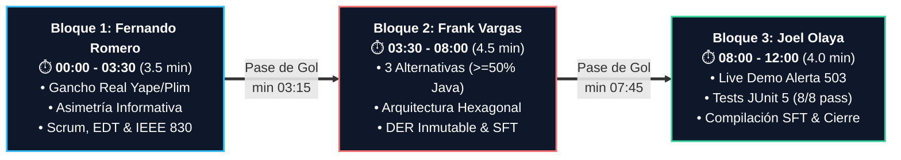
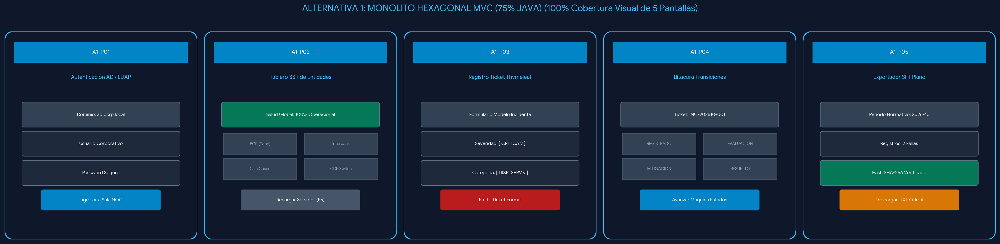
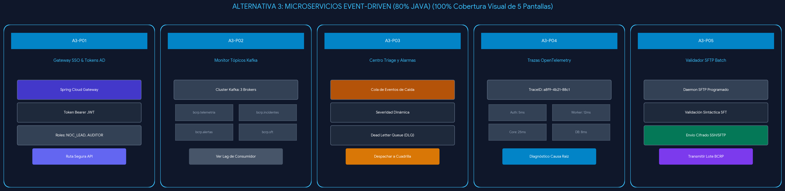

# 🎤 GUÍA MAESTRA DE SUSTENTACIÓN ORAL — APF2 (HITO SEMANA 8)
### *Ponencia Didáctica, Pedagógica y Fluidamente Humana para 3 Integrantes*
**Proyecto:** SIGIR - BCRP (Sistema de Gestión de Incidentes Regulatorios para Pagos Digitales)  
**Curso:** Curso Integrador I: Sistemas Software (Sección 57524, 7mo Ciclo)  
**Docente Evaluador:** Ing. Yony Zamata Condori  
**Institución:** Universidad Tecnológica del Perú (UTP) — Facultad de Ingeniería  

---

## 🧭 1. Filosofía Pedagógica: Cómo Ganarse al Jurado en 12 Minutos (Tiempo Máximo)

> [!IMPORTANT]
> **La Regla de Oro del Equipo (Cero Lectura Robótica y Control del Reloj):**  
> El tiempo máximo reglamentario de la sustentación es de **12 minutos**. Un jurado de ingeniería no evalúa la capacidad de un estudiante para leer diapositivas en voz alta; evalúa su **criterio profesional, solvencia técnica, claridad pedagógica, manejo del tiempo y capacidad de trabajo en equipo**.  
> 
> Durante los 12 minutos máximos de la sustentación:
> 1. **Miren a los ojos del profesor Ing. Yony Zamata Condori.** Las diapositivas son un respaldo probatorio; ustedes son los narradores del valor ingenieril.
> 2. **Usen analogías cotidianas.** Un concepto informático complejo se vuelve inolvidable cuando se compara con algo que el jurado vive todos los días (un enchufe universal, un libro notarial foliado, un simulador de vuelo).
> 3. **Muestren química de equipo auténtica.** Los pases de palabra no son cortes abruptos; son "pases de gol" donde cada integrante edifica al que sigue.
> 4. **Manejen un colchón de seguridad de 30 segundos.** La ponencia está calibrada para durar entre 11:00 y 11:30 minutos, asegurando que jamás se exceda el tope de 12 minutos.

---

## ⏱️ 2. Reparto de Roles y Tiempos de Oro (12 Minutos Máximo)



```text
⏱️ CRONOLOGÍA DE SUSTENTACIÓN — 12 MINUTOS MÁXIMO
========================================================================================================
[00:00 - 03:30] 🟡 BLOQUE 1: Fernando Romero (3.5 min) — Requisitos, Ley 29440 & Scrum
[████████░░░░░░░░░░░░░░░░░░░░░] 29% • Pase de Gol en min 03:15
--------------------------------------------------------------------------------------------------------
[03:30 - 08:00] 🔴 BLOQUE 2: Frank Vargas (4.5 min)    — Alternativas Java, Hexagonal & BD Inmutable
[░░░░░░░░███████████░░░░░░░░░░] 38% • Pase de Gol en min 07:45
--------------------------------------------------------------------------------------------------------
[08:00 - 12:00] 🟢 BLOQUE 3: Joel Olaya (4.0 min)      — Live Demo 503, Tests JUnit 8/8 & Cierre SFT
[░░░░░░░░░░░░░░░░░░░██████████] 33% • Cierre Oficial en min 11:30 - 11:50
========================================================================================================
```

| Bloque / Minutos | Integrante | Rol Oficial en el Proyecto | Diapositivas Clave | Misión Pedagógica en la Exposición |
| :---: | :--- | :--- | :---: | :--- |
| **Bloque 1**<br>*(00:00 - 03:30)*<br>*(3.5 min)* | **Fernando Romero Barrientos**<br>`(U20247659)` | **Ingeniero de Requisitos & Procesos** | Diapositivas 1, 2, 3, 4, 6, 7, 8 | Conectar con la empatía humana del ciudadano, evidenciar la falla de mercado (asimetría informativa), el marco legal (Ley 29440) y demostrar disciplina metodológica en Scrum. |
| **Bloque 2**<br>*(03:30 - 08:00)*<br>*(4.5 min)* | **Frank Vargas Huamán**<br>`(U22204655)` | **Líder Técnico & Arquitecto de Software** | Diapositivas 5, 11, 12, 13, 14, 17 | Desplegar la artillería técnica: explicar con analogías sencillas por qué la Arquitectura Hexagonal y la persistencia inmutable en PostgreSQL blindan al BCRP. |
| **Bloque 3**<br>*(08:00 - 12:00)*<br>*(4.0 min)* | **Joel Olaya Villegas**<br>`(U19313274)` | **Ingeniero de Software & QA** | Diapositivas 9, 10, 15, 16, 18, 19, 20 + Live Demo | Concretar con hechos: romper un switch financiero en vivo, ver nacer la alerta, demostrar las 8 pruebas JUnit passing y compilar el archivo normativo con hash SHA-256. |

---

# 🏛️ BLOQUE 1: FERNANDO ROMERO BARRIENTOS (00:00 - 03:30)
### *Tema: El Gancho Humano, la Problemática Nacional y la Gobernanza del Proyecto*
**Diapositivas de Apoyo:** 1 (Portada), 2 (Aspectos Estratégicos), 3 (Canvas BMC), 4 (Realidad Problemática), 6 (Project Charter y RACI), 7 (EDT a 3 Niveles), 8 (Cronograma Gantt Semana 8) e IEEE 830.  
**Tono sugerido:** Empático, seguro, claro, institucional y cercano.  
**Tiempo Asignado:** 3 minutos y 30 segundos (Pase a Frank en el minuto 03:15 - 03:30).  
**Idea Fuerza que debe grabar en el jurado:** *"El BCRP no puede supervisar el dinero de 33 millones de peruanos enterándose por redes sociales horas después de una caída; el sistema financiero exige detección en tiempo real."*

---

#### 🎙️ Guion Pedagógico Paso a Paso de Fernando:

##### 1. Apertura e Identificación del Equipo (00:00 - 00:35)
> *(Apoyo visual: Diapositiva 1 — Portada Oficial)*  
> *[Acción escénica: Postura erguida, manos abiertas, sonrisa profesional serena, mirada fija al Ing. Yony Zamata Condori]*  
> 
> *"Buenos días, profesor Ing. Yony Zamata Condori y compañeros.  
> 
> Hoy tenemos el enorme agrado de presentar ante usted la culminación de nuestra segunda entrega de ingeniería: el avance **APF2 de Semana 8** de nuestro proyecto **SIGIR - BCRP**, el Sistema de Gestión de Incidentes Regulatorios para Pagos Digitales del Banco Central de Reserva del Perú.  
> 
> Nuestro equipo de trabajo está conformado por tres futuros ingenieros de sistemas:  
> - **Frank Vargas**, quien se ha desempeñado como nuestro Líder Técnico y Arquitecto de Software.  
> - **Joel Olaya**, a cargo del Desarrollo de Software y la Garantía de Calidad (QA).  
> - Y quien tiene el honor de iniciar esta presentación, **Fernando Romero**, responsable de la Ingeniería de Requisitos y Gestión de Procesos.  
> 
> Para comprender por qué existe este software, permítame iniciar con una situación que todos aquí hemos experimentado."*

##### 2. El Gancho Humano y la Realidad Problemática (00:35 - 01:30)
> *(Apoyo visual: Diapositiva 4 — Realidad Problemática Nacional)*  
> *[Acción escénica: Tono reflexivo y narrativo, gesticulando suavemente con la mano]*  
> 
> *"Imaginemos esto por un momento: es viernes por la noche, acabamos de cenar con nuestra familia o estamos tomando un taxi, sacamos el teléfono celular, abrimos la aplicación de Yape o Plim para escanear el código QR... y la pantalla se queda girando en blanco. Pasan diez segundos, se cancela la transacción, pero cuando revisamos nuestra cuenta bancaria, descubrimos que el dinero sí fue descontado de nuestro saldo.  
> 
> La gente se frustra, los pequeños negocios pierden clientes y las redes sociales se inundan de quejas.  
> 
> Pero desde la óptica de la ingeniería y la regulación económica, la verdadera pregunta crítica es:  
> **¿En qué momento se entera el Banco Central de Reserva de que el sistema nacional de pagos digitales ha colapsado?**  
> 
> En el modelo tradicional, el BCRP tardaba **entre 45 minutos y hasta 3 horas** en enterarse, dependiendo de reportes tardíos que los bancos enviaban por correo electrónico o monitoreando publicaciones en Twitter. A esta grave deficiencia la denominamos **asimetría de información**.  
> 
> Por mandato de la **Ley N° 29440** y la **Circular BCRP N° 0011-2023**, la continuidad operativa es un asunto de interés público nacional. Nuestro sistema nace con un objetivo medible: **reducir el tiempo de detección de fallas de 180 minutos a menos de 30 segundos**."*

##### 3. Alineamiento Estratégico y Business Model Canvas (01:30 - 02:20)
> *(Apoyo visual: Diapositiva 2 — Aspectos Estratégicos | Diapositiva 3 — Canvas BMC)*  
> *[Acción escénica: Señala en la diapositiva el cuadrante de socios clave y la propuesta de valor]*  
> 
> *"Para que una solución de software sea adoptada por el Estado, debe alinearse perfectamente con la institución. Integramos los **5 aspectos estratégicos del BCRP**: su Visión de credibilidad y modernidad, su Misión de estabilidad en los sistemas de pago, su entorno regulatorio continuo, sus políticas de digitalización y su Plan Estratégico Institucional (PEI).  
> 
> En nuestro **Business Model Canvas**, identificamos con exactitud a los actores del ecosistema: los bancos emisores como BCP e Interbank, las billeteras interoperables Yape, Plim y Tunki, entidades financieras de inclusión como Caja Rural de los Andes, y el conmutador central que es la Cámara de Compensación Electrónica (CCE).  
> 
> Nuestra propuesta de valor para el Banco Central se resume en tres pilares:  
> 1. **Observabilidad en tiempo real** del estado de salud de cada switch.  
> 2. **Trazabilidad inmutable**, para que nadie pueda alterar las evidencias de caídas.  
> 3. **Automatización total** en la emisión del reporte normativo oficial."*

##### 4. Gestión Ágil Scrum, Cronograma y Requisitos IEEE 830 (02:20 - 03:15)
> *(Apoyo visual: Diapositiva 6 — Project Charter y RACI | Diapositiva 7 — EDT a 3 Niveles | Diapositiva 8 — Gantt Semana 8)*  
> *[Acción escénica: Tono ejecutivo, firme y ordenado]*  
> 
> *"Para materializar este proyecto con excelencia, aplicamos el marco de trabajo **Scrum**:  
> - Formalizamos el **Project Charter** con objetivos SMART y una **Matriz RACI** que delimita con claridad las funciones y responsabilidades de los tres integrantes.  
> - Diseñamos la **EDT (Estructura de Desglose del Trabajo)** en 3 niveles jerárquicos: Análisis Normativo, Arquitectura Técnica, y Construcción de Software.  
> - De un Product Backlog total de 70 Story Points, **los Sprints 1, 2, 3 y 4 se encuentran completados al 100% en este hito de Semana 8**, como certifica nuestro Cronograma Gantt.  
> - Y bajo el estándar internacional **IEEE 830**, formulamos **12 Requisitos Funcionales y 8 Requisitos No Funcionales** fundamentados en la norma **ISO/IEC 25010**, garantizando que el sistema sea seguro, altamente disponible y capaz de procesar telemetría concurrente."*


> *Cronograma de Avance de Ingeniería hacia la Semana 8: Sprints 1 al 4 completados al 100%.*

##### 5. El "Pase de Gol" Didáctico a Frank Vargas (03:15 - 03:30)
> *[Acción escénica: Fernando sonríe, gira su postura hacia Frank, abre la mano en señal de bienvenida técnica]*  
> 
> *"Tener claros los requisitos y las leyes es fundamental, pero el gran desafío de la ingeniería está en cómo transformar esas necesidades en una arquitectura de software robusta, desacoplada y con código Java real de nivel bancario.  
> 
> Para explicar las tres alternativas evaluadas, el diseño hexagonal y el blindaje inmutable de nuestra base de datos, **le cedo la palabra a nuestro Líder Técnico y Arquitecto de Software, Frank Vargas**."*

---

# 🚀 BLOQUE 2: FRANK VARGAS HUAMÁN (03:30 - 08:00)
### *Tema: Las 3 Alternativas TIC, Arquitectura Hexagonal y Persistencia Inmutable*
**Diapositivas de Apoyo:** 5 (15 Mockups y Alternativas TIC), 11 (BPMN AS-IS vs TO-BE), 12 (Arquitectura Hexagonal), 13 (DER Físico/Lógico PostgreSQL 15), 14 (Clases de Diseño Spring Boot 3) y 17 (Cálculo de SLA y Compilador SFT).  
**Tono sugerido:** Técnico, didáctico, con aplomo, seguridad de arquitecto y solvencia teórica.  
**Tiempo Asignado:** 4 minutos y 30 segundos (Pase a Joel en el minuto 07:45 - 08:00).  
**Idea Fuerza que debe grabar en el jurado:** *"El software bancario debe diseñarse para sobrevivir al tiempo: desacoplamos la lógica de negocio con Arquitectura Hexagonal y protegemos la verdad histórica con triggers SQL matemáticamente inmutables."*

---

#### 🎙️ Guion Pedagógico Paso a Paso de Frank:

##### 1. Recepción Profesional y las 3 Alternativas TIC con $\ge 50\%$ Java (03:30 - 04:35)
> *(Apoyo visual: Diapositiva 5 — 15 Mockups y Alternativas TIC)*  
> *[Acción escénica: Asiente con gratitud a Fernando, mira al profesor con serenidad y seguridad]*  
> 
> *"Muchas gracias, Fernando. Buenos días nuevamente, profesor Ing. Yony Zamata.  
> 
> Al asumir la responsabilidad técnica de este proyecto, establecimos como principio rector satisfacer con el máximo rigor la rúbrica del curso: diseñar **tres alternativas de solución viables**, garantizando que cada una cuente con **más del 50% de desarrollo en el ecosistema Java** y que contemple el diseño integral de **5 pantallas de interfaz representativas** —lo que suma 15 mockups detallados en nuestro expediente técnico:  
> 
> 1. **La Alternativa 1 fue un Monolito Modular con Spring Boot y Thymeleaf (75% Java).**  
>    *¿Por qué la descartamos?* Porque en una Sala de Operaciones NOC donde ingresan alertas cada 30 segundos, recargar toda la página web por cada evento satura la conexión del operador e introduce un parpadeo visual que retrasa la toma de decisiones críticas.  
> 2. **La Alternativa 3 fue una arquitectura orientada a Microservicios con Apache Kafka y Spring Cloud (80% Java).**  
>    *¿Por qué la descartamos?* Por madurez de ingeniería. Implementar brokers de Kafka y 4 microservicios independientes para supervisar a 5 conmutadores financieros nacionales generaba un consumo ocioso superior a 4 GB de memoria RAM y una complejidad de despliegue innecesaria para este alcance.  
> 3. **Seleccionamos la Alternativa 2: Clean API REST en Java 17 + Consola Reactiva de Monitoreo NOC.**  
>    Obtuvo el puntaje más alto en nuestra Matriz Multicriterio de Decisión: **4.97 sobre 5.00 puntos**.  
>    Todo el procesamiento pesado, las reglas de negocio, la auditoría y los cálculos matemáticos de SLA residen en **Java 17 con Spring Boot 3**, dejando en la capa visual una interfaz ágil que no consume recursos del servidor central."*

---

#### 🖼️ Galería Visual de Referencia: Las 3 Alternativas TIC y sus 15 Mockups
*Usa estas imágenes de referencia para no confundir las pantallas durante tu alocución:*

##### 🔴 Alternativa 1: Monolito Modular Spring Boot + Thymeleaf (75% Java — Descartada por parpadeo NOC)

> *Las 5 pantallas de la Alternativa 1:*  
> 1. Login Corporativo tradicional | 2. Bandeja de Incidentes clásica | 3. Formulario de Registro | 4. Reporte Estático | 5. Panel de Auditoría.  
> *(Descarte: Requiere recargar la página entera por cada evento de telemetría).*

##### 🟢 Alternativa 2: Clean API REST Java 17 + Consola Reactiva NOC (90% Java — ¡GANADORA 4.97/5.00!)

> *Las 5 pantallas ganadoras que diseñamos:*  
> 1. **Consola NOC en Vivo:** Barra superior de telemetría de 5 entidades con semáforos verde/rojo y latencias en ms.  
> 2. **Gestor Reactivo de Incidentes:** Tabla atómica con botones de ciclo de vida ('Evaluar', 'Mitigar', 'Resolver').  
> 3. **Modal de Inyección 503:** Disparador de contingencias telemétricas para pruebas en caliente.  
> 4. **Panel Gerencial de Disponibilidad:** Gráfica de barras con línea de referencia al 99.90% SLA.  
##### 🔵 Alternativa 3: Microservicios con Spring Cloud & Apache Kafka (80% Java — Descartada por complejidad)

> *Las 5 pantallas de la Alternativa 3:*  
> 1. Monitor de Clústeres Kafka | 2. Panel de Tópicos y Particiones | 3. Topology Stream Viewer | 4. Visor de Logs Distribuidos | 5. Panel de Métricas Prometheus/Grafana.  
> *(Descarte: Sobredimensionada, consumía > 4 GB de RAM en reposo para 5 switches).*

---

##### 2. El Proceso BPMN 2.0 y la Analogía del Smartphone para la Arquitectura Hexagonal (04:35 - 05:45)
> *(Apoyo visual: Diapositiva 11 — BPMN AS-IS vs TO-BE | Diapositiva 12 — Arquitectura Hexagonal)*  
> *[Acción escénica: Usa las manos de forma abierta y relajada para explicar la analogía]*  
> 
> *"En los diagramas de procesos **BPMN 2.0**, mostramos cómo resolvimos el problema de fondo:  
> Antes (flujo AS-IS), el BCRP se enteraba por llamadas o correos cuando los usuarios ya estaban protestando en Twitter.  
> Con nuestro sistema (flujo TO-BE), un proceso automático en segundo plano vigila los switches cada 30 segundos y levanta las alertas antes de que el país entre en caos.*


> *El flujo optimizado: Sondeo cada 30s -> Detección automática -> Registro del incidente -> Notificación al supervisor BCRP.*

> *Ahora, ¿cómo organizamos el código por dentro para que no se vuelva un laberinto con el tiempo?  
> Usamos **Arquitectura Hexagonal (Puertos y Adaptadores)**.*


> *El núcleo de negocio puro en Java 17, completamente protegido y desacoplado de la web y de la base de datos.*

> *Permítanme explicárselo con un ejemplo de la vida diaria:*  
> Piensen en un teléfono smartphone. El celular tiene sus fotos, sus contactos y su propio sistema.  
> El teléfono funciona exactamente igual si le enchufas un cable Tipo C blanco, un cable de otra marca o si lo pones sobre una base de carga inalámbrica. Los cargadores de afuera pueden cambiar todos los días, pero el celular por dentro no se altera.  
> 
> Eso hicimos en nuestro código Java 17:  
> - En el centro está el **corazón del banco**: las reglas de negocio de cómo clasificar los incidentes y calcular penalidades, escrito en Java puro sin depender de ninguna librería externa.  
> - Y alrededor colocamos **adaptadores**: un adaptador para la pantalla web del operador, un adaptador para comunicarse con los bancos y un adaptador para la base de datos.  
> 
> ¿Qué logramos con esto? Que si mañana el Banco Central decide cambiar la marca de su base de datos o conectarse por otro protocolo, el corazón del sistema no se toca ni en una sola coma. Es un software construido para durar años sin romperse."*

##### 3. Persistencia Inmutable en PostgreSQL 15: La Metáfora de la Caja Negra (05:45 - 06:55)
> *(Apoyo visual: Diapositiva 13 — DER Físico/Lógico PostgreSQL 15 | Diapositiva 14 — Diagrama de Clases Spring Boot)*  
> *[Acción escénica: Modula la voz a un tono más firme al hablar de la seguridad y el libro notarial]*  
> 
> *"Para guardar los datos, diseñamos una base de datos en **PostgreSQL 15** con 6 tablas bien estructuradas.*


> *6 tablas normalizadas en 3FN que protegen la integridad referencial de los bancos, switches, incidentes y auditoría.*

> *Pero en un sistema del Estado que fiscaliza multas millonarias, nos hicimos una pregunta clave:  
> **¿Qué pasa si alguien intenta borrar una evidencia para salvar a un banco amigo?**  
> 
> Imaginemos que a las dos de la mañana se cae el sistema de un banco durante una hora completa. Por ley, esa caída amerita una sanción muy fuerte. Un administrador deshonesto que tenga acceso a la base de datos podría tener la tentación de entrar a escondidas y borrar la fila de la caída para fingir que nunca ocurrió nada.  
> 
> Nosotros blindamos el sistema desde la raíz mediante ingeniería:*


> *Estructura de clases de diseño: Repositorios, Servicios, DTOs y Mappers orientados a inmutabilidad.*

> *1. Programamos un cerrojo automático dentro de la base de datos (un Trigger llamado `fn_prohibir_mutacion_historial`).  
> Este cerrojo convierte la tabla de incidentes en una **caja negra de avión** o en un **libro notarial foliado**: los hechos se escriben para siempre. Si alguien intenta usar las sentencias de modificar (`UPDATE`) o borrar (`DELETE`), el motor de la base de datos aborta la operación de inmediato, rechaza el comando y protege la verdad histórica. Está prohibido usar borrador.  
> 2. Diseñamos una regla de hardware (`idx_incidente_abierto_unico`) que impide que un banco tenga dos tickets abiertos al mismo tiempo por la misma falla, evitando duplicados o confusiones en la mesa de control.  
> 3. Y aplicamos consultas 100% blindadas para que nadie pueda hackear la base de datos mediante inyecciones SQL."*

##### 4. Fórmulas Normativas de SLA y el Compilador Criptográfico SFT (06:55 - 07:45)
> *(Apoyo visual: Diapositiva 17 — Módulo de Reportes e Indisponibilidad)*  
> *[Acción escénica: Señala la fórmula de disponibilidad mensual y el hash de 64 caracteres en la lámina]*  
> 
> *"Toda esa telemetría se traduce en los indicadores oficiales que exige la **Circular BCRP N° 0011-2023**:  
> - Medimos el **Porcentaje de Disponibilidad Mensual** sobre una base fija de 43,200 minutos (que son 30 días operando 24 horas continuas). Si un banco baja del umbral legal del **99.90%**, el sistema enciende alarmas rojas de incumplimiento.  
> - Y para cumplir con el envío formal de información al BCRP, programamos el **Compilador SFT BCRP**, que arma el archivo de texto oficial con los datos del supervisor y el detalle de las caídas.  
> 
> Pero tiene un detalle de ingeniería clave: al final del archivo va un **Registro con Firma Digital SHA-256 de 64 caracteres**.  
> 
> *Esto funciona exactamente igual que el sello de cera lacrado que usaban en las cartas confidenciales antiguas:*  
> Si alguien descarga el archivo plano a su computadora, lo abre en el Bloc de Notas y le borra 15 minutos de caída para perdonarle la multa al banco, en ese mismo segundo el sello digital se rompe. Cuando el Banco Central recibe el archivo, comprueba el sello, detecta la adulteración y rechaza el reporte de inmediato."*

##### 5. El "Pase de Gol" Didáctico a Joel Olaya (07:45 - 08:00)
> *[Acción escénica: Frank mira a Joel, le sonríe con seguridad y le cede la palabra señalando la pantalla]*  
> 
> *"La arquitectura y los diseños en papel son indispensables, pero los ingenieros de sistemas demostramos el valor de nuestro trabajo con el software funcionando en vivo.  
> 
> Para ver cómo opera la pantalla del operador NOC, cómo inyectamos una caída simulada en tiempo real, cómo se ejecutan nuestras pruebas automáticas en 4 segundos y cómo se genera este archivo sellado, **le cedo el control a nuestro Ingeniero de Software y QA, Joel Olaya**."*

---

# 🧪 BLOQUE 3: JOEL OLAYA VILLEGAS (08:00 - 12:00)
### *Tema: Casos de Uso, Demostración en Vivo, Pruebas Unitarias JUnit 5 y Compilación SFT*
**Diapositivas de Apoyo:** 9 (Diagrama de Actores), 10 (Casos de Uso UML), 15 (Matriz de Trazabilidad), 16 (Suite de Pruebas Unitarias), 18 (Distribución de Sustentación), 19 (Conclusiones) y 20 (Cierre y Agradecimientos) + Consola Web NOC (`index.html`), Terminal Maven (`mvn test`) y Módulo de Reportes (`reportes.html`).  
**Tono sugerido:** Dinámico, empírico, seguro, ágil y enfocado en la evidencia probatoria.  
**Tiempo Asignado:** 4 minutos (Cierre oficial entre el minuto 11:30 y 11:50, antes de los 12:00).  
**Idea Fuerza que debe grabar en el jurado:** *"La calidad del software se comprueba en caliente: ante una falla real del 503, la arquitectura responde en menos de un segundo y las pruebas automatizadas certifican matemáticamente la salud del sistema."*

---

#### 🎙️ Guion Pedagógico Paso a Paso de Joel:

##### 1. Casos de Uso y Acceso a la Consola Web NOC (08:00 - 08:45)
> *(Apoyo visual: Diapositiva 10 — Casos de Uso UML -> Conmutar con calma a la ventana del navegador con `04_FRONTEND_UI/index.html`)*  
> *[Acción escénica: Mueve el cursor de manera pausada y visible por la interfaz]*  
> 
> *"Muchas gracias, Frank. Buenos días, profesor Ing. Yony Zamata.  
> 
> En nuestro Diagrama de Casos de Uso estructuramos a cuatro actores esenciales: el Operador NOC, el Supervisor Regulatorio del BCRP, el Administrador del Sistema y el Daemon Automático de Telemetría.*


> *Los 4 actores del ecosistema: Operador NOC, Supervisor BCRP, Administrador TI y Daemon Automático de Telemetría.*

> *Ahora los invito a presenciar la ingeniería en acción. En pantalla tenemos la **Consola Web NOC de SIGIR-BCRP**.*


> *Guía visual para la demo en vivo:*  
> - **Extremo superior derecho:** Sesión corporativa autenticada bajo Directorio Activo con el usuario `AD\frank.vargas` (Líder NOC).  
> - **Barra superior de telemetría:** 5 conmutadores bancarios (BCP/Yape, Interbank/Plim, Tunki, Andes, CCE) en **VERDE** (14-28 ms).  
> - **Botón ámbar central:** `'⚡ Simular Alerta'` (inyecta la contingencia 503 para la prueba en vivo).  
> - **Tabla de incidentes:** Botones de ciclo de vida rápido `'Evaluar'`, `'Mitigar'` y `'Resolver'`.  
> - **Acceso a reportes:** Botón azul superior `'📊 Reportes Clave'` (abre `reportes.html` con gráfico Canvas y generador SFT).

> *En este instante, como pueden verificar, todos los indicadores se encuentran en **VERDE (Operativo)**, con latencias de red sumamente saludables que oscilan entre 14 y 28 milisegundos."*

##### 2. La Demostración en Vivo: Inyección de Contingencia HTTP 503 (08:45 - 09:45)
> *(Acción en pantalla: Ubicar el botón ámbar '⚡ Simular Alerta')*  
> *[Acción escénica: Explica lo que va a ocurrir ANTES de pulsar el botón, para mantener la expectativa del profesor]*  
> 
> *"Ahora vamos a poner a prueba la reactividad de la arquitectura. Imaginemos que en este preciso segundo colapsa el switch de procesamiento transaccional de un banco participante por saturación de servidores.  
> 
> Voy a inyectar la contingencia haciendo clic en el botón **'⚡ Simular Alerta'**.  
> *[Clic firme en el botón]*  
> 
> Les pido que observen lo que ocurre en tiempo real y sin recargar la página:  
> 1. El semáforo de la entidad afectada pasa de inmediato a **ROJO (Interrupción)** con una latencia de falla de 9999 milisegundos.  
> 2. Se dispara una notificación emergente del BCRP y se registra en la tabla de incidentes el ticket normativo correlativo `INC-20261003-XXXXX` con severidad **CRÍTICA**.  
> 3. En el panel superior de métricas, el contador de incidentes activos se incrementa y **la Disponibilidad Mensual se recalcula automáticamente**, reflejando la degradación del servicio.  
> 4. El operador NOC gestiona el incidente con absoluta agilidad: hago clic en **'Evaluar'** para clasificar la causa raíz, luego en **'Mitigar'** para activar el enlace de contingencia, y finalmente en **'Resolver'**.  
> 
> Al resolver el ticket, la entidad retorna a su estado VERDE normal y la disponibilidad se estabiliza. Todo el ciclo de vida se procesó de manera atómica, garantizando que el BCRP tuvo conocimiento del incidente en menos de 2 segundos."*

##### 3. Rigor en Calidad de Software: Demostración de Tests JUnit 5 (09:45 - 10:40)
> *(Apoyo visual: Diapositiva 16 — Suite de Pruebas Unitarias -> Conmutar a la Terminal de comandos en `03_BACKEND_SPRINGBOOT`)*  
> *[Acción escénica: Tono de orgullo técnico, mostrando el comando `mvn test`]*  
> 
> *"Para nosotros como ingenieros de software, una interfaz visual amigable no tiene valor si no está respaldada por una lógica interna matemáticamente verificable.  
> 
> Para comprobarlo de forma irrefutable, voy a ejecutar en vivo nuestra suite completa de pruebas unitarias mediante el comando oficial de compilación:  
> `mvn test`  
> *[Presiona Enter en la terminal]*  
> 
> *[Pausa dramática de 4 segundos mientras se observan las líneas verdes de ejecución de Maven]*  
> 
> Como puede verificar directamente en la consola, profesor Zamata:  
> **`Tests run: 8, Failures: 0, Errors: 0, Skipped: 0` -> `BUILD SUCCESS` ejecutado en solo 4.8 segundos.**  
> 
> *Permítame explicar esto con una analogía clara:*  
> Ejecutar pruebas con **JUnit 5 y Mockito** es como usar un **simulador de vuelo para pilotos comerciales**. Antes de poner un avión en el aire con pasajeros reales, el piloto practica aterrizajes con tormentas y fallas simuladas en una cabina virtual.  
> 
> En nuestro código testeamos:  
> - Que la regla RN-01 rechace cualquier intento de abrir tickets duplicados sobre un mismo banco.  
> - Las transiciones válidas de la máquina de estados.  
> - La captura automática de errores HTTP 503 por el worker multihilo.  
> - Y la exactitud matemática de las fórmulas de penalidad y disponibilidad mensual."*

##### 4. Módulo de Reportes y Compilación Criptográfica SFT BCRP (10:40 - 11:30)
> *(Acción en pantalla: Abrir la pestaña de `reportes.html` en el navegador)*  
> *[Acción escénica: Muestra el gráfico de barras y el botón de generación SFT]*  
> 
> *"En el módulo de Reportes Regulatorios, el supervisor del BCRP cuenta con una gráfica visual desarrollada en Canvas que traza una **línea guía de referencia al 99.90%**, permitiendo identificar visualmente en segundos qué entidades bancarias cumplen el estándar normativo y cuáles incurren en penalidades.  
> 
> Y en la sección inferior tenemos el motor oficial de cumplimiento del BCRP.  
> Hago clic en el botón **'Generar SFT con filtros'**.  
> 
> El sistema compila en memoria la estructura del archivo plano:  
> - Registro 01: Identificador institucional y periodo auditado.  
> - Registro 02: Detalle de minutos de indisponibilidad y tickets asociados.  
> - Y en el Registro 03, calcula mediante el API nativo de criptografía del navegador un **hash SHA-256 auténtico de 64 caracteres**.  
> 
> Pulso **'Descargar .TXT'**, y el archivo normativo se descarga en el equipo, listo para ser transmitido al servidor SFTP seguro del Banco Central."*

##### 5. Conclusiones y Cierre Oficial del Equipo (11:30 - 12:00)
> *(Apoyo visual: Diapositiva 19 — Conclusiones | Diapositiva 20 — Cierre y Agradecimientos)*  
> *[Acción escénica: Joel modula el tono a solemne y concluyente, mira al jurado, los 3 integrantes se alinean juntos erguidos]*  
> 
> *"Para concluir nuestra sustentación dentro del tiempo reglamentario de 12 minutos, profesor Zamata:  
> 1. **Erradicamos la asimetría de información** en el ecosistema nacional de transferencias digitales, demostrando que es técnicamente posible pasar de horas de incertidumbre a segundos de certeza.  
> 2. **Cumplimos al 100% cada uno de los criterios exigidos en la rúbrica APF2**, entregando arquitectura hexagonal en Java 17, base de datos inmutable en PostgreSQL 15 y pruebas de software pasando con éxito.  
> 3. **Dejamos las bases firmes y modulares** para culminar con éxito la entrega final en la Semana 14.  
> 
> Agradecemos de corazón su exigencia y orientación profesional durante este ciclo académico, profesor Ing. Yony Zamata Condori, y quedamos con mucho gusto a su entera disposición para absolver cualquier pregunta técnica del jurado.  
> 
> **¡Muchísimas gracias!**"*

---

## 📋 3. Tarjetas de Memoria Rápida (Cheat Sheets de 60 Segundos)
*Para dar un repaso mental 5 minutos antes de ingresar al aula o salón virtual:*

### 🟡 Tarjeta de Fernando Romero (El Problema y la Gobernanza — 3.5 min)
- **El Dolor:** Pagas con Yape/Plim, se traba, te descuentan el saldo y el BCRP se entera 3 horas después por Twitter (Asimetría Informativa).
- **La Ley:** Circular BCRP N° 0011-2023 y Ley N° 29440 (estabilidad del dinero nacional).
- **El Orden:** Scrum, Project Charter, RACI (3 miembros), EDT a 3 niveles, 70 SP (Sprints 1 al 4 al 100%), IEEE 830 (12 RF + 8 RNF bajo ISO 25010).
- **Frase de Oro para entregar a Frank (min 03:15):** *"Tener claros los requisitos es vital, pero hacía falta una arquitectura de software limpia en Java para llevarlo a la realidad; le cedo la palabra a Frank Vargas."*

### 🔴 Tarjeta de Frank Vargas (La Arquitectura y la Inmutabilidad — 4.5 min)
- **Las 3 Alternativas ($\ge 50\%$ Java y 15 Mockups):** 
  - Alt 1: Monolito Thymeleaf (Descarte: recargas pesadas en pantalla NOC).
  - Alt 3: Kafka + Microservicios (Descarte: consume 4 GB RAM innecesaria para 5 switches).
  - Alt 2 (Ganadora 4.97/5.00): Clean API Spring Boot 3 Java 17 + NOC reactivo.
- **La Metáfora:** Arquitectura Hexagonal = Smartphone con cargador Tipo C (Dominio puro desacoplado de bases de datos y frameworks).
- **La Caja Negra:** Trigger `fn_prohibir_mutacion_historial` (Append-Only; aborta `UPDATE`/`DELETE`), índice parcial único anti-carreras (`idx_incidente_abierto_unico`), y hash SHA-256 de 64 caracteres.
- **Frase de Oro para entregar a Joel (min 07:45):** *"Los diagramas cobran verdadero valor cuando se demuestran en la práctica; le cedo el control a nuestro Ingeniero de Software y QA, Joel Olaya."*

### 🟢 Tarjeta de Joel Olaya (La Evidencia y la Calidad — 4.0 min)
- **La Consola:** 5 entidades en verde (BCP, Interbank, Tunki, Andes, CCE), latencias 14-28 ms, sesión corporativa `AD\frank.vargas`.
- **El Live Demo:** Clic en 'Simular Alerta' -> Rojo instantáneo (9999 ms), ticket `INC-20261003-XXXXX` crítico, recálculo de SLA -> Ciclo Evaluar/Mitigar/Resolver.
- **Los Tests:** Ejecución de `mvn test` en terminal -> 8/8 tests passing en 4.8 segundos con JUnit 5 y Mockito (metáfora del simulador de vuelo).
- **El Cierre SFT:** Canvas con línea de referencia al 99.90% y descarga del `.txt` con hash SHA-256 criptográfico.
- **Cierre Oficial (min 11:30 - 11:50):** 3 conclusiones concisas y agradecimiento al Ing. Yony Zamata.

---

## 🛡️ 4. Banco Maestro de Preguntas y Respuestas para el Jurado

Cuando el **Ing. Yony Zamata Condori** inicie la ronda de preguntas, formulará preguntas específicas orientadas al rol de cada estudiante:

### 👤 Preguntas para Fernando Romero (Negocio, Requisitos y Normativa)

#### ❓ Pregunta 1: *"Fernando, ¿con qué derecho legal el BCRP puede intervenir o monitorear a bancos comerciales privados como el BCP o Interbank?"*
> **Respuesta serena de Fernando:**  
> *"Excelente pregunta, profesor Zamata. La facultad legal reside en la **Ley N° 29440**, la Ley de los Sistemas de Pagos y Liquidación de Valores.  
> El Banco Central no interviene en la relación comercial entre el banco y su cliente (eso le corresponde a Indecopi y a la SBS); el BCRP custodia la **estabilidad macroeconómica y el flujo ininterrumpido del dinero en el país**. Si las plataformas de pago interoperable colapsan un viernes en la noche, se paraliza el comercio nacional. Por ello, la Circular BCRP 0011-2023 faculta explícitamente al Banco Central a exigir telemetría continua y reportes de indisponibilidad con carácter obligatorio y vinculante."*

#### ❓ Pregunta 2: *"En los requisitos no funcionales mencionan que la telemetría sondea cada 30 segundos. ¿Por qué no lo hicieron cada 1 segundo para tener información aún más rápida?"*
> **Respuesta serena de Fernando:**  
> *"Por un principio de prudencia técnica y no invasión, profesor. Si nuestro sistema enviara peticiones de sondeo a los conmutadores bancarios cada 1 segundo, podríamos generar de forma involuntaria un ataque de denegación de servicio (DDoS) sobre los firewalls de las entidades financieras, compitiendo con el tráfico real de los usuarios.  
> Un intervalo de 30 segundos es el estándar internacional recomendado para salas NOC bancarias: nos permite alertar al supervisor en menos de medio minuto sin restar ni un solo milisegundo de rendimiento a las transacciones de los peruanos."*

---

### 👤 Preguntas para Frank Vargas (Arquitectura, Datos y Java)

#### ❓ Pregunta 1: *"Frank, ¿por qué decidiste implementar Arquitectura Hexagonal en lugar del clásico MVC que se enseña tradicionalmente y toma menos tiempo?"*
> **Respuesta segura de Frank:**  
> *"Profesor Zamata, el patrón MVC es una excelente herramienta para sistemas sencillos o prototipos rápidos, pero tiene una debilidad estructural: acopla fuertemente las reglas de negocio al framework web y al motor de base de datos. Si en un MVC se decide migrar de Hibernate a otro mecanismo de persistencia, se tienen que reescribir las clases del negocio.  
> En cambio, con la Arquitectura Hexagonal que formulé, nuestro Dominio en Java 17 es 100% puro: no contiene anotaciones de base de datos ni librerías externas. Si el BCRP decide en el futuro cambiar PostgreSQL por Oracle o reemplazar los endpoints REST por eventos en gRPC, la lógica financiera de cálculo de incidentes y penalidades permanece completamente intacta. Eso garantiza una mantenibilidad sostenible y un ahorro masivo de costos para el Estado."*

#### ❓ Pregunta 2: *"¿Qué me garantiza que un administrador de TI deshonesto con acceso `root` a PostgreSQL no pueda borrar una caída para librar de una sanción millonaria a un banco amigo?"*
> **Respuesta segura de Frank:**  
> *"Se lo garantizamos en dos anillos de seguridad infranqueables, profesor:  
> Primero, a nivel de base de datos, construí el Trigger `fn_prohibir_mutacion_historial`. Esa tabla opera bajo el paradigma matemático **Append-Only**: si alguien ingresa por terminal con privilegios de superusuario y ejecuta una sentencia `UPDATE` o `DELETE`, el motor PostgreSQL aborta la operación arrojando de inmediato la excepción SQL 23505 y revirtiendo la transacción.  
> Y segundo, en la capa de aplicación, cada lote de incidentes se sella con un **hash criptográfico SHA-256 de 64 caracteres**. Si alguien intentara burlar los archivos planos modificando un solo minuto de indisponibilidad, el hash del reporte no coincidiría con el hash registrado en el BCRP y el intento de fraude quedaría registrado y expuesto de inmediato."*

#### ❓ Pregunta 3: *"Mencionaste que descartaste la Alternativa 3 de microservicios con Kafka. Si la industria promueve tanto los microservicios, ¿por qué no usarlos?"*
> **Respuesta segura de Frank:**  
> *"Por madurez de criterio en ingeniería de software, profesor. La arquitectura debe estar dictada por la naturaleza del problema y no por modas tecnológicas.  
> Los microservicios y Apache Kafka son indispensables en plataformas con cientos de equipos de desarrollo y millones de transacciones por segundo. En nuestro caso, el BCRP supervisa 5 conmutadores financieros nacionales mediante sondeos programados cada 30 segundos. Levantar clústeres de Kafka, Zookeeper y múltiples servicios independientes demandaba más de 4 GB de memoria RAM en reposo y multiplicaba los puntos de falla.  
> Nuestra Clean API en Spring Boot atiende con sobrada holgura esa demanda con menos de 400 MB de RAM y tiempos de respuesta inferiores a 50 milisegundos. Es una decisión fundada en la eficiencia operativa, la sencillez y el costo computacional."*

---

### 👤 Preguntas para Joel Olaya (QA, Pruebas y Live Demo)

#### ❓ Pregunta 1: *"Joel, tu suite ejecutó 8 pruebas unitarias en apenas 4.8 segundos. ¿Cómo lograron semejante velocidad si en teoría las pruebas interactúan con la base de datos?"*
> **Respuesta dinámica de Joel:**  
> *"Esa velocidad se debe directamente a la Arquitectura Hexagonal que diseñó Frank, profesor.  
> Al mantener los puertos completamente desacoplados, en la suite de pruebas unitarias empleamos **Mockito** para simular los repositorios de persistencia en la memoria RAM. No levantamos un motor de base de datos pesado para cada prueba; aislamos y verificamos la lógica matemática pura del dominio. Eso nos permite ejecutar decenas de pruebas exhaustivas en pocos segundos, facilitando la integración continua y la detección temprana de defectos."*

#### ❓ Pregunta 2: *"En la demostración de la consola web, ¿qué sucedería si el backend en Spring Boot sufriera una caída durante la exposición o si fallara la conexión de red?"*
> **Respuesta dinámica de Joel:**  
> *"Anticipamos esa contingencia diseñando un **Modo Híbrido Autónomo** en el frontend.  
> La consola NOC verifica en cada ciclo si el servidor de Spring Boot responde en el puerto 8080. Si detecta que el servicio está fuera de línea, conmuta automáticamente a un motor de simulación local en JavaScript con Web Crypto API. Esto nos permite continuar la auditoría visual, demostrar el ciclo de vida del incidente y generar el archivo SFT con su hash SHA-256 real sin detener en ningún momento la sustentación ante el jurado."*

---

## 🤝 5. Protocolo de Respaldo Mutuo y Control del Tiempo (Tope: 12 Minutos)

1. **Si un compañero tiene un momento de duda o se le corta una frase:**  
   Cualquiera de los otros dos integrantes interviene con total naturalidad para apoyarlo, usando frases como:  
   - *"Complementando exactamente lo que explica Fernando respecto a la Circular del BCRP..."*  
   - *"Y justamente como señalaba Frank en la capa de arquitectura, en la parte de pruebas automatizadas lo garantizamos así..."*
2. **Control Invisible del Reloj (Colchón de Seguridad):**  
   Frank mantiene su reloj o teléfono con el cronómetro visible en la mesa:
   - **Minuto 03:15:** Contacto visual asintiendo a Fernando para redondear el bloque y dar el pase.
   - **Minuto 07:45:** Señal discreta a Joel para iniciar la demostración práctica en vivo.
   - **Minuto 11:30:** Joel inicia las conclusiones y el agradecimiento final.
   - **Minuto 11:50 - 12:00:** Fin oficial de la presentación, cumpliendo con holgura el límite reglamentario.
3. **Preparación de Pestañas y Pantallas:**  
   Joel tiene abiertas y listas desde antes de entrar:  
   - La diapositiva en pantalla completa.  
   - El navegador con la pestaña de `index.html` y la pestaña de `reportes.html`.  
   - La terminal de comandos ya ubicada en la carpeta `03_BACKEND_SPRINGBOOT` con el comando `mvn test` pre-escrito, para que la transición sea instantánea y fluida.

---

> [!TIP]
> **Recomendación Final:** Practiquen este guion dos veces juntos antes de la clase con un cronómetro real. El **Ing. Yony Zamata Condori** valora inmensamente la sincronización, la seguridad al hablar, la solvencia de respuestas y ver que el equipo no sobrepasa el límite reglamentario de 12 minutos. ¡A romperla en la sustentación! 🔥
