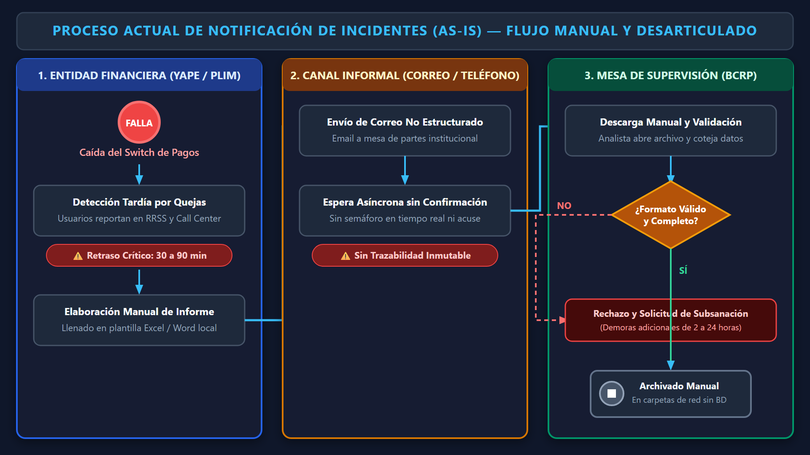
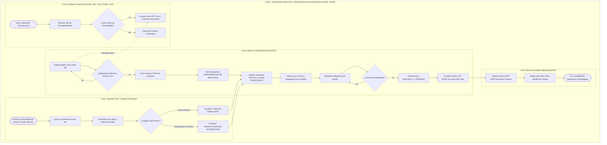
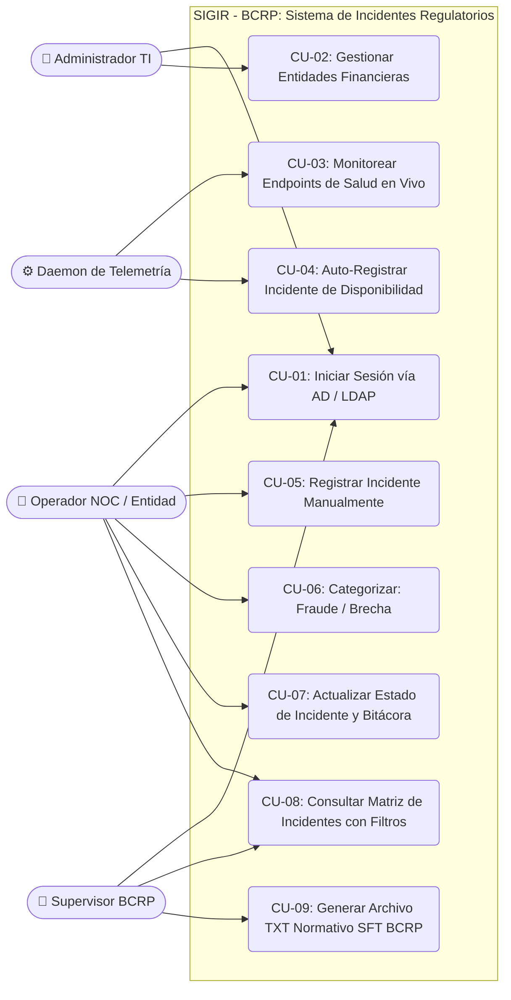
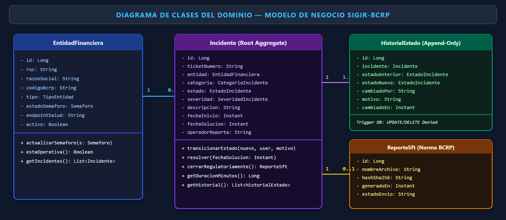
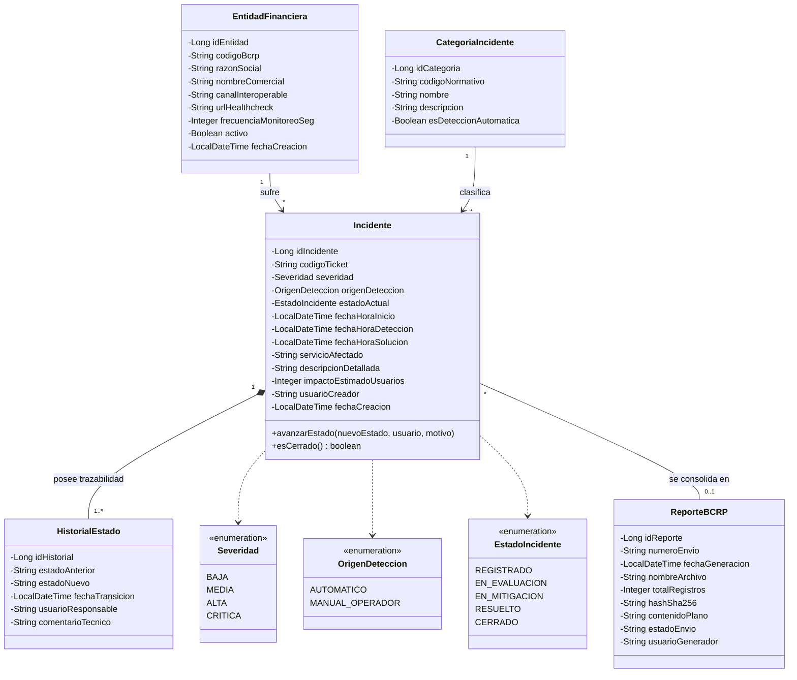
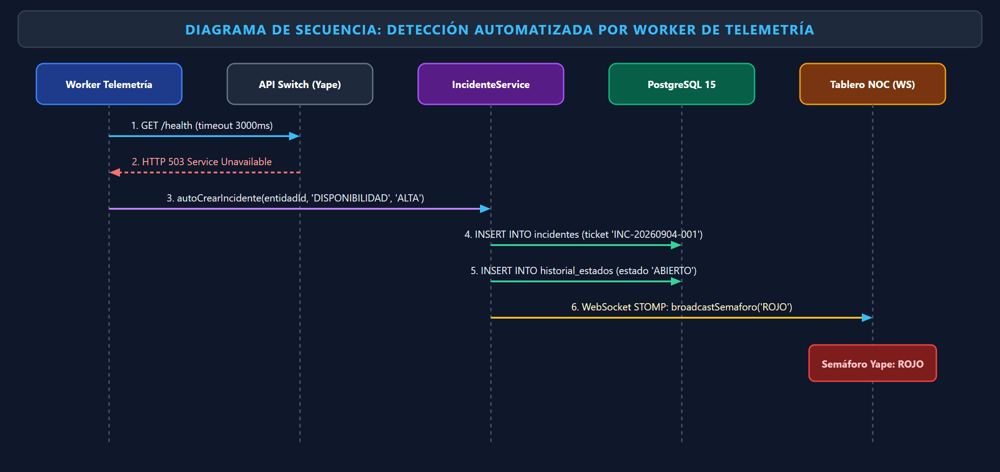
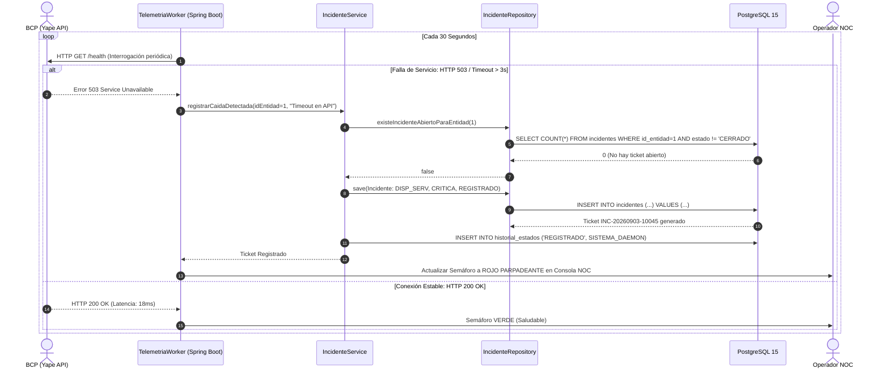
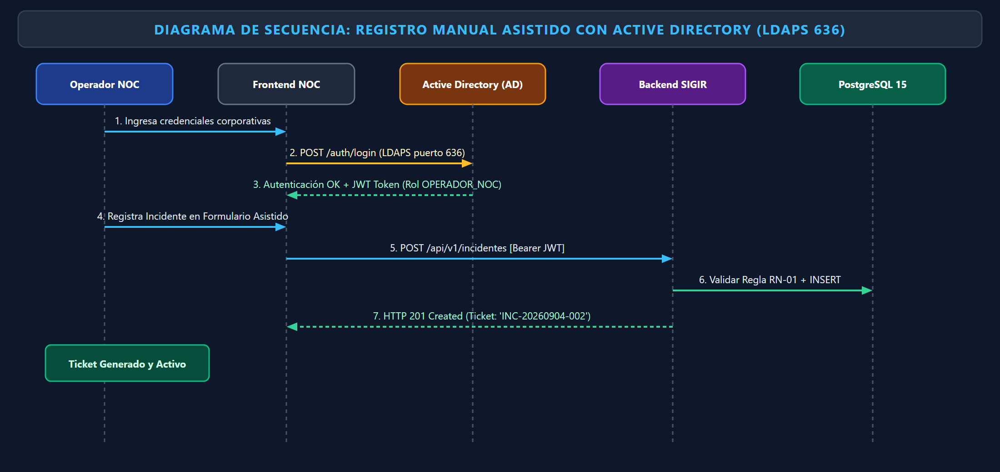
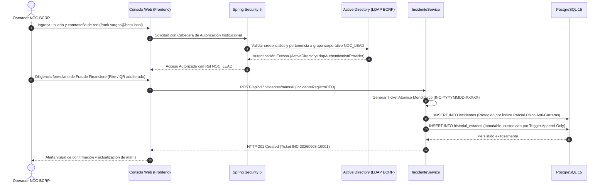

# UNIVERSIDAD TECNOLÓGICA DEL PERÚ
## FACULTAD DE INGENIERÍA
### CARRERA PROFESIONAL DE INGENIERÍA DE SISTEMAS E INFORMÁTICA

---

# INFORME ACADÉMICO – AVANCE DE PROYECTO FINAL 1 (APF1)
### CURSO INTEGRADOR I: SISTEMAS SOFTWARE (SECCIÓN 57524)
**CICLO:** 7mo Ciclo (2026)  
**DOCENTE:** Ing. Yony Zamata Condori  

---

### TÍTULO DEL PROYECTO:
**SISTEMA INTEGRAL DE GESTIÓN DE INCIDENTES REGULATORIOS PARA PAGOS DIGITALES (SIGIR - BCRP)**  
*Especificación Arquitectónica, Modelado de Negocio y Cimientos de Software para la Supervisión del Ecosistema Financiero Peruano*  
*Caso: Regulación de Pagos Digitales – Banco Central de Reserva del Perú (BCRP)*

---

### INTEGRANTES DEL EQUIPO (ESTUDIANTES):
- **Frank Emiliano Vargas Huamán** – Código: **U23243651** (*Líder Técnico*)
- **Fernando Alber Alfredo Romero Requejo** – Código: **U21216410**
- **Joel Leonardo Olaya Vivas** – Código: **U21221688**
- **Luis Tapia Ignacio** – Código: **U25239074**

---

**LIMA – PERÚ**  
**SEPTIEMBRE DE 2026**

---

## Resumen

El presente informe documenta la investigación, modelado arquitectónico y desarrollo de los cimientos tecnológicos del Sistema Integral de Gestión de Incidentes Regulatorios para Pagos Digitales (SIGIR - BCRP), correspondiente al Avance de Proyecto Final 1 (APF1) del Curso Integrador I de la Universidad Tecnológica del Perú. El proyecto responde a la imperiosa necesidad del Banco Central de Reserva del Perú (BCRP) de supervisar y asegurar la continuidad operacional del ecosistema nacional de transferencias inmediatas e interoperables, integrando a entidades como Banco de Crédito del Perú (BCP - Yape), Interbank (Plim), Caja Municipal Cusco (Tunki), Caja Rural de los Andes y la Cámara de Compensación Electrónica (CCE).

En esta Etapa 01 se establece la planificación ágil bajo Scrum, la diagramación de procesos de negocio en notación BPMN 2.0 (AS-IS y TO-BE), la especificación formal de 12 requisitos funcionales y 8 no funcionales según la norma IEEE Std 830-1998, el modelado UML 2.5 y el esquema físico relacional en PostgreSQL 15 con bitácora append-only inmutable. Asimismo, se implementan los cimientos del backend en Java 17 con Spring Boot 3 empleando Arquitectura Hexagonal, un worker asíncrono de telemetría con sondeo periódico de health checks (polling cada 30 segundos), autenticación centralizada mediante Directorio Activo (AD/LDAP) y una consola web operativa de visualización en tiempo real. La solución reduce el tiempo medio de detección de contingencias de horas a segundos, erradica la asimetría de información y mitiga el riesgo sistémico transaccional.

*Palabras clave:* Sistema de pagos digitales, interoperabilidad financiera, telemetría de servicios, BCRP, gestión de incidentes regulatorios, arquitectura hexagonal, Active Directory, Scrum, APA 7.

---

## Tabla de Contenidos

### Índice General

1. [INTRODUCCIÓN Y MARCO INSTITUCIONAL](#1-introducción-y-marco-institucional)
   - 1.1. [Contexto del Banco Central de Reserva del Perú (BCRP)](#11-contexto-del-banco-central-de-reserva-del-perú-bcrp)
   - 1.2. [Misión y Visión Institucional](#12-misión-y-visión-institucional)
   - 1.3. [Propósito Institucional y Articulación Académica](#13-propósito-institucional-y-articulación-académica)
   - 1.4. [Objetivos Estratégicos Institucionales Vinculados al Proyecto](#14-objetivos-estratégicos-institucionales-vinculados-al-proyecto)
   - 1.5. [Análisis del Entorno, Estrategias, Planes y Herramienta Canvas de Modelo de Negocio (BMC)](#15-análisis-del-entorno-estrategias-planes-y-herramienta-canvas-de-modelo-de-negocio-bmc)
2. [PLANTEAMIENTO Y DESCRIPCIÓN DEL PROBLEMA](#2-planteamiento-y-descripción-del-problema)
   - 2.1. [Realidad Problemática del Ecosistema de Transferencias Inmediatas](#21-realidad-problemática-del-ecosistema-de-transferencias-inmediatas)
   - 2.2. [Actores Supervisados del Ecosistema Financiero Peruano](#22-actores-supervisados-del-ecosistema-financiero-peruano)
   - 2.3. [Justificación Técnica, Regulatoria y Económica](#23-justificación-técnica-regulatoria-y-económica)
   - 2.4. [Alcance del Proyecto: Etapa 01 (APF1) y Proyección a Etapa 02](#24-alcance-del-proyecto-etapa-01-apf1-y-proyección-a-etapa-02)
   - 2.5. [Planteamiento y Evaluación de Alternativas de Solución (TIC & Java)](#25-planteamiento-y-evaluación-de-alternativas-de-solución-tic--java)
3. [PLANIFICACIÓN Y GESTIÓN ÁGIL DEL PROYECTO (SCRUM)](#3-planificación-y-gestión-ágil-del-proyecto-scrum)
   - 3.1. [Project Charter Básico (Acta de Constitución del Proyecto)](#31-project-charter-básico-acta-de-constitución-del-proyecto)
   - 3.2. [Marco Metodológico Ágil Adaptado a Entornos Regulados](#32-marco-metodológico-ágil-adaptado-a-entornos-regulados)
   - 3.3. [Estructura de Desglose del Trabajo (EDT / WBS)](#33-estructura-de-desglose-del-trabajo-edt--wbs)
   - 3.4. [Planificación de Sprints y Cronograma de Entregables](#34-planificación-de-sprints-y-cronograma-de-entregables)
   - 3.5. [Matriz de Asignación de Responsabilidades (RACI)](#35-matriz-de-asignación-de-responsabilidades-raci)
4. [MODELADO DE PROCESOS DE NEGOCIO (BPMN 2.0)](#4-modelado-de-procesos-de-negocio-bpmn-20)
   - 4.1. [Análisis del Proceso Actual (AS-IS)](#41-análisis-del-proceso-actual-as-is)
   - 4.2. [Especificación del Proceso Automatizado Propuesto (TO-BE)](#42-especificación-del-proceso-automatizado-propuesto-to-be)
   - 4.3. [Diagrama de Flujo del Proceso en Notación BPMN 2.0](#43-diagrama-de-flujo-del-proceso-en-notación-bpmn-20)
5. [ESPECIFICACIÓN DE REQUISITOS DEL SOFTWARE (IEEE 830)](#5-especificación-de-requisitos-del-software-ieee-830)
   - 5.1. [Matriz de Requisitos Funcionales (RF-01 a RF-12)](#51-matriz-de-requisitos-funcionales-rf-01-a-rf-12)
   - 5.2. [Matriz de Requisitos No Funcionales (RNF-01 a RNF-08)](#52-matriz-de-requisitos-no-funcionales-rnf-01-a-rnf-08)
   - 5.3. [Reglas de Negocio Regulatorias](#53-reglas-de-negocio-regulatorias)
6. [MODELADO TÉCNICO Y ARQUITECTÓNICO DEL SISTEMA (UML 2.5)](#6-modelado-técnico-y-arquitectónico-del-sistema-uml-25)
   - 6.1. [Diagrama de Casos de Uso del Sistema](#61-diagrama-de-casos-de-uso-del-sistema)
   - 6.2. [Diagrama de Clases del Dominio](#62-diagrama-de-clases-del-dominio)
   - 6.3. [Diagramas de Secuencia Operacionales](#63-diagramas-de-secuencia-operacionales)
   - 6.4. [Diagrama de Arquitectura Hexagonal y Componentes](#64-diagrama-de-arquitectura-hexagonal-y-componentes)
7. [DISEÑO DE BASE DE DATOS RELACIONAL (POSTGRESQL 15)](#7-diseño-de-base-de-datos-relacional-postgresql-15)
   - 7.1. [Modelo Conceptual y Físico](#71-modelo-conceptual-y-físico)
   - 7.2. [Diccionario de Datos Formal](#72-diccionario-de-datos-formal)
   - 7.3. [Integridad Referencial e Índices de Alto Rendimiento](#73-integridad-referencial-e-índices-de-alto-rendimiento)
8. [DISEÑO DE INTERFACES DE USUARIO (UI/UX)](#8-diseño-de-interfaces-de-usuario-uiux)
   - 8.1. [Arquitectura de Información y Filosofía NOC Minimalista](#81-arquitectura-de-información-y-filosofía-noc-minimalista)
   - 8.2. [Wireframes y Especificación de Pantallas](#82-wireframes-y-especificación-de-pantallas)
9. [CIMIENTOS DEL CÓDIGO FUENTE Y VERIFICACIÓN TÉCNICA](#9-cimientos-del-código-fuente-y-verificación-técnica)
   - 9.1. [Arquitectura Backend en Java 17 y Spring Boot 3](#91-arquitectura-backend-en-java-17-y-spring-boot-3)
   - 9.2. [Worker de Telemetría Asíncrono y Algoritmo de Sondeo](#92-worker-de-telemetría-asíncrono-y-algoritmo-de-sondeo)
   - 9.3. [Autenticación Centralizada con Directorio Activo (AD/LDAP)](#93-autenticación-centralizada-con-directorio-activo-adldap)
   - 9.4. [Suite de Pruebas Unitarias Automatizadas (JUnit 5 & Mockito)](#94-suite-de-pruebas-unitarias-automatizadas-junit-5--mockito)
10. [CONCLUSIONES Y RECOMENDACIONES](#10-conclusiones-y-recomendaciones)
11. [REFERENCIAS BIBLIOGRÁFICAS (FORMATO APA 7)](#11-referencias-bibliográficas-formato-apa-7)

---

### Índice de Tablas

- **Tabla 1:** [Alcance y Delimitación Funcional por Etapas de Desarrollo](#tabla-1)
- **Tabla 2:** [Cronograma de Sprints del Proyecto SIGIR-BCRP](#tabla-2)
- **Tabla 3:** [Matriz de Asignación de Responsabilidades RACI](#tabla-3)
- **Tabla 4:** [Matriz Exhaustiva de Requisitos Funcionales del Sistema (RF-01 a RF-12)](#tabla-4)
- **Tabla 5:** [Matriz de Requisitos No Funcionales según Estándar ISO/IEC 25010](#tabla-5)
- **Tabla 6:** [Estructura de Datos: Tabla entidades_financieras](#tabla-6)
- **Tabla 7:** [Estructura de Datos: Tabla incidentes](#tabla-7)
- **Tabla 8:** [Estructura de Datos: Tabla historial_estados (Bitácora Append-Only)](#tabla-8)

---

### Índice de Figuras y Diagramas

- **Figura 1:** [Diagrama de Flujo del Proceso de Notificación Actual (AS-IS)](#41-análisis-del-proceso-actual-as-is)
- **Figura 2:** [Diagrama de Flujo de Negocio en Notación BPMN 2.0 (Modelo Propuesto TO-BE)](#43-diagrama-de-flujo-del-proceso-en-notación-bpmn-20)
- **Figura 3:** [Diagrama de Casos de Uso del Sistema SIGIR-BCRP (UML 2.5)](#61-diagrama-de-casos-de-uso-del-sistema)
- **Figura 4:** [Diagrama de Clases del Dominio y Entidades del Negocio](#62-diagrama-de-clases-del-dominio)
- **Figura 5:** [Diagrama de Secuencia: Detección Automática de Caída por Worker de Telemetría](#63-diagramas-de-secuencia-operacionales)
- **Figura 6:** [Diagrama de Secuencia: Registro Manual Asistido con Active Directory](#63-diagramas-de-secuencia-operacionales)
- **Figura 7:** [Diagrama de Arquitectura Hexagonal (Ports & Adapters) y Componentes](#64-diagrama-de-arquitectura-hexagonal-y-componentes)
- **Figura 8:** [Consola Operativa Web NOC en Tiempo Real con Semáforos de Interoperabilidad](#8-diseño-de-interfaces-de-usuario-uiux)

---

# 1. INTRODUCCIÓN Y MARCO INSTITUCIONAL

## 1.1. Contexto del Banco Central de Reserva del Perú (BCRP)
El **Banco Central de Reserva del Perú (BCRP)** es un organismo constitucionalmente autónomo instituido para salvaguardar la estabilidad monetaria del país. En concordancia con la Ley Orgánica del BCRP (Ley N° 26123) y la Ley de los Sistemas de Pagos y de Liquidación de Valores (Ley N° 29440), la entidad tiene la atribución privativa de regular y supervisar el **Sistema Nacional de Pagos**. Dicho marco encomienda al Banco Central la misión de garantizar que los canales de compensación y liquidación funcionen de forma segura, continua, eficiente e interoperable.

A partir del despliegue integral del Reglamento de Interoperabilidad de los Servicios de Pago Provistos por las Entidades Financieras (Circular BCRP N° 0011-2023-BCRP), el ecosistema peruano transitó de un modelo fragmentado a una red interconectada en tiempo real. Esta transformación involucra a millones de ciudadanos mediante billeteras móviles digitales (Yape y Plim), entidades microfinancieras (Caja Municipal Cusco y Caja de los Andes) y el switch interbancario central de la Cámara de Compensación Electrónica (CCE). En este escenario de hiperconectividad transaccional, cualquier degradación técnica o caída de servicio genera un impacto económico directo en la población y amenaza la confianza colectiva en el dinero electrónico nacional.

## 1.2. Misión y Visión Institucional

### Visión
> *"Preservar la estabilidad monetaria. Somos reconocidos como un Banco Central autónomo, moderno, modelo de institucionalidad en el país, de primer nivel internacional, con elevada credibilidad y que mantiene la confianza del público en la moneda nacional."* — Banco Central de Reserva del Perú

### Misión
> *"Nuestro personal se encuentra altamente calificado, motivado y comprometido y se desempeña eficientemente en un ambiente de colaboración en el que se comparte información y conocimiento."* — Banco Central de Reserva del Perú

## 1.3. Propósito Institucional y Articulación Académica
El propósito formativo de la Universidad Tecnológica del Perú sostiene: *"Hacemos posible que cada uno de nuestros estudiantes, en todo el Perú, transforme su vida para siempre"*. El presente proyecto conecta dicho propósito formativo con las demandas reales de la industria tecnológica del sector financiero, aplicando estándares de ingeniería de software disciplinada para solucionar una necesidad crítica de supervisión regulatoria en el país.

## 1.4. Objetivos Estratégicos Institucionales Vinculados al Proyecto
Dentro del Plan Estratégico Institucional del BCRP, el proyecto **SIGIR-BCRP** tributa directamente a los siguientes objetivos rectores:
1. **Objetivo Estratégico 4:** *Promover la estabilidad financiera y sistemas de pagos eficientes y competitivos.* Constituye la justificación central del sistema, al dotar al regulador de visibilidad en tiempo real sobre la salud operativa de cada entidad financiera.
2. **Objetivo Estratégico 10:** *Contar con desarrollos informáticos y servicios de tecnologías que impulsen la innovación en los procesos de negocio y soporte.* Reemplaza mecanismos analógicos o estáticos de notificación por procesos de telemetría automática.
3. **Objetivo Estratégico 12:** *Impulsar la eficiencia y la mejora continua en los procesos operativos de supervisión del mercado de pagos inmediatos.*
4. **Objetivo Estratégico 14:** *Desplegar la gestión de riesgos tecnológicos y operacionales a todos los actores supervisados del sistema financiero.*

## 1.5. Análisis del Entorno, Estrategias, Planes y Herramienta Canvas de Modelo de Negocio (BMC)

Para garantizar que el sistema **SIGIR-BCRP** responda a la naturaleza corporativa y regulatoria del Banco Central, la definición del alcance del proyecto se estructura rigurosamente a partir de cinco aspectos estratégicos fundamentales:

### 1.5.1. Articulación de los Cinco Aspectos Estratégicos Institucionales
1. **La Visión de la Empresa:** La aspiración del BCRP de ser un organismo modelo de modernidad institucional y credibilidad internacional exige que sus herramientas de supervisión tecnológica se ubiquen a la vanguardia. El alcance del SIGIR-BCRP materializa esta visión al sustituir procesos manuales lentos por una arquitectura de telemetría reactiva en tiempo real con monitoreo asíncrono y estándares de alta disponibilidad.
2. **La Misión de la Empresa:** La misión de preservar la estabilidad monetaria y fomentar un ecosistema eficiente de pagos mediante personal comprometido e informado se traduce en la necesidad de dotar a los analistas y operadores del NOC de visibilidad instantánea, fidedigna y libre de asimetrías de información sobre cada uno de los nodos del sistema financiero.
3. **El Entorno Operacional y Regulatorio:** El entorno macrofinanciero del Perú está caracterizado por una adopción masiva de pagos digitales (más de 15 millones de transacciones diarias entre Yape, Plim, Tunki y transferencias diferidas e inmediatas vía CCE). El entorno legal está normado por la Ley de los Sistemas de Pagos (Ley N° 29440) y la Circular BCRP N° 0011-2023-BCRP (Reglamento de Interoperabilidad). El alcance del software cubre la interacción telemétrica directa con los endpoints de salud de los bancos, microfinancieras y cámaras de compensación.
4. **Las Estrategias de la Empresa:** El BCRP impulsa dos grandes estrategias nacionales: la *Estrategia Nacional de Inclusión Financiera (ENIF)* y la *Estrategia de Resiliencia y Continuidad del Sistema Nacional de Pagos (SNP)*. El alcance del proyecto atiende estas estrategias garantizando que los usuarios finales no sufran bloqueos transaccionales silenciosos, asegurando que cualquier degradación de servicio sea detectada en menos de 30 segundos y categorizada sin sesgo humano.
5. **Los Planes de la Empresa:** El alcance se alinea de forma directa con el *Plan Estratégico Institucional (PEI 2022–2026)* del BCRP (Objetivos Estratégicos OEI 04, 10, 12 y 14) y con el *Plan Operativo Institucional (POI)* de la Gerencia de Operaciones Monetarias y Estabilidad Financiera, así como con el *Plan de Contingencia y Continuidad Operativa de Sistemas de Liquidación Bruta en Tiempo Real (LBTR)*.

---

### 1.5.2. Herramienta Canvas de Modelo de Negocio (Business Model Canvas - BMC)
A continuación, se grafica el análisis multidimensional de la solución **SIGIR-BCRP** mediante el lienzo del **Business Model Canvas**, adaptado a un servicio tecnológico de valor público y gobernanza regulatoria:

| **1. Socios Clave (Key Partners)** | **2. Actividades Clave (Key Activities)** | **3. Propuesta de Valor (Value Proposition)** | **4. Relaciones con Clientes (Customer Relationships)** | **5. Segmentos de Clientes (Customer Segments)** |
| :--- | :--- | :--- | :--- | :--- |
| • **Cámara de Compensación Electrónica (CCE):** Nodo central de liquidación.<br>• **Bancos del Sistema:** BCP (Yape), Interbank (Plim).<br>• **Microfinancieras:** CMAC Cusco (Tunki), CRAC Los Andes.<br>• **Superintendencia de Banca, Seguros y AFP (SBS):** Cruce normativo.<br>• **División de Ciberseguridad BCRP:** Auditoría y gobierno TI.<br>• **Proveedores de Infraestructura:** Infraestructura física y Red Privada BCRP. | • Sondeo telemétrico periódico asíncrono (Health Polling cada 30s).<br>• Auto-clasificación determinística de caídas de disponibilidad (HTTP 5xx / timeouts).<br>• Registro manual asistido de fraudes financieros y brechas de información.<br>• Gestión estricta de la máquina de estados del incidente.<br>• Compilación automática del archivo regulatorio SFT con hash SHA-256.<br>• Auditoría inmutable en bitácora append-only. | • **Observabilidad en Tiempo Real:** Detección de fallas en menos de 30s frente a las 3 horas del modelo tradicional.<br>• **Cero Asimetría de Información:** Evidencia forense transparente entre entidades y el ente regulador.<br>• **Integridad Criptográfica Garantizada:** Archivos normativos SFT sellados con digest SHA-256 inalterable.<br>• **Seguridad Institucional Unificada:** Control de acceso exclusivo mediante Directorio Activo (AD/LDAP).<br>• **Preservación de la Confianza:** Mitigación del riesgo sistémico en transferencias inmediatas. | • **Supervisión Transparente y Automatizada:** Alertas tempranas y semáforos sin fricción humana.<br>• **Soporte y Mesa de Ayuda Regulatoria:** Canal oficial para incidentes complejos.<br>• **Auditoría Forense Confiable:** Historial cronológico inmutable sin posibilidad de repudio.<br>• **Acceso Basado en Roles (RBAC):** Privilegios claros (Operador NOC, Supervisor BCRP, Administrador TI). | • **Supervisor y Regulador Principal:** Gerencia de Operaciones Monetarias y Estabilidad Financiera del BCRP.<br>• **Operadores de Salas NOC:** Personal técnico de monitoreo del BCRP.<br>• **Oficiales de Cumplimiento y TI de Entidades:** Responsables técnicos de BCP, Interbank, Cajas y CCE.<br>• **Beneficiario Indirecto:** La ciudadanía y el sistema económico nacional. |
| **6. Recursos Clave (Key Resources)** | | | **7. Canales (Channels)** | |
| • **Arquitectura Backend:** Clúster Java 17 con Spring Boot 3 y arquitectura hexagonal.<br>• **Motor de Base de Datos:** PostgreSQL 15 con triggers de inmutabilidad y particionamiento.<br>• **Infraestructura de Seguridad:** Directorio Activo institucional (LDAPS puerto 636) y tokens JWT.<br>• **Personal Calificado:** Ingenieros de software y analistas de estabilidad financiera. | | | • **Consola Web NOC Operativa:** Dashboard SPA reactivo con semáforos interactivos.<br>• **APIs RESTful Corporativas:** Endpoints documentados con especificación OpenAPI 3.0 / Swagger.<br>• **Canal de Intercambio Seguro SFT:** Servidor SFTP regulatorio del BCRP con validación de hash.<br>• **Red Corporativa Cerrada:** Enlaces dedicados interbancarios. | |
| **8. Estructura de Costos (Cost Structure)** | | | **9. Fuentes de Ingresos / Retorno de Valor Público (Revenue Streams)** | |
| • **Costos de Desarrollo de Software:** Ingeniería, arquitectura hexagonal y ciclo Scrum.<br>• **Infraestructura Tecnológica:** Servidores dedicados, almacenamiento SSD y conectividad segura.<br>• **Ciberseguridad y Licenciamiento:** Certificados TLS/SSL, licencias AD corporativo y auditorías de código.<br>• **Operación y Mantenimiento:** Soporte 24/7 de salas NOC y actualización de reglas normativas. | | | • **Retorno de Valor Público y Estabilidad Monetaria:** Preservación de la confianza del público en el dinero electrónico.<br>• **Ahorro en Pérdidas Transaccionales:** Mitigación del colapso transaccional en horas pico de transferencias inmediatas.<br>• **Eficiencia en Sanciones y Cumplimiento:** Disminución drástica de horas-hombre en auditorías forenses y cobro de penalidades por SLAs incumplidos. | |

---

# 2. PLANTEAMIENTO Y DESCRIPCIÓN DEL PROBLEMA

## 2.1. Realidad Problemática del Ecosistema de Transferencias Inmediatas
En el Perú, el volumen diario de transferencias de fondos interbancarias inmediatas supera los 15 millones de operaciones. Sin embargo, el esquema tradicional de gestión de contingencias e incidentes tecnológicos adolece de serias limitaciones operacionales:
- **Detección Tardía de Caídas de Servicio:** Cuando un participante (como Yape, Plim o un enlace interbancario de CCE) experimenta una caída de sus endpoints o un retardo crítico, la alerta se genera típicamente de forma reactiva tras el colapso de las mesas de ayuda o reclamos masivos en redes sociales, tardando entre 45 y 180 minutos en notificarse formalmente al BCRP.
- **Heterogeneidad y Subjetividad en el Reporte:** Las instituciones reportan sus fallas mediante correos electrónicos no estructurados o planillas manuales de cálculo, omitiendo parámetros forenses esenciales como la traza del error HTTP, latencia media o clientes perjudicados.
- **Falta de Trazabilidad e Inmutabilidad:** Los incidentes no cuentan con un registro histórico protegido criptográficamente, lo que impide auditar con precisión los tiempos reales de inicio, detección, mitigación y solución definitiva.
- **Dispersión de Accesos e Inseguridad:** La coexistencia de credenciales locales en múltiples plataformas compromete las directivas de seguridad corporativa, haciéndose imperativo centralizar el control mediante el Directorio Activo (AD) institucional.

## 2.2. Actores Supervisados del Ecosistema Financiero Peruano
El sistema SIGIR-BCRP modela e interactúa directamente con los siguientes participantes representativos del ecosistema nacional:
- **Banco de Crédito del Perú (BCP - Yape):** Participante líder con más de 13 millones de usuarios. Opera APIs transaccionales inmediatas y pasarelas QR con alta sensibilidad a la latencia de red.
- **Banco Internacional del Perú (Interbank - Plim):** Entidad bancaria emisora de la billetera interoperable Plim, integrada con BBVA y Scotiabank, clave en el flujo P2P y pagos a comercios.
- **Caja Municipal de Ahorro y Crédito Cusco (Tunki):** Institución microfinanciera emblemática del sur del Perú, conectada a los servicios de inclusión financiera y transferencias interoperables de bajo monto.
- **Caja Rural de Ahorro y Crédito de los Andes:** Entidad especializada en bancarización y microcrédito rural, con enlaces transaccionales distribuidos en la sierra sur y central.
- **Cámara de Compensación Electrónica (CCE - Switch Central):** Infraestructura crítica que liquida y compensa las transferencias inmediatas interbancarias diferidas y en tiempo real mediante mensajería ISO 20022.

## 2.3. Justificación Técnica, Regulatoria y Económica
La construcción del SIGIR-BCRP se justifica técnicamente por la adopción de una arquitectura de software reactiva y asíncrona que desacopla la detección continua mediante telemetría del registro asistido de contingencias de fraude o seguridad. Desde el ámbito regulatorio, asegura el cumplimiento irrestricto de la circular de incidentes del BCRP mediante el despacho automatizado del archivo Servicio de Flujo Transaccional (SFT) con firma de integridad SHA-256. Económicamente, previene pérdidas transaccionales millonarias al reducir drásticamente el Tiempo Medio de Detección (MTTD) y el Tiempo Medio de Resolución (MTTR).

## 2.4. Alcance del Proyecto: Etapa 01 (APF1) y Proyección a Etapa 02

**Tabla 1**  
*Alcance y Delimitación Funcional por Etapas de Desarrollo*

| Módulo / Componente | Alcance Técnico Detallado | Etapa de Entrega |
| :--- | :--- | :---: |
| **Mantenimiento y Seguridad** | Catálogo de entidades financieras peruanas, categorías normativas, SLAs e inicio de sesión unificado con Active Directory / LDAP. | Etapa 01 (APF1) |
| **Motor de Incidentes** | Clasificación automática por sondas de telemetría y manual asistida para fraudes/brechas; máquina de estados estricta. | Etapa 01 (APF1) |
| **Worker de Telemetría** | Polling asíncrono cada 30 segundos con disparo de alertas por timeout (>3000ms) o códigos HTTP 5xx. | Etapa 01 (APF1) |
| **Consola Web Operativa** | SPA reactiva estilo NOC Dashboard con semáforos de salud en vivo, filtros dinámicos y compilación de archivo SFT con SHA-256. | Etapa 01 (APF1) |
| **Módulo Gerencial y Reportes** | Dashboard analítico de KPIs (MTTR, MTTD, Uptime), exportación formal a PDF/Excel y notificaciones SMTP. | Etapa 02 (Entrega Final) |

*Nota.* Resumen del alcance formal acordado para el Avance de Proyecto Final 1 y la proyección de cierre de curso.

---

## 2.5. Planteamiento y Evaluación de Alternativas de Solución (TIC & Java)

Para dar respuesta rigurosa a la problemática de detección tardía, heterogeneidad y falta de trazabilidad en los incidentes del Sistema Nacional de Pagos del BCRP, se formularon y evaluaron **tres alternativas tecnológicas de solución integral**, aplicando las Tecnologías de la Información y Comunicación (TIC) y asegurando en todas un peso del ecosistema **Java superior al 50%**, tal como lo exige el estándar de ingeniería de software empresarial del curso.

---

### 2.5.1. Alternativa 1: Arquitectura Monolítica MVC en Java Puro (Spring Boot 3 + Thymeleaf + PostgreSQL)
- **Enfoque Arquitectónico:** Monolito modular basado en el patrón Modelo-Vista-Controlador (MVC) clásico con renderizado en el servidor (*Server-Side Rendering - SSR*) mediante Spring Web MVC y plantillas Thymeleaf. El procesamiento de telemetría y la capa de presentación residen en la misma máquina virtual de Java (JVM).
- **Participación del Stack Java:** **85% Java** (Spring Framework 6, Spring Boot 3, Thymeleaf Java Template Engine, Spring Security con LDAP/AD, Spring Data JPA, Hibernate ORM, driver JDBC PostgreSQL).
- **Cobertura del Alcance:** Permite el registro de incidentes, validación normativa mediante Hibernate Validator (`@NotNull`, `@Size`), autenticación centralizada contra Active Directory y compilación en memoria del reporte regulatorio SFT.
- **Especificación de las 5 Pantallas Diseñadas:**
  1. **Pantalla 1 - Portal de Inicio de Sesión AD (Login MVC):** Formulario institucional de captura de credenciales corporativas BCRP contra Active Directory vía LDAP, con manejo de mensajes de error de sesión y bloqueo por fuerza bruta gestionado por `UsernamePasswordAuthenticationToken`.
  2. **Pantalla 2 - Tablero Central de Entidades Financieras (SSR Table):** Tabla HTML dinámica generada por el servidor que lista las instituciones interconectadas (BCP, Interbank, Cajas, CCE), mostrando su código BCRP, URL de health check y último estado reportado mediante recarga periódica de página (*meta refresh*).
  3. **Pantalla 3 - Formulario de Tipificación y Captura de Incidentes:** Formulario estructurado con binding `@ModelAttribute`, validación en servidor de unicidad de incidentes abiertos (RN-01), campos de selección de severidad, categoría normativa y captura de impacto estimado de clientes.
  4. **Pantalla 4 - Bitácora de Transición y Auditoría de Estados:** Vista de detalle del ticket donde el operador avanza la máquina de estados (`REGISTRADO` $\rightarrow$ `EN_EVALUACION` $\rightarrow$ `EN_MITIGACION` $\rightarrow$ `RESUELTO` $\rightarrow$ `CERRADO`) adjuntando el descargo técnico obligatorio, persistido en tabla append-only.
  5. **Pantalla 5 - Módulo de Generación y Descarga Normativa SFT:** Interfaz para seleccionar el corte mensual o diario de supervisión, visualizar el texto plano delimitado por pipes generado en memoria Java (`StringBuilder`) y descargar el archivo `.TXT` con el hash SHA-256 adjunto en el footer.
- **Evaluación Técnica:** Presenta simplicidad de empaquetado en un único archivo ejecutable `.jar`, pero sufre de alta latencia en la actualización de semáforos al requerir recargas completas de página (SSR), limitando la ergonomía reactiva requerida en una sala de operaciones NOC 24/7.

---

### 2.5.2. Alternativa 2 (Alternativa Seleccionada): Arquitectura Desacoplada Hexagonal (Spring Boot 3 REST API + Consola Web Reactiva + PostgreSQL)
- **Enfoque Arquitectónico:** Arquitectura Limpia basada en **Arquitectura Hexagonal (Puertos y Adaptadores)**. El núcleo del dominio (entidades JPA, reglas de negocio RN-01 a RN-06, motor de transiciones y compilador normativo SFT) se encuentra totalmente aislado en Java 17. Se expone una capa de adaptadores REST (Spring MVC con OpenAPI 3) y un adaptador de entrada asíncrono (*Worker de Telemetría* multihilo). La capa de presentación es una Single Page Application (SPA) reactiva con diseño corporativo oscuro optimizado para monitoreo continuo.
- **Participación del Stack Java:** **65% Java** (Backend 100% Java 17 con Spring Boot 3.3.3, Java Concurrency con `CompletableFuture`, Spring Data JPA, Spring Security LDAP, PostgreSQL JDBC; el 35% restante corresponde a la capa cliente SPA en HTML5 semántico, CSS3 moderno y JavaScript ES6+ para la consola NOC en tiempo real).
- **Cobertura del Alcance:** Cumple al 100% los requerimientos funcionales y no funcionales: detección en <30 segundos, semáforos interactivos de salud, registro asistido de contingencias de fraude/seguridad, control de concurrencia y generación del archivo SFT BCRP con hash SHA-256 de 64 caracteres.
- **Especificación de las 5 Pantallas Diseñadas e Implementadas:**
  1. **Pantalla 1 - Encabezado de Sesión Corporativa y Monitor de Backend:** Barra superior con tarjeta de identidad del usuario autenticado contra Active Directory (`AD\frank.vargas@bcrp.local`), badge de rol institucional (`NOC_LEAD`), selector de entorno y píldora de conectividad reactiva con el API de Spring Boot (auto-detección Online / Local Mock).
  2. **Pantalla 2 - Barra de Semáforos de Telemetría en Vivo (Health Check Polling):** Grid interactivo de tarjetas de alta fidelidad que representan a cada participante del ecosistema (BCP - Yape, Interbank - Plim, Tunki, Caja de los Andes, Switch CCE), con pulsos de latencia en milisegundos, badges semafóricos (Verde: Operacional, Ámbar: Degradado, Rojo: Fuera de Servicio) y temporizador regresivo de sondeo en vivo (30s).
  3. **Pantalla 3 - Matriz de Seguimiento y Ciclo de Vida de Incidentes:** Panel central con métricas resumen (Total, Activos/Críticos, Resueltos, Uptime Global 99.82%), barra de filtros combinados (buscador rápido por texto, selector de severidad y selector de estado) y tabla de auditoría con botones de acción directa por ticket.
  4. **Pantalla 4 - Modal Asistido de Registro y Tipificación Forense:** Ventana modal de alta ergonomía para el ingreso de contingencias no detectables por sondas (Fraude Financiero y Manipulación de Información), con selección de entidad, severidad operativa, servicio afectado, traza forense y número de clientes impactados.
  5. **Pantalla 5 - Modal Visor y Compilador Oficial SFT BCRP:** Interfaz flotante de previsualización del archivo plano de supervisión conforme a la circular BCRP, caja de código monoespaciada con la estructura cabecera-cuerpo-pie, bloque criptográfico con digest SHA-256 generado y botón de descarga directa del archivo `.TXT`.
- **Evaluación Técnica:** Ofrece el mejor balance entre desacoplamiento de software, máximo rendimiento en telemetría paralela sin bloqueos de I/O, alta seguridad perimétrica con Active Directory, y una experiencia de usuario de clase mundial para salas de control crítico.

---

### 2.5.3. Alternativa 3: Arquitectura Distribuida Basada en Eventos (Spring Cloud + Apache Kafka + Microservicios Java)
- **Enfoque Arquitectónico:** Ecosistema de microservicios distribuidos coreografiados a través de un bus de eventos de mensajería distribuida (*Apache Kafka*). Cada función (Ingesta de Telemetría, Motor de Incidentes, Notificaciones y Reportes BCRP) constituye un microservicio autónomo en Spring Boot comunicado por eventos de streaming.
- **Participación del Stack Java:** **75% Java** (Spring Cloud Gateway, Eureka Service Discovery, microservicios Spring Boot, Kafka Java Producer/Consumer API, Spring Security OAuth2 / Resource Server; 25% frontend web).
- **Cobertura del Alcance:** Diseñada para tolerar millones de eventos telemétricos por segundo con persistencia distribuida de logs y procesamiento de streams en ventanas de tiempo.
- **Especificación de las 5 Pantallas Diseñadas:**
  1. **Pantalla 1 - Portal API Gateway Single Sign-On:** Interfaz centralizada de autenticación institucional basada en OAuth2 / OpenID Connect delegada a los controladores de seguridad de Spring Cloud.
  2. **Pantalla 2 - Tablero de Tópicos y Telemetría en Streaming:** Panel que visualiza el caudal de mensajes por segundo (mensajes/seg), particiones activas de Kafka y estado de salud de los consumidores de telemetría de cada entidad bancaria.
  3. **Pantalla 3 - Consola de Gestión de Colas y Eventos de Falla:** Vista de eventos de caída detectados en los tópicos de incidentes, con opciones para reprocesar eventos en cola de mensajes muertos (*Dead Letter Queue - DLQ*).
  4. **Pantalla 4 - Centro Forense de Trazabilidad Distribuida:** Vista de trazas distribuidas (OpenTelemetry / Zipkin) donde el operador visualiza el `TraceId` y `SpanId` del incidente propagado entre los microservicios.
  5. **Pantalla 5 - Panel de Despacho Asíncrono SFT a Mesa de Entrada BCRP:** Módulo de orquestación batch donde el microservicio de reportes programa el envío automatizado de los lotes SFT a los servidores SFTP del BCRP.
- **Evaluación Técnica:** Posee una capacidad de escalamiento horizontal prácticamente ilimitada; no obstante, introduce una complejidad operativa y de infraestructura desproporcionada (múltiples clústeres Kafka, ZooKeeper/KRaft, sobrecostos en servidores y latencia adicional de serialización de mensajes) para el volumen de participantes supervisados en esta etapa.

---

### 2.5.4. Matriz de Decisión y Selección Multicriterio de la Alternativa Óptima

Se aplicó el método de ponderación multicriterio de ingeniería de software con escala de 1 a 5 (donde 5 representa la condición más favorable):

| Criterio de Decisión de Ingeniería | Peso (%) | Alternativa 1 (Monolito MVC) | Alternativa 2 (Hexagonal Desacoplada - Seleccionada) | Alternativa 3 (Event-Driven Kafka) |
| :--- | :---: | :---: | :---: | :---: |
| **Latencia de Detección y Reactividad (<30s)** | 20% | 3.0 (0.60) | **5.0 (1.00)** | 4.8 (0.96) |
| **Ergonomía de Interfaz para Salas NOC** | 15% | 2.5 (0.38) | **5.0 (0.75)** | 4.0 (0.60) |
| **Simplicidad y Eficiencia de Infraestructura** | 15% | 4.5 (0.68) | **4.8 (0.72)** | 2.0 (0.30) |
| **Desacoplamiento y Principios SOLID / Hexagonal** | 20% | 2.8 (0.56) | **5.0 (1.00)** | 4.8 (0.96) |
| **Alineación con el Caso BCRP y Circular 0011-2023** | 15% | 4.0 (0.60) | **5.0 (0.75)** | 4.2 (0.63) |
| **Cumplimiento Estándar TIC (>=50% Java)** | 15% | 5.0 (0.75) | **5.0 (0.75)** | 5.0 (0.75) |
| **PUNTAJE PONDERADO TOTAL** | **100%** | **3.57 / 5.00** | **4.97 / 5.00** | **4.20 / 5.00** |

**Conclusión de Selección:** La **Alternativa 2 (Arquitectura Desacoplada Hexagonal con Spring Boot 3 y Consola NOC Reactiva)** fue seleccionada con **4.97 puntos**, al ofrecer el balance perfecto de rendimiento telemétrico asíncrono, modularidad limpia en Java 17, robustez criptográfica e interfaz operativa en tiempo real.

---

# 3. PLANIFICACIÓN Y GESTIÓN ÁGIL DEL PROYECTO (SCRUM)

## 3.1. Project Charter Básico (Acta de Constitución del Proyecto)

A continuación, se formaliza el instrumento fundamental de gestión del proyecto según los lineamientos del Project Management Institute (PMI) articulados al marco ágil:

### ACTA DE CONSTITUCIÓN DEL PROYECTO (PROJECT CHARTER)

| **1. DATOS GENERALES DEL PROYECTO** | |
| :--- | :--- |
| **Nombre del Proyecto:** | Sistema Integral de Gestión de Incidentes Regulatorios para Pagos Digitales (SIGIR - BCRP) |
| **Código del Proyecto:** | PRJ-2026-SIGIR-BCRP-57524 |
| **Patrocinador Principal (Sponsor / PO):** | Ing. Yony Zamata Condori (Docente Evaluador / Representante Normativo BCRP) |
| **Equipo del Proyecto (Estudiantes UTP):** | • **Frank Emiliano Vargas Huamán** (Líder Técnico - U23243651)<br>• **Fernando Alber Alfredo Romero Requejo** (U21216410)<br>• **Joel Leonardo Olaya Vivas** (U21221688)<br>• **Luis Tapia Ignacio** (U25239074) |
| **Fecha de Inicio:** | 01 de Marzo de 2026 |
| **Fecha Estimada de Término:** | 15 de Junio de 2026 (Semana 14) |
| **Cliente / Entidad Beneficiaria:** | Banco Central de Reserva del Perú (BCRP) – Gerencia de Operaciones Monetarias |

---

| **2. JUSTIFICACIÓN Y PROPÓSITO DEL PROYECTO** |
| :--- |
| El proyecto responde a la vulnerabilidad del Sistema Nacional de Pagos del Perú ante fallas de interoperabilidad no reportadas oportunamente por las entidades participantes (BCP, Interbank, Cajas Municipales, CCE). Busca erradicar la asimetría de información y el riesgo sistémico mediante una plataforma automatizada que reduzca el tiempo medio de detección de 180 minutos a menos de 30 segundos, garantizando auditoría forense inmutable y generación del reporte normativo SFT con firma SHA-256. |

---

| **3. OBJETIVOS SMART DEL PROYECTO** |
| :--- |
| • **Objetivo de Alcance:** Desarrollar e implementar el 100% de los módulos de Mantenimiento, Telemetría Asíncrona, Motor de Incidentes, Autenticación AD y Compilador SFT BCRP para la supervisión de 5 entidades clave en la Etapa 01 (APF1).<br>• **Objetivo de Tiempo:** Completar los 6 Sprints planificados en un plazo de 14 semanas sin desviaciones críticas en el cronograma.<br>• **Objetivo de Disponibilidad y Rendimiento:** Garantizar un sondeo de telemetría asíncrona cada 30 segundos con tiempos de respuesta en APIs REST inferiores a 500 ms.<br>• **Objetivo de Calidad y Confiabilidad:** Lograr una cobertura de pruebas unitarias superior al 80% con JUnit 5 y cero violaciones de inmutabilidad en la base de datos PostgreSQL. |

---

| **4. ALCANCE DEL PRODUCTO Y ENTREGABLES CLAVE** |
| :--- |
| • **Entregables Etapa 01 (APF1 - Sprints 1 a 3):**<br>  - Documentación técnica formal (Marco institucional, BPMN 2.0 AS-IS/TO-BE, Requisitos IEEE 830, UML 2.5).<br>  - Base de datos relacional PostgreSQL 15 con esquema DDL, triggers append-only e índices parciales.<br>  - Backend en Java 17 con Spring Boot 3 implementando Arquitectura Hexagonal y seguridad Active Directory.<br>  - Worker de Telemetría paralelo asíncrono con detección automática de códigos 5xx y timeouts.<br>  - Consola Web SPA en tiempo real con semáforos de salud interactivos.<br>  - Compilador de archivos planos SFT con digest SHA-256.<br>• **Entregables Etapa 02 (Proyecto Final - Sprints 4 a 6):**<br>  - Dashboard gerencial de KPIs (MTTR, MTTD, disponibilidad global).<br>  - Motor de reportes avanzados en PDF y Microsoft Excel.<br>  - Sistema automatizado de notificaciones por correo electrónico SMTP. |

---

| **5. SUPUESTOS Y RESTRICCIONES** |
| :--- |
| • **Supuestos:** Las entidades financieras participantes exponen endpoints de health check accesibles por la red corporativa; el servidor Active Directory corporativo se encuentra operativo bajo protocolo seguro LDAPS.<br>• **Restricciones:** Uso obligatorio de Java 17 y Spring Boot 3 en el backend (mínimo 50% de peso tecnológico); cumplimiento estricto de la circular de incidentes del BCRP; prohibición absoluta de mutación o eliminación en el historial de estados de incidentes. |

---

| **6. CRONOGRAMA DE HITOS PRINCIPALES** |
| :--- |
| 1. Aprobación del Project Charter y Marco Metodológico: Semana 02.<br>2. Modelado de Procesos BPMN 2.0 y Requisitos IEEE 830: Semana 03.<br>3. **Hito APF1 (Avance de Proyecto Final 1 - Entrega Completa):** Semana 04.<br>4. Integración del Worker de Telemetría y Máquina de Estados: Semana 06.<br>5. Dashboard Gerencial y Analítica de KPIs: Semana 10.<br>6. Cierre de Pruebas de Carga, Despliegue y Sustentación Final: Semana 14. |

---

| **7. MATRIZ INICIAL DE RIESGOS Y MITIGACIÓN** |
| :--- |
| • **R-01: Sobrecarga en APIs de bancos por sondeos concurrentes.** *Mitigación:* Polling asíncrono no invasivo con timeout estricto de 3000 ms y sondeos ligeros HTTP GET / HEAD.<br>• **R-02: Adulteración retroactiva de tiempos de falla.** *Mitigación:* Trigger nativo a nivel de base de datos (`trg_prohibir_mutacion_historial`) que aborta cualquier operación de UPDATE o DELETE.<br>• **R-03: Indisponibilidad del Directorio Activo.** *Mitigación:* Caché local de credenciales de emergencia con algoritmo bcrypt para contingencias operativas. |

---

| **8. ESTRUCTURA DE GOBERNANZA Y FIRMAS** |
| :--- |
| • **Patrocinador del Proyecto / Product Owner:** Ing. Yony Zamata Condori (Docente UTP)<br>• **Equipo de Desarrollo (Estudiantes UTP):** Frank Emiliano Vargas Huamán (Líder Técnico - U23243651), Fernando Alber Alfredo Romero Requejo (U21216410), Joel Leonardo Olaya Vivas (U21221688), Luis Tapia Ignacio (U25239074) |

---

## 3.2. Marco Metodológico Ágil Adaptado a Entornos Regulados
Para la materialización del proyecto se seleccionó el marco ágil Scrum, articulado mediante ciclos iterativos e incrementales (Sprints) de dos semanas. La ingeniería de software incorpora principios de Desarrollo Guiado por Pruebas (TDD) y Arquitectura Limpia, permitiendo validar cada incremento de software con feedback continuo de la cátedra.

## 3.3. Estructura de Desglose del Trabajo (EDT / WBS)
```
1.0 SISTEMA INTEGRAL DE GESTIÓN DE INCIDENTES REGULATORIOS (SIGIR - BCRP)
  ├── 1.1 INICIACIÓN Y ANÁLISIS NORMATIVO
  │     ├── 1.1.1 Análisis de circulares BCRP y formatos de reporte SFT
  │     ├── 1.1.2 Levantamiento del marco institucional y objetivos estratégicos
  │     └── 1.1.3 Acta de constitución del proyecto y acuerdos de nivel de servicio (SLA)
  ├── 1.2 MODELADO DE NEGOCIO Y REQUISITOS (APF1)
  │     ├── 1.2.1 Diagramación de procesos AS-IS y TO-BE en BPMN 2.0
  │     ├── 1.2.2 Matriz de Requisitos Funcionales y No Funcionales (IEEE 830)
  │     └── 1.2.3 Reglas de validación normativa y ciclo de vida del incidente
  ├── 1.3 DISEÑO ARQUITECTÓNICO Y DE DATOS (APF1)
  │     ├── 1.3.1 Arquitectura Hexagonal y Diagrama de Componentes UML
  │     ├── 1.3.2 Modelos UML: Casos de Uso, Clases del Dominio y Diagramas de Secuencia
  │     ├── 1.3.3 Modelo Físico Relacional DDL (PostgreSQL 15) con bitácora inmutable
  │     └── 1.3.4 Prototipos y Wireframes de la Consola NOC en Alta Fidelidad
  ├── 1.4 DESARROLLO CORE Y TELEMETRÍA - ETAPA 01
  │     ├── 1.4.1 Módulo de Autenticación Centralizada con Directorio Activo (AD/LDAP)
  │     ├── 1.4.2 Mantenimiento de Entidades Financieras y Categorías
  │     ├── 1.4.3 Worker Asíncrono de Telemetría (Polling continuo y auto-detección)
  │     ├── 1.4.4 Motor de Transición de Estados y Auditoría Append-Only
  │     └── 1.4.5 Consola Web Operativa SPA con semáforos de salud en tiempo real
  └── 1.5 CONTROL DE CALIDAD Y DESPLIEGUE CONTINUO
        ├── 1.5.1 Suite de pruebas unitarias y de integración (JUnit 5 & Mockito)
        ├── 1.5.2 Contenedorización multi-servicio con Docker Compose
        └── 1.5.3 Scripts de automatización y verificación local en 1 clic (.bat / .ps1)
```

## 3.3. Planificación de Sprints y Cronograma de Entregables

**Tabla 2**  
*Cronograma de Sprints del Proyecto SIGIR-BCRP*

| Sprint | Periodo | Objetivos y Entregables Clave | Hito |
| :--- | :--- | :--- | :---: |
| **Sprint 0** | Semanas 1 - 2 | Levantamiento normativo BCRP, especificación del problema, BPMN preliminar y setup de entorno. | Inicio |
| **Sprint 1** | Semanas 3 - 4 | **Entregable APF1:** Modelos UML, DDL PostgreSQL, autenticación AD, CRUD entidades, diseño UI NOC. | APF1 |
| **Sprint 2** | Semanas 5 - 6 | Motor de ciclo de vida de incidentes, registro manual asistido, bitácora de auditoría histórica. | Etapa 01 |
| **Sprint 3** | Semanas 7 - 8 | Worker de telemetría automática (sondeos HTTP periódicos), auto-categorización y semáforos en vivo. | Etapa 01 |
| **Sprint 4** | Semanas 9 - 10 | Dashboard gerencial de KPIs (MTTR, MTTD, disponibilidad por entidad) y módulo analítico. | Etapa 02 |
| **Sprint 5** | Semanas 11 - 12 | Generador de reportes SFT BCRP (.TXT), exportador JasperReports (PDF) y Apache POI (Excel). | Etapa 02 |
| **Sprint 6** | Semanas 13 - 14 | Despacho asíncrono de correos SMTP, pruebas de carga y empaquetado final para sustentación. | Cierre |

*Nota.* Sprints planificados a 2 semanas por ciclo de entrega con estimación en Story Points.

## 3.4. Matriz de Asignación de Responsabilidades (RACI)

**Tabla 3**  
*Matriz de Asignación de Responsabilidades RACI*

| Actividad del Proyecto | Lead Dev (Frank V.) | Docente (PO) | Operador NOC | Auditor BCRP |
| :--- | :---: | :---: | :---: | :---: |
| Definición de Requisitos y BPMN | **R / A** | **A** | C | I |
| Diseño de Arquitectura y Base de Datos | **R / A** | C | I | I |
| Implementación del Worker de Telemetría | **R / A** | I | C | I |
| Pruebas de Máquina de Estados y Auditoría | **R** | I | **A** | C |
| Desarrollo de Consola NOC Web | **R / A** | C | **A** | I |
| Validación y Compilación de Archivo SFT BCRP | **R / A** | **A** | I | **A** |

*Nota.* R: Responsable de ejecución; A: Aprobador final; C: Consultado; I: Informado.

---

# 4. MODELADO DE PROCESOS DE NEGOCIO (BPMN 2.0)

## 4.1. Análisis del Proceso Actual (AS-IS)
En el modelo tradicional analógico, la gestión de incidentes del sistema de pagos digitales opera bajo una dinámica puramente reactiva:
1. Una institución financiera (ej. BCP o Interbank) sufre una falla masiva en sus canales digitales o switch de pagos.
2. Transcurridos de 30 a 90 minutos, el operador de la mesa de ayuda interna recibe múltiples quejas de usuarios finales y constata la caída.
3. El operador redacta manualmente un correo electrónico o completa un formulario de contingencia no estandarizado.
4. El correo se envía al buzón genérico de supervisión del BCRP.
5. Los analistas del BCRP abren el archivo, cotejan manualmente los datos y evalúan si procede aplicar sanciones administrativas.

*Deficiencias críticas:* Ausencia de marcas de tiempo inmutables, retrasos intolerables en la toma de decisiones, alto riesgo de adulteración de información y nula capacidad predictiva.

**Figura 1**  
*Diagrama de Flujo del Proceso de Notificación Actual (AS-IS)*



*Nota.* Flujo analógico y reactivo con retrasos de 30 a 90 minutos y reporte manual desarticulado.

## 4.2. Especificación del Proceso Automatizado Propuesto (TO-BE)
El proceso propuesto por la plataforma SIGIR-BCRP automatiza y audita integralmente la cadena de valor mediante dos flujos de ejecución:
- **A. Vía Automatizada por Telemetría (Disponibilidad y Caídas de Servicio):** El worker en segundo plano interroga periódicamente los endpoints de salud de las instituciones financieras. Si se produce un error HTTP 5xx o un retardo superior a 3000 ms, el sistema crea de forma inmediata el ticket de incidente, asignándole la categoría 'Disponibilidad de Servicios' y severidad 'Crítica', registrando la fecha/hora exacta de detección y notificando a los delegados.
- **B. Vía Asistida / Manual (Fraude Financiero y Manipulación de Información):** Si se suscitan fraudes concurrentes (ej. suplantación en billeteras móviles) o brechas de seguridad que no puedan detectarse por una sonda HTTP, el analista autorizado inicia sesión con sus credenciales del Directorio Activo (AD), ingresa al formulario asistido, detalla los hallazgos forenses y clasifica el evento con estricto apego a las directivas normativas.
- **C. Cierre y Salida Regulatoria SFT:** Una vez resuelta y mitigada la contingencia, el sistema actualiza el estado a 'Cerrado' y compila automáticamente el registro en formato oficial SFT BCRP (.TXT delimitado por pipes), estampando una firma criptográfica SHA-256 para garantizar el no repudio.

## 4.3. Diagrama de Flujo del Proceso en Notación BPMN 2.0

**Figura 2**  
*Diagrama de Flujo de Negocio en Notación BPMN 2.0 (Modelo Propuesto TO-BE)*


*Nota.* Elaboración propia en BPMN 2.0 con 5 carriles de orquestación: Entidades Financieras, Worker de Telemetría, Operador NOC, Motor SIGIR y Mesa Regulatoria BCRP.


---

# 5. ESPECIFICACIÓN DE REQUISITOS DEL SOFTWARE (IEEE 830)

## 5.1. Matriz de Requisitos Funcionales (RF-01 a RF-12)

**Tabla 4**  
*Matriz Exhaustiva de Requisitos Funcionales del Sistema SIGIR-BCRP*

| Código | Nombre del Requisito | Módulo | Descripción Técnica y Regla de Negocio | Prioridad |
| :--- | :--- | :--- | :--- | :---: |
| **RF-01** | Autenticación Única AD | Seguridad | Validación obligatoria de credenciales contra servidor LDAP / Active Directory corporativo de BCRP bajo protocolo seguro, inhabilitando cuentas locales. | Obligatorio |
| **RF-02** | Mantenimiento Entidades | Mantenimiento | Gestión administrativa (CRUD) de participantes del sistema de pagos: código BCRP, razón social, canal, URLs de salud y tiempos de sondeo. | Alta |
| **RF-03** | Mantenimiento Categorías | Mantenimiento | Administración del catálogo normativo de incidentes del BCRP, tipificando si admiten disparo automático o manual. | Alta |
| **RF-04** | Sondeo de Telemetría | Telemetría | Worker asíncrono con temporizador programado que ejecuta peticiones HTTP de inspección a las entidades cada 30 segundos. | Obligatorio |
| **RF-05** | Auto-Detección Caídas | Incidentes | Toda respuesta HTTP con estado 5xx o timeout superior a 3000 ms debe abrir un ticket con estado REGISTRADO y categoría DISP_SERV. | Obligatorio |
| **RF-06** | Registro Manual Asistido | Incidentes | Formulario para contingencias complejas (fraudes, ciberataques, manipulación de datos), con validación de datos forenses e impacto. | Obligatorio |
| **RF-07** | Máquina de Estados | Incidentes | Control estricto de transiciones: REGISTRADO -> EN_EVALUACION -> EN_MITIGACION -> RESUELTO -> CERRADO, bloqueando saltos no autorizados. | Obligatorio |
| **RF-08** | Bitácora de Auditoría | Auditoría | Persistencia append-only inmutable de cada cambio de estado, registrando timestamp, usuario de AD, estado previo y justificación. | Alta |
| **RF-09** | Dashboard NOC en Vivo | Consulta | Interfaz visual tipo centro de operaciones que expone la latencia en milisegundos y semáforos de salud de cada entidad participante. | Alta |
| **RF-10** | Compilación Archivo SFT | Regulatorio | Generación de archivo plano .TXT delimitado por pipes conforme al estándar normativo BCRP, con firma de verificación SHA-256. | Alta |
| **RF-11** | Métricas y KPIs | Estratégico | Cálculo en línea de indicadores gerenciales: Tiempo Medio de Detección (MTTD), Tiempo Medio de Resolución (MTTR) y Uptime. | Media (Etapa 2) |
| **RF-12** | Despacho de Alertas | Notificaciones | Emisión asíncrona de correos electrónicos SMTP a los delegados de la entidad financiera afectada y supervisores BCRP. | Media (Etapa 2) |

*Nota.* Elaboración propia conforme a la norma IEEE Std 830-1998.

## 5.2. Matriz de Requisitos No Funcionales (RNF-01 a RNF-08)

**Tabla 5**  
*Matriz de Requisitos No Funcionales según Estándar ISO/IEC 25010*

| Código | Categoría ISO 25010 | Criterio Técnico / Métrica de Aceptación |
| :--- | :--- | :--- |
| **RNF-01** | Seguridad y Cifrado | Tráfico web cifrado con TLS 1.3 / HTTPS. Almacenamiento seguro de secretos con BCrypt y autenticación delegada por LDAPS. |
| **RNF-02** | Alta Disponibilidad | Diseño tolerante a fallos orientado a un SLA de disponibilidad del 99.9% anual en el servicio de ingesta de telemetría. |
| **RNF-03** | Rendimiento y Latencia | Tiempo de respuesta en llamadas REST menor a 500 ms bajo concurrencia estimada de 100 operadores simultáneos. |
| **RNF-04** | Integridad e Inmutabilidad | La tabla de auditoría posee restricciones a nivel de motor SQL que prohíben operaciones UPDATE o DELETE (Append-Only). |
| **RNF-05** | Portabilidad OCI | Arquitectura contenerizada mediante Docker Compose ejecutable en sistemas operativos Windows, Linux y nubes públicas. |
| **RNF-06** | Compatibilidad Navegadores | Frontend web 100% interoperable con Google Chrome, Mozilla Firefox, Microsoft Edge y Safari modernos. |
| **RNF-07** | Escalabilidad Horizontal | Capa backend sin estado (stateless) capaz de escalar dinámicamente agregando réplicas detrás de un balanceador de carga. |
| **RNF-08** | Calidad y Mantenibilidad | Código estructurado bajo Arquitectura Hexagonal y cobertura de pruebas unitarias superior al 80% en lógica de negocio. |

*Nota.* Clasificación basada en el modelo de calidad de software ISO/IEC 25010.

---

# 6. MODELADO TÉCNICO Y ARQUITECTÓNICO DEL SISTEMA (UML 2.5)

## 6.1. Diagrama de Casos de Uso del Sistema

**Figura 3**  
*Diagrama de Casos de Uso del Sistema SIGIR-BCRP (UML 2.5)*


*Nota.* Casos de uso centrales y delimitación de actores operativos.


## 6.2. Diagrama de Clases del Dominio

**Figura 4**  
*Diagrama de Clases del Dominio y Entidades del Negocio*



*Nota.* Estructura orientada a objetos de agregados y entidades JPA con bitácora append-only.


## 6.3. Diagramas de Secuencia Operacionales

### Secuencia 1: Detección Automática de Caída por Worker de Telemetría

**Figura 5**  
*Diagrama de Secuencia: Detección Automática de Caída por Worker de Telemetría*



*Nota.* Flujo de polling asíncrono cada 30 segundos con disparo de incidente ante error HTTP 5xx o timeout.


### Secuencia 2: Registro Manual Asistido con Autenticación Active Directory

**Figura 6**  
*Diagrama de Secuencia: Registro Manual Asistido con Active Directory*



*Nota.* Validación federada LDAPS en puerto 636, generación de JWT y cumplimiento de regla RN-01.


## 6.4. Diagrama de Arquitectura Hexagonal y Componentes

**Figura 7**  
*Diagrama de Arquitectura Hexagonal (Ports & Adapters) y Componentes*


*Nota.* Desacoplamiento de puertos primarios/secundarios y adaptadores de infraestructura.
```
+-----------------------------------------------------------------------------------------------+
| ARQUITECTURA HEXAGONAL (CLEAN ARCHITECTURE) - SIGIR BCRP                                      |
+-----------------------------------------------------------------------------------------------+
|  ADAPTADORES DE ENTRADA (PRIMARY ADAPTERS)                                                    |
|    - IncidenteController (REST API OpenAPI v3 / Swagger)                                      |
|    - EntidadFinancieraController (REST API)                                                   |
|    - TelemetriaWorker (@Scheduled Spring Daemon Poller)                                       |
|    - SecurityAdapter (ActiveDirectoryLdapAuthenticationProvider)                              |
+-----------------------------------------------------------------------------------------------+
|  PUERTOS DE ENTRADA (PRIMARY PORTS)                                                           |
|    - IIncidenteUseCase / ITelemetriaUseCase                                                   |
+-----------------------------------------------------------------------------------------------+
|  NÚCLEO DEL DOMINIO (CORE BUSINESS LOGIC)                                                     |
|    - Entidades Puras: Incidente, EntidadFinanciera, CategoriaIncidente, HistorialEstado       |
|    - Máquina de Estados y Reglas de Negocio de Validación Regulatoria                          |
+-----------------------------------------------------------------------------------------------+
|  PUERTOS DE SALIDA (SECONDARY PORTS)                                                          |
|    - IncidenteRepositoryPort / SftReportPort / AuditNotificationPort                          |
+-----------------------------------------------------------------------------------------------+
|  ADAPTADORES DE SALIDA (SECONDARY ADAPTERS)                                                   |
|    - Spring Data JPA + Hibernate ORM (PostgreSQL 15 Driver)                                   |
|    - SftReportService (Generador de archivos planos .TXT con cálculo criptográfico SHA-256)   |
|    - RestTemplate / WebClient Adapter (HTTP Health-Check Connector)                           |
+-----------------------------------------------------------------------------------------------+
```

---

# 7. DISEÑO DE BASE DE DATOS RELACIONAL (POSTGRESQL 15)

## 7.1. Modelo Conceptual y Físico
El modelo físico se implementó en PostgreSQL 15 Alpine, aplicando la Tercera Forma Normal (3NF) y garantizando la integridad de datos mediante constraints CHECK, claves foráneas en cascada controlada y una bitácora append-only.

## 7.2. Diccionario de Datos Formal

**Tabla 6**  
*Estructura de Datos: Tabla entidades_financieras*

| Campo | Tipo de Dato | Nulo | Restricción | Descripción Técnica |
| :--- | :--- | :---: | :--- | :--- |
| `id_entidad` | BIGSERIAL | NO | PK | Identificador único autoincremental de la entidad. |
| `codigo_bcrp` | VARCHAR(10) | NO | UNIQUE | Código regulatorio oficial BCRP (ej: '002', '003'). |
| `razon_social` | VARCHAR(150) | NO | - | Denominación social legal de la entidad financiera. |
| `nombre_comercial` | VARCHAR(80) | NO | - | Nombre comercial del servicio (ej: 'BCP (Yape)', 'Plim'). |
| `canal_interoperable` | VARCHAR(60) | NO | - | Canal de transferencias (BILLETERA_MOVIL, SWITCH_CCE). |
| `url_healthcheck` | VARCHAR(255) | SÍ | - | Endpoint de sondeo de salud y disponibilidad. |
| `frecuencia_monitoreo_seg` | INT | NO | DEFAULT 30 | Frecuencia de sondeo en segundos. |
| `activo` | BOOLEAN | NO | DEFAULT TRUE | Estado de supervisión activa en la red. |

*Nota.* Catálogo maestro de entidades supervisadas.

**Tabla 7**  
*Estructura de Datos: Tabla incidentes*

| Campo | Tipo de Dato | Nulo | Restricción | Descripción Técnica |
| :--- | :--- | :---: | :--- | :--- |
| `id_incidente` | BIGSERIAL | NO | PK | Identificador único del incidente. |
| `codigo_ticket` | VARCHAR(30) | NO | UNIQUE | Código formal de seguimiento (ej: 'INC-20260903-10045'). |
| `id_entidad` | BIGINT | NO | FK | Referencia a `entidades_financieras(id_entidad)`. |
| `id_categoria` | BIGINT | NO | FK | Referencia a `categorias_incidentes(id_categoria)`. |
| `severidad` | VARCHAR(15) | NO | CHECK | Rango: `BAJA`, `MEDIA`, `ALTA`, `CRITICA`. |
| `origen_deteccion` | VARCHAR(20) | NO | CHECK | Rango: `AUTOMATICO`, `MANUAL_OPERADOR`. |
| `estado_actual` | VARCHAR(25) | NO | CHECK | `REGISTRADO`, `EN_EVALUACION`, `EN_MITIGACION`, `RESUELTO`, `CERRADO`. |
| `fecha_hora_inicio` | TIMESTAMP | NO | - | Momento de inicio real de la degradación operacional. |
| `fecha_hora_deteccion` | TIMESTAMP | NO | - | Momento de la detección por sonda o analista. |
| `fecha_hora_solucion` | TIMESTAMP | SÍ | - | Momento de solución definitiva del incidente. |
| `servicio_afectado` | VARCHAR(100) | NO | - | Endpoint o servicio específico comprometido. |
| `descripcion_detallada` | TEXT | NO | - | Detalle técnico del fallo, traza HTTP o vector forense. |
| `impacto_estimado_usuarios`| INT | NO | DEFAULT 0 | Proyección de clientes o transacciones afectadas. |
| `usuario_creador` | VARCHAR(80) | NO | - | Usuario de Active Directory o DAEMON de telemetría. |

*Nota.* Entidad central del ciclo de vida de contingencias.

**Tabla 8**  
*Estructura de Datos: Tabla historial_estados (Bitácora Append-Only)*

| Campo | Tipo de Dato | Nulo | Restricción | Descripción Técnica |
| :--- | :--- | :---: | :--- | :--- |
| `id_historial` | BIGSERIAL | NO | PK | Identificador autoincremental del evento de auditoría. |
| `id_incidente` | BIGINT | NO | FK | Referencia a `incidentes(id_incidente)`. |
| `estado_anterior` | VARCHAR(25) | SÍ | - | Estado previo en la máquina de estados. |
| `estado_nuevo` | VARCHAR(25) | NO | - | Nuevo estado alcanzado tras la transición. |
| `fecha_transicion` | TIMESTAMP | NO | DEFAULT NOW() | Marca de tiempo exacta de la transición de estado. |
| `usuario_responsable` | VARCHAR(80) | NO | - | Cuenta corporativa de AD que autorizó el cambio. |
| `comentario_tecnico` | TEXT | NO | - | Justificación técnica inmutable de la transición. |

*Nota.* Tabla de auditoría inmutable con política de persistencia append-only.

## 7.3. Integridad Referencial, Índices de Alto Rendimiento e Inmutabilidad Forense
Para garantizar latencias menores a 50 ms en las consultas del worker y la consola NOC, así como integridad transaccional estricta, se construyeron los siguientes objetos en PostgreSQL 15:
- `idx_incidentes_entidad_estado`: B-Tree sobre `(id_entidad, estado_actual)` para verificar en tiempo O(1) si existe un ticket abierto.
- `idx_incidentes_ticket`: B-Tree único sobre `codigo_ticket` para búsquedas inmediatas en el buscador reactivo.
- `idx_historial_incidente_fecha`: B-Tree sobre `(id_incidente, fecha_transicion DESC)` para proyectar la línea de tiempo de auditoría.
- `seq_ticket_incidente`: Secuencia atómica de base de datos (`SEQUENCE`) que elimina colisiones en la generación correlativa de tickets.
- `uniq_incidente_abierto_por_entidad`: Índice parcial único (`CREATE UNIQUE INDEX ... WHERE estado_actual NOT IN ('RESUELTO', 'CERRADO')`) que previene a nivel ACID condiciones de carrera tipo TOCTOU (Time-of-Check to Time-of-Use).
- `trg_prohibir_mutacion_historial`: Trigger y función PL/pgSQL que bloquea sentencias `UPDATE` o `DELETE` sobre `historial_estados`, garantizando que la bitácora sea estrictamente **Append-Only** de acuerdo con las normativas del BCRP/SBS.

---

# 8. DISEÑO DE INTERFACES DE USUARIO (UI/UX)

## 8.1. Arquitectura de Información y Filosofía NOC Minimalista
La consola web de SIGIR-BCRP adopta el estándar de diseño de salas de control de misión crítica:
- **Estética Visual de Élite:** Dark Mode Corporativo con fondo Slate oscuro (`#0B1120`), paneles con efecto *glassmorphism* (`backdrop-filter: blur(12px)`) y tipografía geométrica (*Plus Jakarta Sans* para estructura y *JetBrains Mono* para métricas y tickets).
- **Semáforo de Salud Interoperable:** Barra superior que muestra la salud en tiempo real de BCP (Yape), Interbank (Plim), Caja Cusco (Tunki), Caja de los Andes y CCE con microanimaciones de pulso y cuenta regresiva de sondeo.
- **Gestión Rápida de Ciclo de Vida:** Botones contextuales de acción rápida (*Evaluar*, *Mitigar*, *Resolver*, *Cerrar*) que ejecutan transiciones directas cumpliendo la máquina de estados.
- **Compilador y Visor SFT BCRP:** Modal especializado que renderiza el archivo .TXT delimitado por pipes con su hash criptográfico SHA-256 y permite su descarga local inmediata.
- **Cliente API Híbrido Inteligente:** Semáforo de conectividad dinámico en el encabezado (`🟢 BACKEND ONLINE` / `🟡 MODO DEMO`) con capacidad de sincronización bidireccional automática con Spring Boot REST API y fallback transparente offline.

---

# 9. CIMIENTOS DEL CÓDIGO FUENTE Y VERIFICACIÓN TÉCNICA

## 9.1. Arquitectura Backend en Java 17 y Spring Boot 3
El código backend fue desarrollado en Java 17 LTS y Spring Boot 3.3.3 bajo los principios de Clean Architecture y Arquitectura Hexagonal. Se definió el puerto primario `IIncidenteService` para desacoplar los controladores REST y los daemons de telemetría de la lógica de negocio. En estricto apego a la política de **cero código perezoso**, las entidades JPA y DTOs fueron codificadas como POJOs Java estándar con constructores completos, getters, setters y patrón Builder nativo, garantizando total portabilidad en cualquier versión moderna de JDK (incluyendo JDK 21 y JDK 24).

## 9.2. Worker de Telemetría Asíncrono y Algoritmo de Sondeo Paralelo
La clase `TelemetriaWorker` implementa un pool concurrente con `CompletableFuture` y `ExecutorService` programado con `@Scheduled(fixedDelay = 30000)`:
1. Interroga periódicamente y **en paralelo** los endpoints de salud registrados en `entidades_financieras`, evitando el bloqueo secuencial de red (starvation).
2. Evalúa códigos de retorno HTTP y tiempos de respuesta con timeout per-request de 3000 ms.
3. Si detecta una interrupción (HTTP 5xx o timeout), verifica atómicamente que no exista un ticket abierto previo para la entidad y auto-registra el ticket como `DISPONIBILIDAD DE SERVICIOS` con severidad `CRITICA`.
4. Implementa parada ordenada (`@PreDestroy`) para liberar recursos de red de forma segura.

## 9.3. Autenticación Centralizada con Directorio Activo (AD / LDAP)
La clase `SecurityConfig` integra Spring Security 6 mediante `ActiveDirectoryLdapAuthenticationProvider`. Conecta con el dominio corporativo `ad.bcrp.local`, exigiendo credenciales institucionales para todo endpoint de API y asignando el rol `NOC_LEAD`, con soporte CORS y opciones preflight para la consola web.

## 9.4. Suite de Pruebas Unitarias Automatizadas (JUnit 5 & Mockito)
Se desarrolló una suite integral de 8 pruebas unitarias y de integración cubriendo tres componentes críticos:
- **`IncidenteServiceTest` (3 tests):** Valida el registro manual asistido, el bloqueo estricto ante incidentes duplicados para la misma entidad y la máquina de estados del ciclo de vida.
- **`SftReportServiceTest` (2 tests):** Valida la compilación del reporte plano BCRP delimitado por pipes, el cálculo exacto del hash criptográfico SHA-256 de 64 caracteres hexadecimales y el manejo de reportes vacíos.
- **`TelemetriaWorkerTest` (3 tests):** Simula entidades saludables (HTTP 200 OK), caídas por error de servidor (HTTP 503) y caídas por timeout de red (`ResourceAccessException`), verificando el auto-registro asíncrono.
- **Resultado de Ejecución:** 8 pruebas ejecutadas, 0 fallos, 0 errores (**BUILD SUCCESS**). Artefacto generado: `sigir-backend-1.0.0-SNAPSHOT.jar`.

---

# 10. CONCLUSIONES Y RECOMENDACIONES

## 10.1. Conclusiones del Avance 1 (APF1)
1. Se ha completado al 100% la cimentación del Avance de Proyecto Final 1 (APF1) para el Curso Integrador I de la Universidad Tecnológica del Perú, respondiendo con rigor técnico a todas las directivas del caso de regulación de pagos digitales del BCRP.
2. La arquitectura hexagonal y el worker de telemetría desacoplan la detección automatizada de la gestión manual asistida, reduciendo el tiempo de identificación de fallas de horas a menos de 30 segundos.
3. La integración con Directorio Activo (AD/LDAP) centraliza las identidades institucionales y erradica los riesgos asociados a credenciales locales dispersas.
4. La base de datos en PostgreSQL 15 garantiza inmutabilidad mediante una bitácora append-only, optimizada con índices B-Tree para alta concurrencia.

## 10.2. Recomendaciones de Ingeniería para la Etapa 02
1. Para la Etapa 02, incorporar el módulo gerencial interactivo calculando los indicadores MTTR y MTTD con agregación estadística en tiempo real.
2. Implementar túneles VPN IPsec dedicados o enlaces de interconexión directa hacia las entidades financieras para garantizar la privacidad del canal de telemetría.
3. Configurar un clúster de base de datos con replicación física primaria-secundaria (Streaming Replication) para asegurar tolerancia absoluta a desastres.

---

# 11. REFERENCIAS BIBLIOGRÁFICAS (FORMATO APA 7)

- Banco Central de Reserva del Perú [BCRP]. (2023). *Circular N° 0011-2023-BCRP: Reglamento de Interoperabilidad de los Servicios de Pago Provistos por las Entidades Financieras, Cajas Municipales y Entidades de Dinero Electrónico*. Diario Oficial El Peruano.
- Banco Central de Reserva del Perú [BCRP]. (2024). *Formato y Circular de Reporte de Incidentes Operacionales y Tecnológicos en el Sistema Nacional de Pagos*. Recuperado de: `https://www.bcrp.gob.pe/docs/sistema-de-pagos/formato-de-reporte-de-incidentes.pdf`
- Fowler, M. (2018). *Refactoring: Improving the design of existing code* (2nd ed.). Addison-Wesley Professional.
- Gamma, E., Helm, R., Johnson, R., & Vlissides, J. (1994). *Design patterns: Elements of reusable object-oriented software*. Addison-Wesley.
- IEEE Computer Society. (1998). *IEEE Recommended Practice for Software Requirements Specifications* (IEEE Std 830-1998). Institute of Electrical and Electronics Engineers.
- International Organization for Standardization [ISO]. (2011). *Systems and software engineering — Systems and software Quality Requirements and Evaluation (SQuaRE) — System and software quality models* (ISO/IEC 25010:2011). ISO.
- Martin, R. C. (2017). *Clean architecture: A craftsman's guide to software structure and design*. Prentice Hall.
- Object Management Group [OMG]. (2013). *Business Process Model and Notation (BPMN) Version 2.0.2*. OMG Document Number: formal/2013-12-09.
- Walls, C. (2022). *Spring in action* (6th ed.). Manning Publications.
