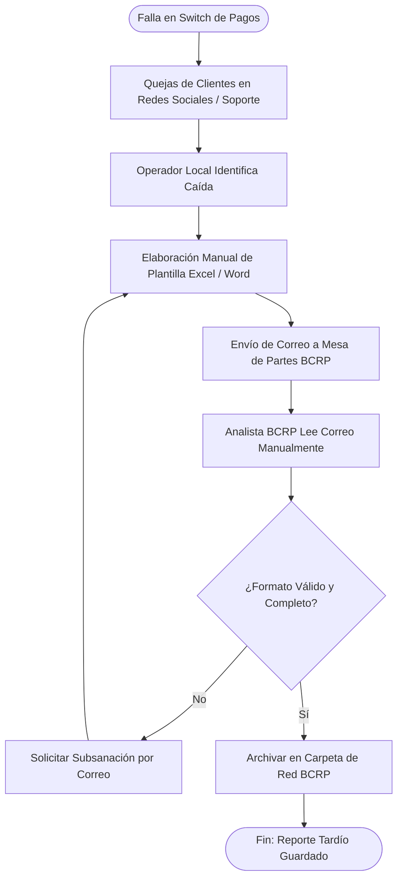

# MODELADO DE PROCESOS DE NEGOCIO (BPMN 2.0)
**Proyecto:** Sistema Integral de Gestión de Incidentes Regulatorios (SIGIR - BCRP)  
**Curso:** Curso Integrador I: Sistemas Software (Sección 57524)  
**Docente:** Ing. Yony Zamata Condori  
**Estudiante:** Frank Emiliano Vargas Huamán  

---

## 1. INTRODUCCIÓN Y OBJETIVOS DEL MODELADO

El modelado de procesos en notación **BPMN 2.0 (Business Process Model and Notation)** permite representar gráficamente y de forma estandarizada la secuencia de actividades, compuertas lógicas, eventos y flujos de mensajes entre los diferentes actores que integran el ecosistema de pagos digitales peruano.

El presente documento analiza la brecha entre el modelo operativo actual (**AS-IS**), caracterizado por la reactividad y la fragmentación, y el modelo digitalizado propuesto (**TO-BE**) mediante la plataforma **SIGIR - BCRP**.

---

## 2. ANÁLISIS DEL PROCESO ACTUAL (AS-IS)

### 2.1. Descripción de Actividades del Proceso AS-IS
1. **Ocurrencia de la Falla:** Ocurre una indisponibilidad en la API de transferencias interbancarias o en el switch de pagos de una entidad financiera (ej. Yape, Plim, CCE).
2. **Detección Tardía:** La falla es identificada horas después tras el reclamo masivo de clientes finales o alarmas locales internas no conectadas a un sistema central.
3. **Elaboración Manual del Reporte:** El operador de la institución financiera redacta un documento manual en procesador de texto o llena una hoja de cálculo en Excel.
4. **Envío Desarticulado:** El reporte es enviado vía correo electrónico a la casilla general de la mesa de partes del BCRP.
5. **Recepción y Validación Manual:** Un analista del BCRP descarga el archivo, revisa de forma manual si cumple con las columnas normativas y solicita subsanaciones por correo si faltan datos.
6. **Almacenamiento Disperso:** El incidente queda archivado en carpetas compartidas sin trazabilidad en tiempo real ni cálculo automático de tiempos de afectación (MTTR).

### 2.2. Diagrama de Flujo AS-IS (Proceso Tradicional)

---

## 3. ANÁLISIS DEL PROCESO PROPUESTO (TO-BE)

### 3.1. Mejoras y Valor Agregado del Proceso TO-BE
- **Detección Proactiva:** El sistema no espera reportes humanos; el Worker de Telemetría interroga activamente los endpoints de salud (*health checks*) de las entidades cada 30 segundos.
- **Categorización Asistida:** 
  - *Automática:* Caídas de servicio, errores HTTP 5xx y timeouts de red son catalogados de inmediato como `Disponibilidad de Servicios`.
  - *Manual:* Eventos de `Fraude Financiero` y `Manipulación de Información / Brechas de Datos` son reportados y tipificados por operadores calificados mediante formularios asistidos con autenticación corporativa (Directorio Activo).
- **Control Estricto del Ciclo de Vida:** Máquina de estados determinística (`REGISTRADO` $\rightarrow$ `EN_EVALUACION` $\rightarrow$ `EN_MITIGACION` $\rightarrow$ `RESUELTO` $\rightarrow$ `CERRADO`) con auditoría inmutable en cada paso.
- **Generación Automatizada del Estándar BCRP:** Al resolver y cerrar un incidente, se compila automáticamente el archivo estructurado **SFT BCRP (.TXT)** incorporando el código de hash SHA-256 de integridad.

### 3.2. Diagrama de Procesos TO-BE en Notación BPMN 2.0

```mermaid
flowchart TD
    %% Pools y Lanes
    subgraph POOL ["PROCESO GLOBAL: GESTIÓN INTEGRAL DE INCIDENTES REGULATORIOS (TO-BE)"]
        
        subgraph LANE_ENTIDAD ["LANE: Entidades Financieras (Yape, Plim, Tunki, CCE)"]
            P1([Inicio: Operación Transaccional Continua]) --> P2[Procesar Transacciones Digitales]
            P2 --> P3{¿Ocurre Anomalía Técnica?}
            P3 -->|No| P2
            P3 -->|Sí: Caída de Conectividad| P4[Endpoint Health Check devuelve HTTP 5xx / Timeout]
            P3 -->|Sí: Fraude o Brecha Interna| P5[Notificar a Oficial de Seguridad de la Entidad]
        end

        subgraph LANE_TELEMETRIA ["LANE: Worker de Telemetría SIGIR-BCRP"]
            T1[Temporizador: Sondeo cada 30 segundos] --> T2[Ejecutar HTTP GET a Endpoint de Salud de la Entidad]
            T2 -.->|Consulta de Salud| P4
            T2 --> T3{¿Respuesta Exitosa HTTP 200?}
            T3 -->|Sí: Latencia Normal| T4[Registrar Uptime y Latencia en Memoria]
            T4 --> T1
            T3 -->|No: Error 5xx o Timeout| T5[Disparar Evento de Falla Detectada]
            T5 --> T6[Auto-Categorizar: 'Disponibilidad de Servicios' / Severidad ALTA]
            T6 --> C1
        end

        subgraph LANE_OPERADOR ["LANE: Operador NOC / Analista de Riesgos"]
            P5 --> O1[Iniciar Sesión en SIGIR vía Directorio Activo AD]
            O1 --> O2[Acceder a Formulario de Registro Manual]
            O2 --> O3{¿Tipo de Incidente No Automático?}
            O3 -->|Ataque de Suplantación / Transacciones Anómalas| O4[Seleccionar Categoría: 'Fraude Financiero']
            O3 -->|Acceso No Autorizado a BD / Fuga de Datos| O5[Seleccionar Categoría: 'Manipulación de Información']
            O4 --> C1
            O5 --> C1
            
            O6[Operador Revisa Detalle del Incidente] --> O7[Transicionar Estado a 'EN_EVALUACION']
            O7 --> O8[Coordinar Acciones de Mitigación con la Entidad]
            O8 --> O9[Actualizar a 'EN_MITIGACION']
            O9 --> O10{¿Servicio Restablecido y Verificado?}
            O10 -->|No| O8
            O10 -->|Sí| O11[Ingresar Fecha/Hora Solución y Marcar 'RESUELTO']
        end

        subgraph LANE_MOTOR ["LANE: Motor Central SIGIR & Auditoría"]
            C1[Crear Ticket en Estado 'REGISTRADO'] --> C2[Almacenar Registro Inmutable en Historial con Marca de Tiempo]
            C2 --> C3[Actualizar Semáforo en Dashboard NOC a Rojo/Crítico]
            C3 --> C4[Disparar Notificación de Alerta por Correo a Contactos Regulatorios]
            C4 --> O6
            
            O11 --> C5[Ejecutar Cierre Formal: Estado 'CERRADO']
            C5 --> C6[Compilar Archivo Plano Normativo SFT BCRP .TXT]
            C6 --> C7[Generar Hash Criptográfico SHA-256 de Integridad]
            C7 --> C8[Registrar Reporte Regulatorio en Base de Datos]
        end

        subgraph LANE_BCRP ["LANE: Sistema Central de Supervisión BCRP"]
            C8 --> B1[Transmisión Segura del Archivo SFT BCRP vía SFTP / API]
            B1 --> B2[Validación de Hash y Estructura por Mesa de Entrada BCRP]
            B2 --> B3([Fin: Cumplimiento Regulatorio Validado])
        end

    end
```

---

## 4. MATRIZ DETALLADA DE ACTIVIDADES Y RESPONSABILIDADES DEL PROCESO TO-BE

| ID Actividad | Nombre de la Actividad | Tipo de Tarea BPMN | Actor Responsable | Entradas | Salidas |
| :--- | :--- | :--- | :--- | :--- | :--- |
| **ACT-01** | Sondeo de Health Check | Tarea de Servicio (*Service Task*) | Worker de Telemetría | URL Health Check de Entidad | Código de estado HTTP y latencia en ms. |
| **ACT-02** | Registro y Categorización Automática | Tarea de Servicio (*Service Task*) | Worker de Telemetría | Error HTTP 5xx o Timeout >3000ms | Ticket creado con categoría `Disponibilidad de Servicios`. |
| **ACT-03** | Autenticación Corporativa AD | Tarea de Usuario (*User Task*) | Operador / Analista | Credenciales corporativas AD/LDAP | Token JWT y sesión autorizada. |
| **ACT-04** | Clasificación Manual de Contingencias | Tarea de Usuario (*User Task*) | Operador / Analista | Datos de investigación forense / reclamos | Ticket creado con categoría `Fraude` o `Manipulación de Información`. |
| **ACT-05** | Notificación Inmediata por Correo | Tarea de Envío (*Send Task*) | Motor de Notificaciones | Ticket en estado `REGISTRADO` | Correo SMTP despachado a contactos regulatorios. |
| **ACT-06** | Gestión y Cambio de Estado | Tarea de Usuario (*User Task*) | Operador NOC | Justificación técnica de avance | Transición de estado y registro inmutable en `historial_estados`. |
| **ACT-07** | Compilación de Archivo SFT BCRP | Tarea de Servicio (*Service Task*) | Motor Regulatorio | Incidentes resueltos del período | Archivo plano .TXT estructurado con cabecera, detalle y hash SHA-256. |
| **ACT-08** | Ingesta en Mesa Regulatoria BCRP | Tarea de Recepción (*Receive Task*)| Sistema Central BCRP | Archivo TXT y Hash SHA-256 | Constancia formal de recepción regulatoria. |
