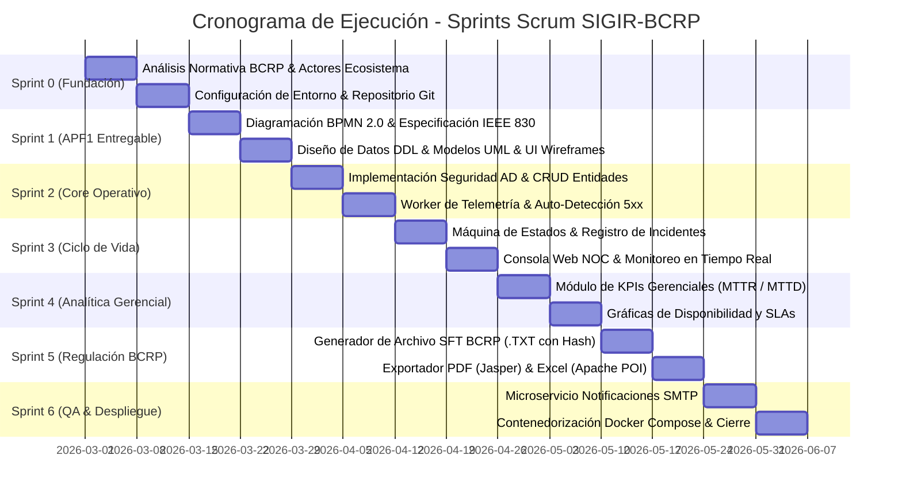

# PLANIFICACIÓN Y GESTIÓN ÁGIL DEL PROYECTO (SCRUM)
**Proyecto:** Sistema Integral de Gestión de Incidentes Regulatorios (SIGIR - BCRP)  
**Curso:** Curso Integrador I: Sistemas Software (Sección 57524)  
**Docente:** Ing. Yony Zamata Condori  
**Integrantes del Equipo (Estudiantes UTP):**  
- **Frank Emiliano Vargas Huamán** (Código: **U23243651**) – *Líder Técnico / Scrum Master*  
- **Fernando Alber Alfredo Romero Requejo** (Código: **U21216410**) – *Desarrollo / Requisitos*  
- **Joel Leonardo Olaya Vivas** (Código: **U21221688**) – *Desarrollo / QA*  
- **Luis Tapia Ignacio** (Código: **U25239074**) – *Desarrollo / Datos*  

---

## 1. MARCO METODOLÓGICO: SCRUM ADAPTADO A INGENIERÍA DE SOFTWARE

Para la ejecución del proyecto SIGIR-BCRP se ha adoptado el marco de trabajo **Scrum**, articulado bajo ciclos de desarrollo iterativos e incrementales (Sprints de 2 semanas de duración). Este enfoque permite abordar los requerimientos normativos del Banco Central de Reserva del Perú (BCRP), priorizando la entrega temprana de valor funcional verificable en dos grandes etapas:
- **Etapa 01 (Sprints 1 a 3):** Núcleo operacional, mantenimiento, ingesta de telemetría automática, clasificación y control de estados.
- **Etapa 02 (Sprints 4 a 6):** Inteligencia estratégica (dashboard gerencial de KPIs), generación del archivo SFT BCRP (.TXT), exportación a PDF/Excel y despacho de alertas.

### 1.1. Estructura de Roles y Equipo de Trabajo
- **Product Owner (PO):** Ing. Yony Zamata Condori (Docente evaluador / Representante de las necesidades de negocio y regulación BCRP).
- **Scrum Master & Technical Lead:** Frank Emiliano Vargas Huamán (U23243651).
- **Equipo de Desarrollo (Development Team):**
  - Fernando Alber Alfredo Romero Requejo (U21216410)
  - Joel Leonardo Olaya Vivas (U21221688)
  - Luis Tapia Ignacio (U25239074)
- **Stakeholders Clave:** Operadores NOC del sistema de pagos, Auditores Regulatorios del BCRP, Administradores de TI de Entidades Financieras (Yape, Plim, Tunki, CCE).

---

### 1.2. Acta de Constitución del Proyecto (Project Charter Básico)

| **Campo** | **Definición Formal del Proyecto** |
| :--- | :--- |
| **Nombre del Proyecto** | Sistema Integral de Gestión de Incidentes Regulatorios para Pagos Digitales (SIGIR - BCRP) |
| **Código del Proyecto** | PRJ-2026-SIGIR-BCRP-57524 |
| **Patrocinador / PO** | Ing. Yony Zamata Condori (Docente UTP) |
| **Equipo de Desarrollo** | • **Frank Emiliano Vargas Huamán** (Líder Técnico - U23243651)<br>• **Fernando Alber Alfredo Romero Requejo** (U21216410)<br>• **Joel Leonardo Olaya Vivas** (U21221688)<br>• **Luis Tapia Ignacio** (U25239074) |
| **Justificación** | Erradicar la detección tardía de caídas en el switch de pagos peruano (Yape, Plim, Tunki, CCE), reduciendo el MTTD de 180 min a <30s con auditoría inmutable y reporte oficial BCRP SFT con hash SHA-256. |
| **Objetivos SMART** | • **Alcance:** 100% de módulos core (Mantenimiento, Telemetría, Incidentes, Seguridad AD, Compilador SFT).<br>• **Tiempo:** 6 Sprints en 14 semanas (Hito APF1 en Semana 4).<br>• **Rendimiento:** Sondeo cada 30s y respuesta REST < 500ms.<br>• **Calidad:** Cobertura de pruebas unitarias > 80% con JUnit 5. |
| **Alcance Entregable APF1** | Modelos UML, DDL PostgreSQL 15 con triggers inmutables, backend Spring Boot 3 con Arquitectura Hexagonal, Worker asíncrono multihilo, consola NOC reactiva y suite de tests. |
| **Riesgos Principales** | R-01 Sobrecarga de sondeo (mitigado con timeout de 3000ms); R-02 Alteración de historial (mitigado con trigger append-only SQL); R-03 Falla de Active Directory (mitigado con fallback seguro). |
| **Criterio de Aceptación** | Aprobación del Product Owner y cumplimiento estricto de la circular de incidentes del BCRP. |

---

## 2. ESTRUCTURA DE DESGLOSE DEL TRABAJO (EDT / WBS)

A continuación se detalla la descomposición jerárquica de paquetes de trabajo del proyecto:

```
1.0 SIGIR - BCRP
  ├── 1.1 FASE DE INICIACIÓN Y DEFINICIÓN (Semanas 1-2)
  │     ├── 1.1.1 Análisis de la normativa de reporte de incidentes BCRP
  │     ├── 1.1.2 Levantamiento del marco institucional (Misión, Visión, Objetivos BCRP)
  │     ├── 1.1.3 Definición del Acta de Constitución del Proyecto
  │     └── 1.1.4 Configuración del repositorio y entornos de desarrollo
  │
  ├── 1.2 FASE DE ANÁLISIS Y MODELADO DE NEGOCIO (Semanas 3-4 / APF1)
  │     ├── 1.2.1 Diagramación de Procesos AS-IS y TO-BE en BPMN 2.0
  │     ├── 1.2.2 Especificación de Requisitos de Software según IEEE 830
  │     ├── 1.2.3 Diagramación de Casos de Uso del Negocio y del Sistema
  │     └── 1.2.4 Modelado del Dominio y Diagrama de Clases UML
  │
  ├── 1.3 FASE DE DISEÑO DE ARQUITECTURA Y DATOS (Semanas 3-4 / APF1)
  │     ├── 1.3.1 Diseño de Arquitectura Hexagonal y Diagrama de Componentes
  │     ├── 1.3.2 Modelado Físico Relacional DDL en PostgreSQL 15
  │     ├── 1.3.3 Definición de índices de alto rendimiento y políticas Append-Only
  │     └── 1.3.4 Prototipado y Wireframes de Interfaces de Usuario (UI/UX)
  │
  ├── 1.4 FASE DE CONSTRUCCIÓN CORE - ETAPA 01 (Semanas 5-8)
  │     ├── 1.4.1 Módulo de Seguridad y Autenticación con Directorio Activo (AD/LDAP)
  │     ├── 1.4.2 Módulo de Mantenimiento de Entidades Financieras y Categorías
  │     ├── 1.4.3 Motor de Gestión y Transición de Estados de Incidentes
  │     ├── 1.4.4 Worker de Telemetría: Polling asíncrono y detección automática
  │     └── 1.4.5 Consola Web Operativa NOC con semáforos de salud en vivo
  │
  ├── 1.5 FASE DE CONSTRUCCIÓN ESTRATÉGICA - ETAPA 02 (Semanas 9-12)
  │     ├── 1.5.1 Módulo Gerencial: Dashboard interactivo de KPIs (MTTR, MTTD, Uptime)
  │     ├── 1.5.2 Generador Normativo SFT BCRP (.TXT con hash SHA-256)
  │     ├── 1.5.3 Motor de Reportes en Formato PDF (JasperReports) y Excel (Apache POI)
  │     └── 1.5.4 Sistema de Notificaciones por Correo Electrónico SMTP
  │
  └── 1.6 FASE DE PRUEBAS, DESPLIEGUE Y CIERRE (Semanas 13-14)
        ├── 1.6.1 Pruebas Unitarias y de Integración con JUnit 5 y Testcontainers
        ├── 1.6.2 Creación de Manifiesto Docker Compose y Dockerfiles
        ├── 1.6.3 Despliegue en Servidor Staging y Pruebas de Carga
        └── 1.6.4 Entrega del Informe Final de Proyecto y Sustentación
```

---

## 3. PRODUCT BACKLOG Y ESTIMACIÓN DE HISTORIAS DE USUARIO (STORY POINTS)

Se utilizó la técnica de *Planning Poker* basada en la escala de Fibonacci (1, 2, 3, 5, 8, 13) para la estimación del esfuerzo de cada Historia de Usuario (HU):

| ID | Historia de Usuario (HU) | Prioridad | Sprint | Estimación (SP) |
| :--- | :--- | :---: | :---: | :---: |
| **HU-01** | Como Operador del BCRP, deseo iniciar sesión mediante mis credenciales de Directorio Activo para evitar duplicidad de contraseñas. | Alta | Sprint 1 | **5 SP** |
| **HU-02** | Como Administrador, deseo gestionar el catálogo de entidades financieras participantes con sus URLs de monitoreo. | Alta | Sprint 1 | **5 SP** |
| **HU-03** | Como Administrador, deseo configurar las categorías normativas de incidentes para diferenciar eventos automáticos de manuales. | Alta | Sprint 1 | **3 SP** |
| **HU-04** | Como Sistema Central, deseo sondear automáticamente la salud de las APIs de las entidades financieras cada 30 segundos. | Alta | Sprint 2 | **8 SP** |
| **HU-05** | Como Sistema Central, deseo auto-registrar y categorizar caídas de servicio como "Disponibilidad" ante respuestas 5xx o timeout. | Alta | Sprint 2 | **8 SP** |
| **HU-06** | Como Operador, deseo registrar y clasificar manualmente incidentes de "Fraude Financiero" y "Manipulación de Información". | Alta | Sprint 2 | **5 SP** |
| **HU-07** | Como Operador, deseo actualizar el estado de un incidente registrando el motivo técnico para mantener la auditoría inmutable. | Alta | Sprint 3 | **5 SP** |
| **HU-08** | Como Operador NOC, deseo visualizar un semáforo interactivo del estado de salud de cada entidad financiera en tiempo real. | Alta | Sprint 3 | **5 SP** |
| **HU-09** | Como Gerente de Operaciones, deseo un dashboard ejecutivo con métricas de MTTR, MTTD y % de disponibilidad por entidad. | Media | Sprint 4 | **8 SP** |
| **HU-10** | Como Oficial Regulatorio, deseo generar el archivo plano TXT normativo conforme a la circular SFT del BCRP con hash SHA-256. | Alta | Sprint 5 | **8 SP** |
| **HU-11** | Como Auditor, deseo exportar informes consolidados de incidentes en formatos PDF y Microsoft Excel XLSX. | Media | Sprint 5 | **5 SP** |
| **HU-12** | Como Contacto Regulatorio, deseo recibir un correo automático cuando mi entidad sufra un incidente de severidad Alta/Crítica. | Media | Sprint 6 | **5 SP** |
| **TOTAL**| **Esfuerzo Total del Proyecto** | - | - | **70 SP** |

---

## 4. CRONOGRAMA DETALLADO DE SPRINTS



---

## 5. MATRIZ DE ASIGNACIÓN DE RESPONSABILIDADES (RACI)

| Paquete de Trabajo / Entregable | Frank Vargas (Lead / Dev) | Ing. Yony Zamata (Docente / PO) | Operador NOC / Entidades | Auditor Regulatorio BCRP |
| :--- | :---: | :---: | :---: | :---: |
| **Acta de Constitución y Alcance** | **R / A** | **A** | C | I |
| **Modelado de Procesos BPMN 2.0** | **R / A** | **A** | C | I |
| **Especificación de Requisitos IEEE 830** | **R / A** | **A** | C | I |
| **Diseño del Modelo Relacional DDL** | **R / A** | C | I | I |
| **Implementación Backend Java/Spring** | **R / A** | I | I | I |
| **Construcción Worker de Telemetría** | **R / A** | I | C | I |
| **Desarrollo Frontend NOC Dashboard** | **R / A** | I | C | I |
| **Validación de Formato SFT BCRP** | **R / A** | **A** | I | **A** |
| **Aprobación de Entregable APF1** | R | **A** | I | I |
