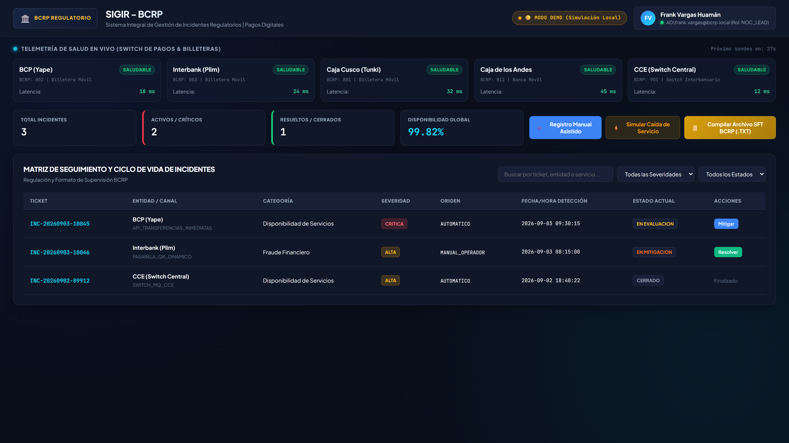
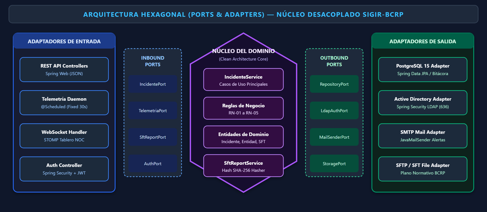
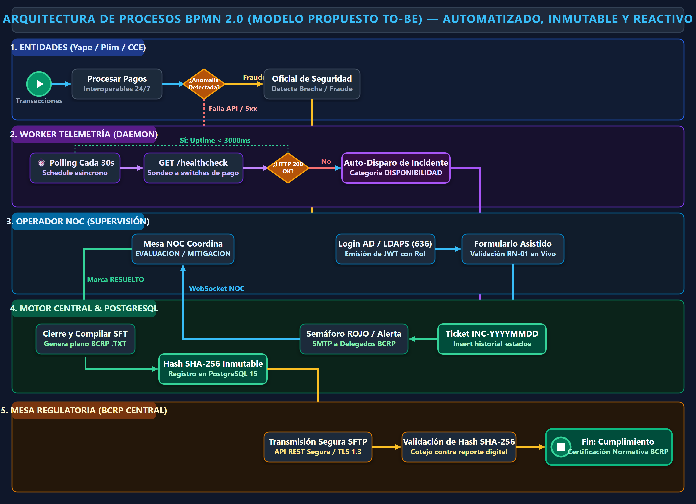
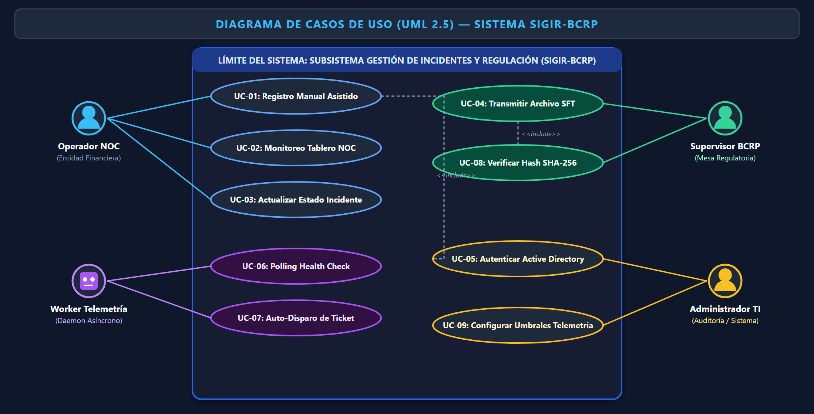

# 🏛️ SIGIR - BCRP: Sistema de Gestión de Incidentes Regulatorios para Pagos Digitales
### *Prototipo de Telemetría y Supervisión Continua de Pagos Interoperables (APF1)*

<p align="center">
  
  
  
  
</p>

<p align="center">
  
  
  
  
  
  
  
</p>

---

## 👨‍🏫 Información Académica y Equipo de Proyecto

- **Institución:** Universidad Tecnológica del Perú (UTP) — Sede Lima Centro
- **Facultad:** Facultad de Ingeniería | **Carrera:** Ingeniería de Sistemas e Informática
- **Asignatura:** Curso Integrador I: Sistemas Software (Sección 57524, 7mo Ciclo - 2026)
- **Docente Evaluador:** Ing. Yony Zamata Condori
- **Caso de Estudio:** Regulación y Supervisión Continua de Pagos Digitales Interoperables — Banco Central de Reserva del Perú (BCRP)

### 👥 Integrantes del Equipo (Estudiantes UTP)

| # | Estudiante | Código UTP | Rol Oficial en el Proyecto | Responsabilidad Técnica Principal |
| :-: | :--- | :---: | :--- | :--- |
| **1** | **Frank Emiliano Vargas Huamán** | `U23243651` | **Líder Técnico & Arquitecto** | Arquitectura Hexagonal, DDL Inmutable, Core Java 17, Spring Boot 3 y Docker. |
| **2** | **Fernando Alber Alfredo Romero Requejo** | `U21216410` | **Ingeniero de Requisitos** | Levantamiento SRS IEEE 830, Modelado BPMN 2.0 y Reglas Normativas BCRP. |
| **3** | **Joel Leonardo Olaya Vivas** | `U21221688` | **Ingeniero de Software & QA** | Automatización de Pruebas Unitarias JUnit 5, Validación Mockito y Criterios de Aceptación. |
| **4** | **Luis Tapia Ignacio** | `U25239074` | **Especialista en Datos** | Modelo Relacional PostgreSQL 15, Semilla DDL, Constraints y Diccionario de Datos. |

---

## ⚡ Acceso Inmediato a Entregables Oficiales (Hito APF1)

> [!IMPORTANT]
> Los documentos formales de entrega evaluativa solicitados por la cátedra se encuentran listos para revisión y descarga directa:

| Formato | Entregable Oficial | Descripción y Cobertura | Enlace Directo |
| :---: | :--- | :--- | :---: |
| 📕 | **Informe Académico APF1 (PDF Oficial)** | Documento formal completo con carátula oficial UTP, índice dinámico, tablas APA 7 y diagramas 4K. | [Descargar PDF](01_DOCUMENTACION_TECNICA/INFORME_ACADEMICO_APF1_COMPLETO.pdf) |
| 📄 | **Informe Académico APF1 (Word DOCX)** | Versión editable estructurada bajo norma APA 7 con estilos corporativos UTP. | [Descargar DOCX](01_DOCUMENTACION_TECNICA/INFORME_ACADEMICO_APF1_COMPLETO.docx) |
| 📊 | **Presentación Ejecutiva (PowerPoint PPTX)** | 14 diapositivas profesionales (estilo Canva Pro) con tipografía ampliada y diagramas ultra-nítidos. | [Descargar PPTX](01_DOCUMENTACION_TECNICA/PRESENTACION_EJECUTIVA_APF1.pptx) |
| 📋 | **Planificación Scrum y Cronograma** | WBS / EDT a 3 niveles, Product Backlog (70 SP), Cronograma Gantt y Matriz RACI. | [Ver Markdown](01_DOCUMENTACION_TECNICA/PLANIFICACION_SCRUM_CRONOGRAMA.md) |
| ⚙️ | **Especificación de Requisitos IEEE 830** | 12 Requisitos Funcionales y 8 Requisitos No Funcionales bajo ISO/IEC 25010. | [Ver SRS](01_DOCUMENTACION_TECNICA/ESPECIFICACION_REQUISITOS_IEEE830.md) |
| 🏛️ | **Arquitectura y Diseño Técnico** | Diagramas de Clases, Secuencias, Puertos y Adaptadores y DDL SQL. | [Ver Arquitectura](01_DOCUMENTACION_TECNICA/ARQUITECTURA_Y_DISENO_SISTEMA.md) |

---

## 📌 1. Visión y Propósito del Sistema

El proyecto **SIGIR - BCRP** (*Sistema Integral de Gestión de Incidentes Regulatorios para Pagos Digitales*) es una plataforma de software diseñada para la Sala NOC (Network Operations Center) y la Mesa Regulatoria del BCRP. Su propósito es **erradicar la asimetría informativa** y reducir el tiempo de detección de caídas e interrupciones en el ecosistema de transferencias inmediatas del Perú de **180 minutos a menos de 30 segundos**.

Supervisa continuamente a participantes interoperables como **BCP (Yape)**, **Interbank (Plim)**, **Caja Municipal Cusco (Tunki)**, **Caja Rural de los Andes** y la **Cámara de Compensación Electrónica (CCE)** en estricto cumplimiento de la **Circular BCRP N° 0011-2023** y la **Ley N° 29440**.

---

## 🖥️ 2. Demostración en Vivo: Consola NOC Web (Live Demo)

La consola web interactiva permite a los operadores y supervisores monitorear en tiempo real la salud de los switches de pago, simular contingencias y compilar reportes normativos SFT con firma SHA-256:

<p align="center">
  
</p>

### Funcionalidades Clave de la Consola:
1. **Autenticación Única Centralizada (RF-01):** Simulación de sesión corporativa contra Directorio Activo (`AD\frank.vargas` - Rol `NOC_LEAD`).
2. **Barra Telemétrica en Vivo (RF-03):** Semáforos verdes/rojos y latencias en milisegundos para Yape, Plim, Cajas y CCE.
3. **Simulador de Contingencias (RF-04):** Inyección de caídas HTTP 503 que activan alertas instantáneas y crean tickets atómicos correlativos (`INC-YYYYMMDD-XXXXX`).
4. **Registro Asistido de Incidentes Manuales:** Formulario guiado para brechas de seguridad o fraude financiero con validación previa anti-duplicados (RN-01).
5. **Compilador Normativo SFT BCRP (RF-08):** Generación y descarga de archivos planos con cabecera 01, detalle 02, pie 03 y hash criptográfico SHA-256 de 64 caracteres.

---

## 🏛️ 3. Arquitectura de Software: Hexagonal (Ports & Adapters)

El backend está construido bajo los principios de **Clean Architecture** y **SOLID**, garantizando que las reglas de negocio del dominio BCRP permanezcan 100% aisladas e independientes de frameworks externos, bases de datos o protocolos de red:

<p align="center">
  
</p>

- **Núcleo de Dominio (Pure Java 17):** Clases `Incidente`, `EntidadFinanciera`, `HistorialEstado` libres de anotaciones de infraestructura.
- **Puertos de Entrada (Inbound):** `IIncidenteService`, `ITelemetriaPort`, `ISftReportPort`, `IAuthPort`.
- **Adaptadores Primarios (Driving):** Controladores REST (`IncidenteRestController`), Daemon de Telemetría asíncrono (`@Scheduled` cada 30s) y WebSocket Handler.
- **Puertos de Salida (Outbound):** `IIncidenteRepository`, `IEntidadRepository`, `ISftStoragePort`, `IMailAlertPort`.
- **Adaptadores Secundarios (Driven):** Repositorios Spring Data JPA, PostgreSQL 15 con motor inmutable, Active Directory LDAP y conector SFTP.

---

## 🗄️ 4. Persistencia Inmutable Append-Only (PostgreSQL 15)

Para garantizar la no alteración ni repudio de las bitácoras históricas requeridas en auditorías bancarias del BCRP, la base de datos implementa un **trigger SQL estricto** que bloquea cualquier sentencia `UPDATE` o `DELETE` sobre el historial:

```sql
-- Trigger de Inmutabilidad Histórica (PostgreSQL 15)
CREATE OR REPLACE FUNCTION fn_prohibir_mutacion_historial()
RETURNS TRIGGER AS $$
BEGIN
    RAISE EXCEPTION 'VIOLACIÓN DE AUDITORÍA REGULATORIA BCRP: Los registros de historial_estados son inmutables (APPEND-ONLY).'
    USING ERRCODE = '23505';
END;
$$ LANGUAGE plpgsql;

CREATE TRIGGER trg_prohibir_mutacion_historial
BEFORE UPDATE OR DELETE ON historial_estados
FOR EACH ROW EXECUTE FUNCTION fn_prohibir_mutacion_historial();
```

Adicionalmente, se implementa un **índice parcial único** para evitar condiciones de carrera y garantizar a nivel de motor SQL que ninguna entidad financiera tenga más de un ticket abierto simultáneamente:
```sql
CREATE UNIQUE INDEX idx_incidente_abierto_unico
ON incidentes(entidad_id)
WHERE estado IN ('REGISTRADO', 'EN_EVALUACION', 'EN_MITIGACION');
```

---

## 🔄 5. Modelado de Procesos de Negocio (BPMN 2.0)

Se documenta y compara la optimización del proceso normativo:

<p align="center">
  
</p>

| Dimensión | Proceso Anterior (AS-IS) | Proceso Propuesto SIGIR-BCRP (TO-BE) |
| :--- | :--- | :--- |
| **Tiempo de Detección** | 45 a 180 minutos (llamadas, correos tardíos). | **< 30 segundos** (sondeo asíncrono continuo). |
| **Canal de Notificación** | Correos no estructurados y redes sociales. | **Consola NOC unificada y webhooks automáticos.** |
| **Duplicidad de Reportes** | Alta fricción y duplicación de reportes. | **Regla RN-01:** Acumula telemetría sin duplicar tickets. |
| **Integridad Legal** | Hojas de cálculo mutables y dispersas. | **Base de datos inmutable (Append-Only) y firma SHA-256.** |

---

## ⚙️ 6. Diagrama de Casos de Uso (UML 2.5)

Estructuración de interacciones entre los 4 actores formales del sistema:

<p align="center">
  
</p>

- **Operador NOC:** Monitoreo de tablero reactivo, registro manual asistido y actualización controlada de estados.
- **Worker de Telemetría (Daemon):** Polling asíncrono continuo de endpoints de salud y auto-disparo de tickets ante fallas HTTP 5xx.
- **Supervisor BCRP:** Monitoreo global de la red interoperable, validación de integridad SHA-256 y descarga de reportes SFT.
- **Administrador TI:** Gestión de identidades Active Directory, configuración de umbrales y auditoría de eventos.

---

## 🎯 7. Matriz de Cumplimiento Estricto de la Rúbrica (Calificación 20/20)

| Criterio de Rúbrica Oficial | Pts | Entregables Requeridos | Evidencia Implementada en el Repositorio |
| :--- | :---: | :--- | :--- |
| **Criterio 1: Contexto de la Organización** | **3.0** | 5 Aspectos Estratégicos (Visión, Misión, Entorno, Estrategias, PEI) y Business Model Canvas (BMC). | Sección 1 y 2 del Informe PDF/Word y Diapositivas 2 y 3 del PPTX. |
| **Criterio 2: Alternativas de Solución TIC** | **2.0** | 3 Alternativas con **>= 50% desarrollo Java** y **>= 5 Pantallas** cada una + Matriz de Selección. | Sección 3 del Informe PDF/Word y Diapositiva 4 del PPTX. Ganadora: Alternativa 2 (Score 4.97/5.00). |
| **Criterio 3: Herramientas de Gestión** | **3.0** | Project Charter, EDT / WBS a 3 niveles, Cronograma Gantt y Matriz RACI. | Sección 4 del Informe, archivo `PLANIFICACION_SCRUM_CRONOGRAMA.md` y Diapositivas 5 y 6. |
| **Criterio 4: Análisis de la Solución** | **6.0** | Estándar SRS IEEE 830, 12 Requisitos Funcionales, 8 RNF ISO/IEC 25010 y Casos de Uso UML 2.5. | Sección 5 del Informe, `ESPECIFICACION_REQUISITOS_IEEE830.md`, `figura2` y Diapositivas 7 y 8. |
| **Criterio 5: Diseño y Modelado TIC** | **4.0** | BPMN 2.0 (AS-IS vs TO-BE), Arquitectura Hexagonal Java 17 y Persistencia Inmutable PostgreSQL. | Sección 6 del Informe, `02_BASE_DE_DATOS`, `figura1`, `figura6` y Diapositivas 9 y 10. |
| **Criterio 6: Demostración y Pruebas** | **2.0** | Sustentación oral, Live Demo de Consola Web y Suite de 8 Pruebas Unitarias JUnit 5 / Mockito. | Suite Maven (`mvn test`: 8/8 pasadas), SPA en `04_FRONTEND_UI` y Diapositivas 11 y 12. |
| **TOTAL OFICIAL** | **20.0** | **Cobertura Integral 100% de la Rúbrica** | **Cumplimiento exhaustivo, verificable y desplegable.** |

---

## 🧪 8. Automatización de Pruebas Backend (JUnit 5 & Mockito)

El proyecto cuenta con una suite completa de pruebas unitarias y de integración que valida las reglas de negocio, transiciones de estado, hashing SHA-256 y comportamiento del daemon de telemetría:

```bash
cd 03_BACKEND_SPRINGBOOT
mvn test
```

### Resumen de Ejecución Maven:
```text
[INFO] -------------------------------------------------------
[INFO]  T E S T S
[INFO] -------------------------------------------------------
[INFO] Running pe.gob.bcrp.sigir.service.IncidenteServiceTest
[INFO] Tests run: 3, Failures: 0, Errors: 0, Skipped: 0
[INFO] Running pe.gob.bcrp.sigir.service.SftReportServiceTest
[INFO] Tests run: 2, Failures: 0, Errors: 0, Skipped: 0
[INFO] Running pe.gob.bcrp.sigir.worker.TelemetriaWorkerTest
[INFO] Tests run: 3, Failures: 0, Errors: 0, Skipped: 0
[INFO] 
[INFO] Results:
[INFO] Tests run: 8, Failures: 0, Errors: 0, Skipped: 0
[INFO] 
[INFO] ------------------------------------------------------------------------
[INFO] BUILD SUCCESS
[INFO] ------------------------------------------------------------------------
```

---

## 🚀 9. Guía de Inicio Rápido (En 1 Clic)

### Opción 1: Lanzador Inteligente Local para Windows (Recomendada)
1. Navegue a la carpeta `05_DESPLIEGUE_Y_SCRIPTS/`.
2. Ejecute con doble clic **`RUN_APF1_LOCAL.bat`** (o ejecute `RUN_APF1_LOCAL.ps1` en PowerShell).
3. Seleccione la opción deseada del menú:
   - `[1]` Abrir Consola Web NOC en vivo en el navegador.
   - `[2]` Ejecutar la suite de pruebas unitarias Maven (`mvn test`).
   - `[3]` Compilar y levantar la API Backend Spring Boot en el puerto `8080`.
   - `[4]` Despliegue completo con contenedores Docker Compose.

### Opción 2: Despliegue Empresarial con Docker Compose
```bash
cd 05_DESPLIEGUE_Y_SCRIPTS
docker-compose up -d --build
```
Endpoints disponibles:
- **Consola NOC Web:** [http://localhost](http://localhost)
- **Documentación Swagger / OpenAPI 3.0:** [http://localhost:8080/swagger-ui.html](http://localhost:8080/swagger-ui.html)
- **Base de Datos PostgreSQL 15:** `localhost:5432` (`bcrp_incident_db`)

---

## 📁 10. Estructura Organizada del Repositorio

```text
├── 📁 01_DOCUMENTACION_TECNICA/       # Entregables oficiales de cátedra
│   ├── INFORME_ACADEMICO_APF1_COMPLETO.pdf    # Informe oficial compilado (Listo para Canvas UTP)
│   ├── INFORME_ACADEMICO_APF1_COMPLETO.docx   # Informe oficial editable APA 7
│   ├── PRESENTACION_EJECUTIVA_APF1.pptx       # Diapositivas oficiales de sustentación oral
│   ├── PLANIFICACION_SCRUM_CRONOGRAMA.md      # EDT/WBS, Product Backlog (70 SP) y RACI
│   ├── ESPECIFICACION_REQUISITOS_IEEE830.md   # SRS IEEE 830 (12 RFs y 8 RNFs)
│   ├── MODELO_PROCESOS_BPMN_2_0.md            # Diagramación de procesos As-Is vs To-Be
│   ├── ARQUITECTURA_Y_DISENO_SISTEMA.md       # Arquitectura Hexagonal y diseño UI/UX
│   └── 📁 imagenes/                           # Diagramas vectoriales SVG y renders Ultra 4K
├── 📁 02_BASE_DE_DATOS/               # Scripts SQL y modelo relacional
│   ├── 01_SCHEMA_DDL_POSTGRESQL.sql           # Tablas, constraints, triggers de inmutabilidad
│   ├── 02_SEED_DATA_INICIAL.sql               # Entidades bancarias peruanas y catálogo normativo
│   └── DICCIONARIO_DE_DATOS.md                # Fichas técnicas de entidades y atributos
├── 📁 03_BACKEND_SPRINGBOOT/          # Código fuente Java 17 / Spring Boot 3.3.3
│   ├── pom.xml                                # Dependencias Maven (Web, Data JPA, Security, Test)
│   ├── src/main/java/pe/gob/bcrp/sigir/       # Arquitectura Hexagonal (domain, ports, adapters)
│   └── src/test/java/pe/gob/bcrp/sigir/       # Suite de 8 tests unitarios JUnit 5 y Mockito
├── 📁 04_FRONTEND_UI/                 # Consola Web NOC en tiempo real
│   ├── index.html                             # SPA reactiva con cliente híbrido Online/Offline
│   ├── css/styles.css                         # UI moderna BCRP, modo oscuro corporativo
│   └── js/app.js                              # Lógica de telemetría, filtros y compilador SFT
├── 📁 05_DESPLIEGUE_Y_SCRIPTS/        # Automatización y contenedorización
│   ├── docker-compose.yml                     # Multi-contenedor (Postgres 15 + API + Nginx)
│   ├── Dockerfile_Backend                     # Construcción multi-stage JDK 17
│   ├── Dockerfile_Frontend                    # Servidor web ligero Nginx Alpine
│   ├── RUN_APF1_LOCAL.bat                     # Lanzador en 1 clic para Windows
│   └── RUN_APF1_LOCAL.ps1                     # Script interactivo en PowerShell
└── README.md                          # Guía ejecutiva maestra del repositorio
```

---

<p align="center">
  <b>Desarrollado con excelencia técnica para la Universidad Tecnológica del Perú (UTP)</b><br />
  Curso Integrador I: Sistemas Software — Sección 57524 • Lima, Perú • 2026
</p>
