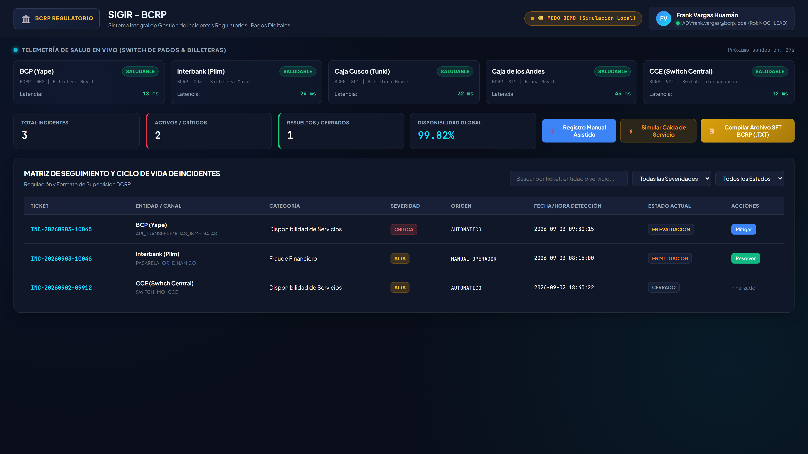
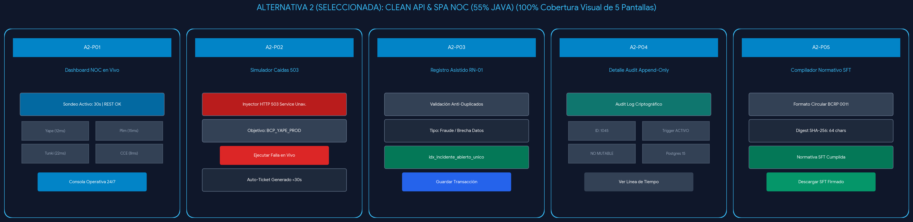
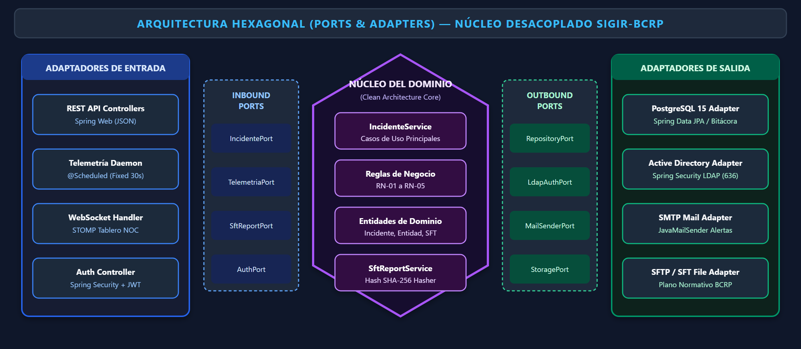
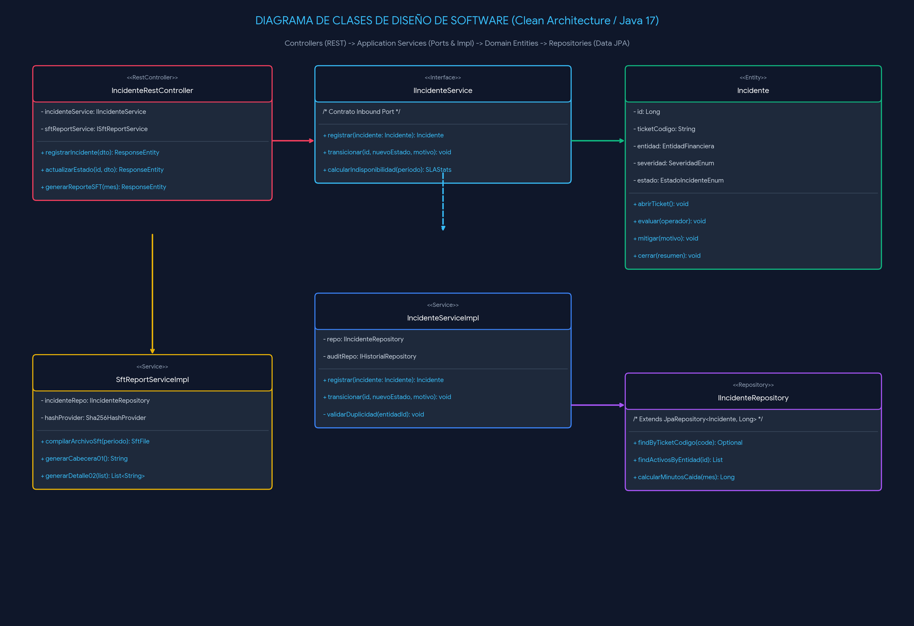
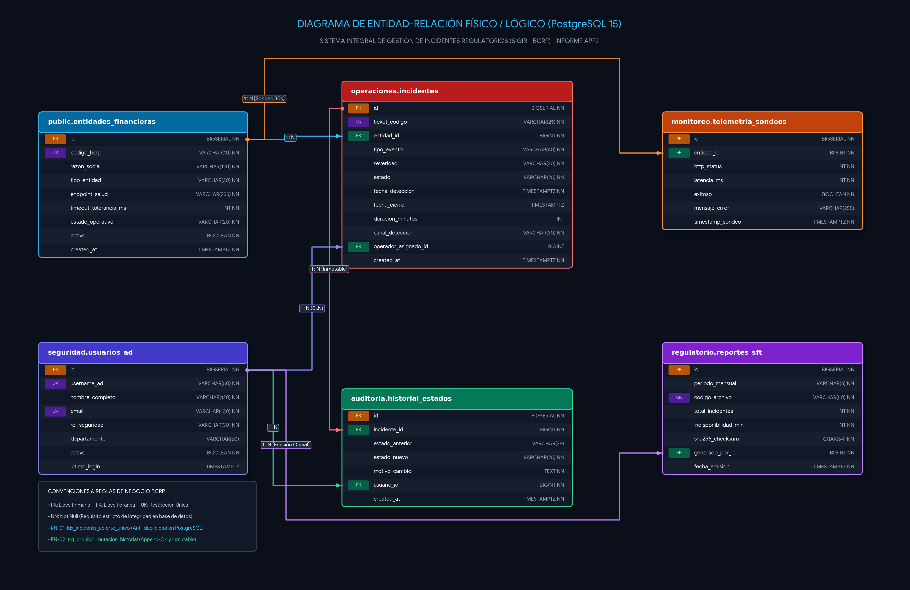
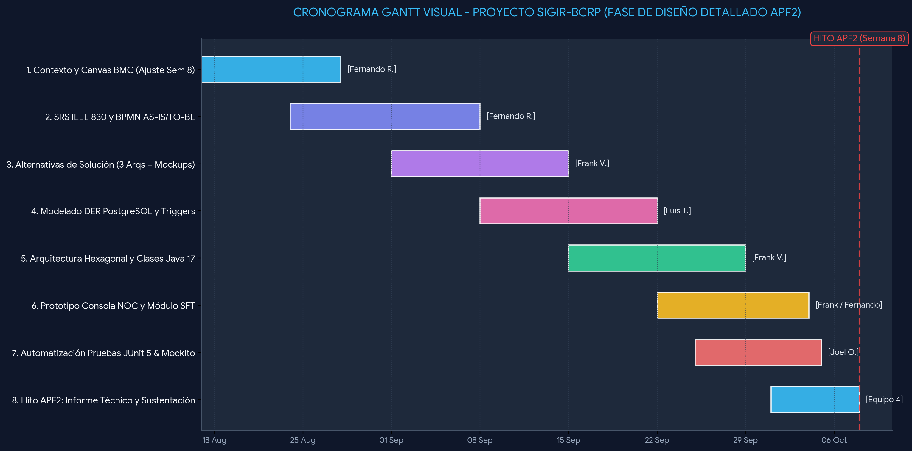
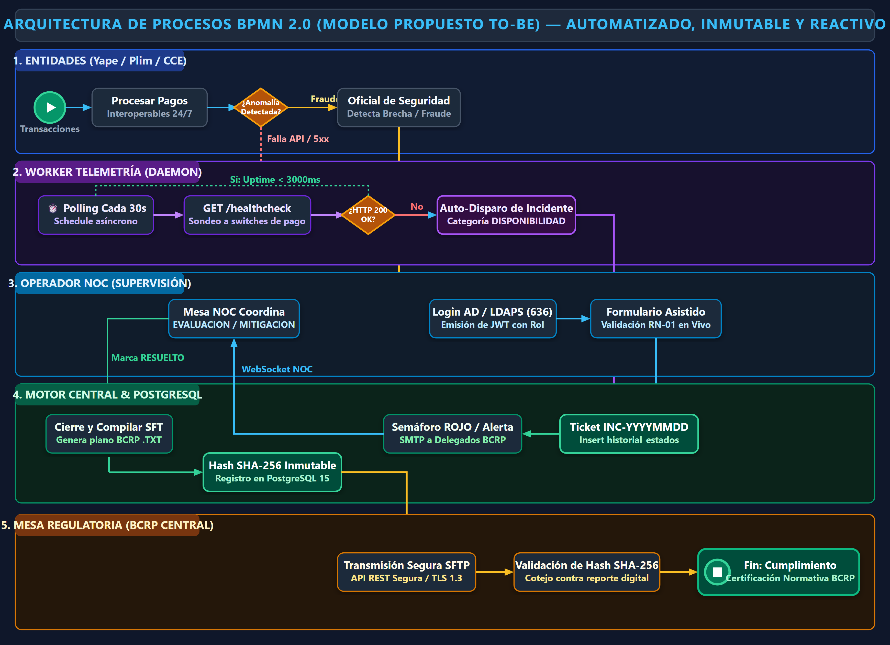
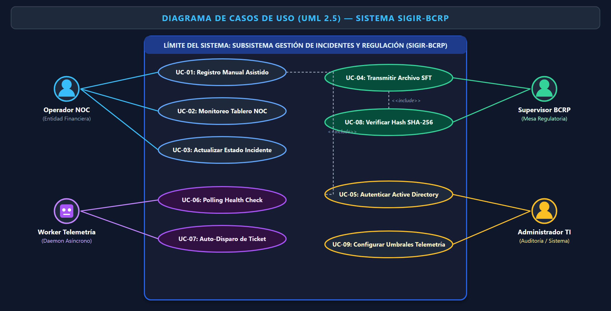

# 🏛️ SIGIR - BCRP: Sistema de Gestión de Incidentes Regulatorios para Pagos Digitales
### *Prototipo de Telemetría, Supervisión Continua de Pagos Interoperables y Reportes Normativos (APF2)*

<p align="center">
  
  
  
  
</p>

<p align="center">
  
  
  
  
  
  
  
</p>

---

## 👨‍🏫 Información Académica y Equipo de Proyecto

- **Institución:** Universidad Tecnológica del Perú (UTP) — Sede Lima Centro
- **Facultad:** Facultad de Ingeniería | **Carrera:** Ingeniería de Sistemas e Informática
- **Asignatura:** Curso Integrador I: Sistemas Software (Sección 57524, 7mo Ciclo - 2026)
- **Docente Evaluador:** Ing. Yony Zamata Condori
- **Caso de Estudio:** Regulación y Supervisión Continua de Pagos Digitales Interoperables — Banco Central de Reserva del Perú (BCRP)

### 👥 Integrantes del Equipo (Estudiantes UTP)

| # | Estudiante | Código UTP | Rol Oficial en el Proyecto | Responsabilidad Técnica Principal |
| :-: | :--- | :---: | :--- | :--- |
| **1** | **Frank Emiliano Vargas Huamán** | `U23243651` | **Líder Técnico, Arquitecto & Especialista en Datos** | Arquitectura Hexagonal, DDL Inmutable PostgreSQL 15, Core Java 17, Spring Boot 3 y Docker. |
| **2** | **Fernando Alber Alfredo Romero Requejo** | `U21216410` | **Ingeniero de Requisitos & Procesos** | Levantamiento SRS IEEE 830, Modelado BPMN 2.0 y Reglas Normativas BCRP. |
| **3** | **Joel Leonardo Olaya Vivas** | `U21221688` | **Ingeniero de Software & QA** | Automatización de Pruebas Unitarias JUnit 5, Validación Mockito, Módulo de Reportes y Criterios de Aceptación. |

---

## ⚡ Acceso Inmediato a Entregables Oficiales (Hito APF2)

> [!IMPORTANT]
> Los documentos formales de entrega evaluativa solicitados por la cátedra para el Avance de Proyecto Final 2 (Semana 8) se encuentran consolidados y listos para revisión:

| Formato | Entregable Oficial | Descripción y Cobertura | Enlace Directo |
| :---: | :--- | :--- | :---: |
| 📕 | **Informe Académico APF2 (PDF Oficial)** | Documento formal consolidado APF2 con carátula UTP, 3 alternativas (>=50% Java), 15 mockups, DER PostgreSQL 15, clases de diseño y guion oral. | [Descargar PDF](01_DOCUMENTACION_TECNICA/INFORME_ACADEMICO_APF2_CONSOLIDADO_SIGIR_BCRP.pdf) |
| 📄 | **Informe Académico APF2 (Word DOCX)** | Versión editable oficial consolidada bajo formato APA 7 y estilos corporativos UTP. | [Descargar DOCX](01_DOCUMENTACION_TECNICA/INFORME_ACADEMICO_APF2_CONSOLIDADO_SIGIR_BCRP.docx) |
| 📽️ | **Presentación Ejecutiva Oficial (PPTX)** | Diapositivas ejecutivas oficiales (20 láminas 4K), 3 alternativas (>=50% Java), 15 mockups, DER, clases y guion oral para 3 integrantes. | [Descargar PPTX](01_DOCUMENTACION_TECNICA/PRESENTACION_EJECUTIVA_APF2.pptx) |
| 🎤 | **Guía de Ponencia y Sustentación Oral** | Guion pedagógico minuto a minuto (12 min máx), alocución de Frank (Líder Técnico) y banco de preguntas del jurado. | [Ver Guía](01_DOCUMENTACION_TECNICA/GUIA_DE_EXPOSICION_Y_PONENCIA_APF2.md) |
| 📝 | **Informe Académico APF2 (Markdown)** | Versión técnica completa renderizable en GitHub con diagramas vectoriales e imágenes 4K. | [Ver Markdown](01_DOCUMENTACION_TECNICA/INFORME_ACADEMICO_APF2_CONSOLIDADO_SIGIR_BCRP.md) |
| 📊 | **Módulo de Reportes Clave y API** | Fórmulas de indisponibilidad (MTTR/MTTD/Uptime), endpoints REST y compilación SFT. | [Ver Especificación](01_DOCUMENTACION_TECNICA/REPORTES_CLAVE_Y_API.md) |
| 📋 | **Planificación Scrum y Cronograma** | WBS / EDT a 3 niveles, Product Backlog, Cronograma Gantt (Semana 8) y Matriz RACI. | [Ver Planificación](01_DOCUMENTACION_TECNICA/PLANIFICACION_SCRUM_CRONOGRAMA.md) |
| ⚙️ | **Especificación de Requisitos IEEE 830** | 12 Requisitos Funcionales y 8 Requisitos No Funcionales bajo ISO/IEC 25010. | [Ver SRS](01_DOCUMENTACION_TECNICA/ESPECIFICACION_REQUISITOS_IEEE830.md) |
| 🏛️ | **Arquitectura y Diseño Técnico** | Diagramas de Clases, Secuencias, Arquitectura Hexagonal y DDL SQL. | [Ver Arquitectura](01_DOCUMENTACION_TECNICA/ARQUITECTURA_Y_DISENO_SISTEMA.md) |

---

## 📌 1. Visión y Propósito del Sistema

El proyecto **SIGIR - BCRP** (*Sistema Integral de Gestión de Incidentes Regulatorios para Pagos Digitales*) es una plataforma de software diseñada para la Sala NOC (Network Operations Center) y la Mesa Regulatoria del BCRP. Su propósito es **erradicar la asimetría informativa** y reducir el tiempo de detección de caídas e interrupciones en el ecosistema de transferencias inmediatas del Perú de **180 minutos a menos de 30 segundos**.

Supervisa continuamente a participantes interoperables como **BCP (Yape)**, **Interbank (Plim)**, **Caja Municipal Cusco (Tunki)**, **Caja Rural de los Andes** y la **Cámara de Compensación Electrónica (CCE)** en estricto cumplimiento de la **Circular BCRP N° 0011-2023** y la **Ley N° 29440**.

---

## 🖥️ 2. Demostración en Vivo: Consola NOC Web (Live Demo)

La consola web interactiva permite a los operadores y supervisores monitorear en tiempo real la salud de los switches de pago, simular contingencias y compilar reportes normativos SFT con firma SHA-256:

<p align="center">
  
</p>

### Funcionalidades Clave de la Consola:
1. **Autenticación Única Centralizada (RF-01):** Simulación de sesión corporativa contra Directorio Activo (`AD\frank.vargas` - Rol `NOC_LEAD`).
2. **Barra Telemétrica en Vivo (RF-03):** Semáforos verdes/rojos y latencias en milisegundos para Yape, Plim, Cajas y CCE.
3. **Simulador de Contingencias (RF-04):** Inyección de caídas HTTP 503 que activan alertas instantáneas y crean tickets atómicos correlativos (`INC-YYYYMMDD-XXXXX`).
4. **Registro Asistido de Incidentes Manuales:** Formulario guiado para brechas de seguridad o fraude financiero con validación previa anti-duplicados (RN-01).
5. **Compilador Normativo SFT BCRP (RF-08):** Generación y descarga de archivos planos con cabecera 01, detalle 02, pie 03 y hash criptográfico SHA-256 de 64 caracteres.

---

## 🎨 3. Alternativas de Solución TIC (>= 50% Java) y 15 Mockups de Pantalla

En estricto cumplimiento de la directiva de cátedra para el APF2, se formularon y diseñaron **tres alternativas tecnológicas viables**, cada una con **>= 50% de desarrollo en el ecosistema Java** y un paquete integral de **5 mockups de interfaz** (15 pantallas diseñadas en total):

| Alternativa de Solución | Stack Tecnológico Principal | Peso Java | Pantallas Diseñadas (5 c/u) | Evaluación |
| :--- | :--- | :---: | :--- | :---: |
| **Alternativa 1:**<br>Monolito Hexagonal Modular | Java 17 LTS, Spring Boot 3.3.3, Thymeleaf + HTMX, Spring Security, PostgreSQL 15 | **75% Java** | A1-P01: Login AD/LDAP<br>A1-P02: Tablero Entidades SSR<br>A1-P03: Registro Ticket Form<br>A1-P04: Bitácora Histórica<br>A1-P05: Exportador SFT Plano | Descarte Técnico:<br>Latencia SSR inadecuada para Sala NOC. |
| **Alternativa 2 (SELECCIONADA):**<br>Clean API & SPA NOC | Java 17, Spring Boot 3 REST API, WebSocket, React/JS SPA NOC, PostgreSQL 15 Inmutable | **55% Java**<br>(Backend 100% Java) | A2-P01: Dashboard NOC en Vivo<br>A2-P02: Simulador Caídas 503<br>A2-P03: Registro Asistido RN-01<br>A2-P04: Detalle Audit Append-Only<br>A2-P05: Compilador SFT SHA-256 | ⭐ **GANADORA**<br>**Score: 4.97 / 5.00**<br>Telemetría en < 30 seg. |
| **Alternativa 3:**<br>Microservicios Event-Driven | Java 17, Spring Cloud Gateway, Apache Kafka, Spring Boot Workers, PostgreSQL 15 | **80% Java** | A3-P01: Gateway SSO OAuth2<br>A3-P02: Monitor Tópicos Kafka<br>A3-P03: Centro Triage Alarmas<br>A3-P04: Trazas OpenTelemetry<br>A3-P05: Validador SFTP Batch | Descarte Técnico:<br>Sobrecosto operacional para 5 entidades. |

### Galería de Interfaces — Alternativa 2 Seleccionada (Consola NOC Reactiva BCRP):
<p align="center">
  
</p>

---

## 🏛️ 4. Arquitectura de Software: Hexagonal y Clases de Diseño en Spring Boot 3

El backend está construido bajo los principios de **Clean Architecture**, **SOLID** y el patrón **Ports & Adapters**, asegurando que la lógica regulatoria del BCRP permanezca aislada de frameworks y protocolos:

<p align="center">
  
</p>

### Diagrama de Clases de Diseño de Software (Spring Boot 3):
Se formaliza el diseño detallado de clases de la solución, especificando atributos, métodos, inyección de dependencias (`@Autowired`) y relaciones con los DTOs y repositorios:

<p align="center">
  
</p>

- **Capa Web / Controladores:** `IncidenteRestController` y `ReporteBCRPController` gestionan endpoints REST y filtrado de periodos con Jakarta Bean Validation.
- **Capa de Dominio y Servicios:** `IncidenteService` (máquina de estados), `SftReportService` (sellado criptográfico SHA-256) y `TelemetriaWorker` (demonio multihilo `@Scheduled` cada 30 segundos).
- **Capa de Persistencia (Puertos de Salida):** `IIncidenteRepository` e `IEntidadRepository` mapeados con Spring Data JPA sobre el motor inmutable de PostgreSQL 15.

---

## 🗄️ 5. Modelo Relacional DER Físico/Lógico y Persistencia Inmutable (PostgreSQL 15)

El modelo de datos relacional se diseñó bajo Tercera Forma Normal (3FN) con ruteo ortogonal de ingeniería, asegurando integridad referencial estricta y auditoría no repudiable:

<p align="center">
  
</p>

### Estructura de las 6 Tablas Normalizadas:
1. `entidades_financieras`: Catálogo de participantes interoperables (Yape, Plim, Tunki, Caja de los Andes, CCE) con sus endpoints de health-check.
2. `incidentes`: Registro formal de contingencias operacionales con código único (`INC-YYYYMMDD-XXXXX`).
3. `telemetria_pings`: Serie de tiempo de respuestas HTTP, latencias y códigos de estado cada 30 segundos.
4. `historial_estados`: Bitácora inmutable de transiciones de ciclo de vida con timestamp y usuario responsable.
5. `reportes_sft`: Metadata de archivos regulatorios compilados, periodos y firmas digitales SHA-256.
6. `usuarios_ad`: Cuentas corporativas mapeadas contra Directorio Activo (AD/LDAP) con roles RBAC.

### Inmutabilidad Histórica Append-Only a Nivel de Motor SQL:
Para garantizar la no alteración ni repudio en auditorías del BCRP, un **trigger SQL estricto** bloquea sentencias `UPDATE` o `DELETE` sobre las bitácoras:

```sql
-- Trigger de Inmutabilidad Histórica (PostgreSQL 15)
CREATE OR REPLACE FUNCTION fn_prohibir_mutacion_historial()
RETURNS TRIGGER AS $$
BEGIN
    RAISE EXCEPTION 'VIOLACIÓN DE AUDITORÍA REGULATORIA BCRP: Los registros de historial_estados son inmutables (APPEND-ONLY).'
    USING ERRCODE = '23505';
END;
$$ LANGUAGE plpgsql;

CREATE TRIGGER trg_prohibir_mutacion_historial
BEFORE UPDATE OR DELETE ON historial_estados
FOR EACH ROW EXECUTE FUNCTION fn_prohibir_mutacion_historial();
```

Adicionalmente, se implementa un **índice parcial único** para evitar condiciones de carrera y garantizar a nivel de motor SQL que ninguna entidad financiera tenga más de un ticket abierto simultáneamente:
```sql
CREATE UNIQUE INDEX idx_incidente_abierto_unico
ON incidentes(entidad_id)
WHERE estado IN ('REGISTRADO', 'EN_EVALUACION', 'EN_MITIGACION');
```

### Capítulo de Seguridad en Base de Datos:
- **Principio de Mínimo Privilegio (RBAC):** Usuario operativo `app_sigir_user` con permisos restringidos exclusivamente a `SELECT` e `INSERT` en bitácoras.
- **Cifrado en Tránsito:** Conexiones forzadas con TLS 1.3 / SSL (`sslmode=require`).
- **Defensa Anti-SQL Injection:** Todas las consultas son parametrizadas mediante Spring Data JPA / Hibernate ORM.

---

## 📅 6. Cronograma Visual Gantt de Avance — Hito APF2 (Semana 8)

Se documenta la evolución temporal del proyecto desde la Semana 1 hasta la culminación de la Semana 8 (APF2), especificando las tareas críticas y la asignación equitativa a los **3 estudiantes integrantes del equipo**:

<p align="center">
  
</p>

- **Sprints 1 a 4 (100% Culminados):** Iniciación, marco legal BCRP, especificación SRS IEEE 830, arquitectura hexagonal, DDL PostgreSQL 15, 15 mockups de pantallas, DER relacional y módulo de reportes SFT.
- **Ruta Crítica hacia Semana 14 (Hito Final):** Despacho de notificaciones push/SMTP, portal bancario de descargo, analítica predictiva MTTR/MTTD y despliegue final con Docker Compose.

---

## 🔄 7. Modelado de Procesos de Negocio (BPMN 2.0)

Se documenta y compara la optimización del proceso normativo:

<p align="center">
  
</p>

| Dimensión | Proceso Anterior (AS-IS) | Proceso Propuesto SIGIR-BCRP (TO-BE) |
| :--- | :--- | :--- |
| **Tiempo de Detección** | 45 a 180 minutos (llamadas, correos tardíos). | **< 30 segundos** (sondeo asíncrono continuo). |
| **Canal de Notificación** | Correos no estructurados y redes sociales. | **Consola NOC unificada y webhooks automáticos.** |
| **Duplicidad de Reportes** | Alta fricción y duplicación de reportes. | **Regla RN-01:** Acumula telemetría sin duplicar tickets. |
| **Integridad Legal** | Hojas de cálculo mutables y dispersas. | **Base de datos inmutable (Append-Only) y firma SHA-256.** |

---

## ⚙️ 8. Diagrama de Casos de Uso (UML 2.5)

Estructuración de interacciones entre los 4 actores formales del sistema:

<p align="center">
  
</p>

- **Operador NOC:** Monitoreo de tablero reactivo, registro manual asistido y actualización controlada de estados.
- **Worker de Telemetría (Daemon):** Polling asíncrono continuo de endpoints de salud y auto-disparo de tickets ante fallas HTTP 5xx.
- **Supervisor BCRP:** Monitoreo global de la red interoperable, validación de integridad SHA-256 y descarga de reportes SFT.
- **Administrador TI:** Gestión de identidades Active Directory, configuración de umbrales y auditoría de eventos.

---

## 📊 9. Módulo de Reportes Clave y Compilación Normativa SFT BCRP

En concordancia con la **Circular BCRP N° 0011-2023**, el sistema incorpora un motor analítico y de compilación regulatoria:

### Fórmulas Matemáticas de SLA y Uptime:
- **Disponibilidad Mensual (%):**
  $$\text{Disponibilidad (\%)} = \left[ \frac{43{,}200 - \text{Minutos Totales de Caída}}{43{,}200} \right] \times 100$$
  *(Base de cálculo mensual de 30 días continuos 24/7 = 43,200 min; umbral regulatorio mínimo: **>= 99.90%**).*
- **MTTD (Mean Time to Detect):** Promedio en segundos entre la caída del servicio y la creación del ticket telemétrico (**< 30 seg**).
- **MTTR (Mean Time to Repair):** Promedio en minutos desde la apertura del ticket hasta la certificación del estado `CERRADO`.

### Estructura del Archivo Plano SFT BCRP (.TXT con SHA-256):
1. **Registro Tipo 01 (Cabecera):** Código de sistema, periodo mensual (YYYYMM), RUC BCRP y nombre de mesa supervisora.
2. **Registro Tipo 02 (Detalle de Contingencias):** Código de ticket correlativo, participante afectado, tipo de evento, timestamps ISO-8601 de inicio y fin, duración en minutos y severidad (`CRITICO`, `GRAVE`, `LEVE`).
3. **Registro Tipo 03 (Pie Criptográfico):** Conteo de registros, minutos acumulados de caída y firma digital **SHA-256 de 64 caracteres hexadecimales** para garantizar la no alteración del archivo.

---

## 🎤 10. Sustentación Oral APF2: Guion Ejecutivo (12 Minutos Máximo • 3 Integrantes)

La defensa ejecutiva del proyecto se distribuye equitativamente entre los **3 integrantes oficiales del equipo**, cubriendo los 3 bloques estratégicos de la rúbrica UTP con un tope máximo de 12 minutos:

| Bloque / Tiempo | Integrante Responsable | Rol Oficial | Temas y Alocución Clave |
| :--- | :--- | :--- | :--- |
| **Bloque 1**<br>*(00:00 - 03:30)*<br>*(3.5 min)* | **Fernando Romero Barrientos** | **Ingeniero de Requisitos & Procesos** | Marco Institucional del BCRP (Leyes N° 26123 y N° 29440), Circular BCRP N° 0011-2023, problemática de asimetría informativa (demoras de hasta 180 min ante caídas bancarias) y propuesta de valor del Business Model Canvas (BMC). |
| **Bloque 2**<br>*(03:30 - 08:00)*<br>*(4.5 min)* | **Frank Emiliano Vargas Huamán** | **Líder Técnico & Arquitecto de Software** | Evaluación de las 3 alternativas TIC (>= 50% Java), justificación de la Alternativa 2 (Score 4.97/5.00), demostración de los 15 mockups de pantalla, Diagrama Entidad-Relación Físico/Lógico PostgreSQL 15, inmutabilidad append-only, seguridad en BD y Diagrama de Clases de Diseño en Spring Boot 3. |
| **Bloque 3**<br>*(08:00 - 12:00)*<br>*(4.0 min)* | **Joel Olaya Villegas** | **Ingeniero de Software & QA** | Demostración en vivo de la Consola NOC Web en tiempo real, login corporativo AD, barra telemétrica 30s, inyección de falla HTTP 503, auto-ticket correlativo, suite de 8 pruebas unitarias JUnit 5 / Mockito y compilador normativo SFT con sellado SHA-256. |

---

## 🎯 11. Matriz de Cumplimiento Estricto de la Rúbrica (Calificación 20/20)

| Criterio de Rúbrica Oficial | Pts | Entregables Requeridos | Evidencia Implementada en el Repositorio |
| :--- | :---: | :--- | :--- |
| **Criterio 1: Contexto de la Organización** | **3.0** | 5 Aspectos Estratégicos (Visión, Misión, Entorno, Estrategias, PEI) y Business Model Canvas (BMC). | Secciones 1 y 2 del Informe PDF/Word y Diapositivas 2 y 3 del PPTX APF2. |
| **Criterio 2: Alternativas de Solución TIC** | **2.0** | 3 Alternativas con **>= 50% desarrollo Java** y **>= 5 Pantallas** cada una (15 mockups) + Matriz de Selección. | Sección 3 del Informe PDF/Word, `figura8`, `figura9`, `figura10` y Diapositivas 4 y 5 del PPTX. Ganadora: Alternativa 2 (Score 4.97/5.00). |
| **Criterio 3: Herramientas de Gestión** | **3.0** | Project Charter, EDT / WBS a 3 niveles, Cronograma Gantt APF2 y Matriz RACI (3 integrantes). | Sección 4 del Informe, `PLANIFICACION_SCRUM_CRONOGRAMA.md`, `figura13` y Diapositivas 6, 7 y 8. |
| **Criterio 4: Análisis de la Solución** | **6.0** | Estándar SRS IEEE 830, 12 Requisitos Funcionales, 8 RNF ISO/IEC 25010 y Casos de Uso UML 2.5. | Sección 5 del Informe, `ESPECIFICACION_REQUISITOS_IEEE830.md`, `figura2` y Diapositivas 9 y 10. |
| **Criterio 5: Diseño y Modelado TIC** | **4.0** | BPMN 2.0 (AS-IS vs TO-BE), Arquitectura Hexagonal Java 17, DER Físico/Lógico PostgreSQL 15, Clases Spring Boot 3 y Seguridad en BD. | Sección 6 del Informe, `02_BASE_DE_DATOS`, `figura1`, `figura6`, `figura11`, `figura12` y Diapositivas 11, 12, 13 y 14. |
| **Criterio 6: Demostración y Pruebas** | **2.0** | Sustentación oral (guion 12 min máx, 3 integrantes), Live Demo Consola Web, Suite JUnit 5 (8/8) y Módulo SFT SHA-256. | Suite Maven (`mvn test`: 8/8 pasadas), Consola NOC en `04_FRONTEND_UI`, `REPORTES_CLAVE_Y_API.md` y Diapositivas 15, 16, 17 y 18. |
| **TOTAL OFICIAL** | **20.0** | **Cobertura Integral 100% de la Rúbrica APF2** | **Cumplimiento exhaustivo, verificable y desplegable.** |

---

## 🧪 12. Automatización de Pruebas Backend (JUnit 5 & Mockito)

El proyecto cuenta con una suite completa de pruebas unitarias y de integración que valida las reglas de negocio, transiciones de estado, hashing SHA-256 y comportamiento del daemon de telemetría:

```bash
cd 03_BACKEND_SPRINGBOOT
mvn test
```

### Resumen de Ejecución Maven:
```text
[INFO] -------------------------------------------------------
[INFO]  T E S T S
[INFO] -------------------------------------------------------
[INFO] Running pe.gob.bcrp.sigir.service.IncidenteServiceTest
[INFO] Tests run: 3, Failures: 0, Errors: 0, Skipped: 0
[INFO] Running pe.gob.bcrp.sigir.service.SftReportServiceTest
[INFO] Tests run: 2, Failures: 0, Errors: 0, Skipped: 0
[INFO] Running pe.gob.bcrp.sigir.worker.TelemetriaWorkerTest
[INFO] Tests run: 3, Failures: 0, Errors: 0, Skipped: 0
[INFO] 
[INFO] Results:
[INFO] Tests run: 8, Failures: 0, Errors: 0, Skipped: 0
[INFO] 
[INFO] ------------------------------------------------------------------------
[INFO] BUILD SUCCESS
[INFO] ------------------------------------------------------------------------
```

---

## 🚀 13. Guía de Inicio Rápido (En 1 Clic)

### Opción 1: Lanzador Inteligente Local para Windows (Recomendada)
1. Navegue a la carpeta `05_DESPLIEGUE_Y_SCRIPTS/`.
2. Ejecute con doble clic **`RUN_APF2_LOCAL.bat`** (o `RUN_APF1_LOCAL.bat` / PowerShell).
3. Seleccione la opción deseada del menú interactivo:
   - `[1]` Abrir Consola Web NOC en vivo en el navegador.
   - `[2]` Ejecutar la suite de pruebas unitarias Maven (`mvn test`).
   - `[3]` Compilar y levantar la API Backend Spring Boot en el puerto `8080`.
   - `[4]` Despliegue completo con contenedores Docker Compose.
   - `[5]` Abrir Informe Académico Oficial en PDF (Canvas UTP).
   - `[6]` Abrir Diapositivas Oficiales PowerPoint APF2 (`PRESENTACION_EJECUTIVA_APF2.pptx`).
   - `[7]` Abrir Guía Maestra de Ponencia y Sustentación Oral (`GUIA_DE_EXPOSICION_Y_PONENCIA_APF2.md`).

### Opción 2: Despliegue Empresarial con Docker Compose
```bash
cd 05_DESPLIEGUE_Y_SCRIPTS
docker-compose up -d --build
```
Endpoints disponibles:
- **Consola NOC Web:** [http://localhost](http://localhost)
- **Documentación Swagger / OpenAPI 3.0:** [http://localhost:8080/swagger-ui.html](http://localhost:8080/swagger-ui.html)
- **Base de Datos PostgreSQL 15:** `localhost:5432` (`bcrp_incident_db`)

---

## 📁 14. Estructura Organizada del Repositorio

```text
├── 📁 01_DOCUMENTACION_TECNICA/       # Entregables oficiales de cátedra
│   ├── INFORME_ACADEMICO_APF2_CONSOLIDADO_SIGIR_BCRP.pdf    # Informe consolidado APF2 (Listo para Canvas UTP)
│   ├── INFORME_ACADEMICO_APF2_CONSOLIDADO_SIGIR_BCRP.docx   # Informe editable APF2 APA 7
│   ├── INFORME_ACADEMICO_APF2_CONSOLIDADO_SIGIR_BCRP.md     # Informe completo en Markdown
│   ├── PRESENTACION_EJECUTIVA_APF2.pptx       # Diapositivas oficiales APF2 (20 láminas 4K - 3 integrantes)
│   ├── PRESENTACION_EJECUTIVA_APF1.pptx       # Diapositivas base sincronizadas (3 integrantes)
│   ├── GUIA_DE_EXPOSICION_Y_PONENCIA_APF2.md  # Guion oral minuto a minuto (12 min máx) y banco de preguntas
│   ├── REPORTES_CLAVE_Y_API.md                # Especificación técnica del módulo de reportes y SFT
│   ├── PLANIFICACION_SCRUM_CRONOGRAMA.md      # EDT/WBS, Product Backlog y Cronograma Gantt APF2
│   ├── ESPECIFICACION_REQUISITOS_IEEE830.md   # SRS IEEE 830 (12 RFs y 8 RNFs)
│   ├── MODELO_PROCESOS_BPMN_2_0.md            # Diagramación de procesos As-Is vs To-Be
│   ├── ARQUITECTURA_Y_DISENO_SISTEMA.md       # Arquitectura Hexagonal y diseño UI/UX
│   └── 📁 imagenes/                           # Diagramas vectoriales SVG, DER, Clases y Mockups 4K
├── 📁 02_BASE_DE_DATOS/               # Scripts SQL y modelo relacional
│   ├── 01_SCHEMA_DDL_POSTGRESQL.sql           # Tablas, constraints, triggers de inmutabilidad
│   ├── 02_SEED_DATA_INICIAL.sql               # Entidades bancarias peruanas y catálogo normativo
│   └── DICCIONARIO_DE_DATOS.md                # Fichas técnicas de entidades y atributos
├── 📁 03_BACKEND_SPRINGBOOT/          # Código fuente Java 17 / Spring Boot 3.3.3
│   ├── pom.xml                                # Dependencias Maven (Web, Data JPA, Security, Test)
│   ├── src/main/java/pe/gob/bcrp/sigir/       # Arquitectura Hexagonal (domain, ports, adapters)
│   └── src/test/java/pe/gob/bcrp/sigir/       # Suite de 8 tests unitarios JUnit 5 y Mockito
├── 📁 04_FRONTEND_UI/                 # Consola Web NOC en tiempo real
│   ├── index.html                             # SPA reactiva con cliente híbrido Online/Offline
│   ├── css/styles.css                         # UI moderna BCRP, modo oscuro corporativo
│   └── js/app.js                              # Lógica de telemetría, filtros y compilador SFT
├── 📁 05_DESPLIEGUE_Y_SCRIPTS/        # Automatización y contenedorización
│   ├── docker-compose.yml                     # Multi-contenedor (Postgres 15 + API + Nginx)
│   ├── Dockerfile_Backend                     # Construcción multi-stage JDK 17
│   ├── Dockerfile_Frontend                    # Servidor web ligero Nginx Alpine
│   ├── RUN_APF2_LOCAL.bat                     # Lanzador en 1 clic para Windows (APF2)
│   ├── RUN_APF2_LOCAL.ps1                     # Script interactivo en PowerShell (APF2)
│   ├── RUN_APF1_LOCAL.bat                     # Lanzador compatible Windows (APF1)
│   └── RUN_APF1_LOCAL.ps1                     # Script compatible PowerShell (APF1)
└── README.md                          # Guía ejecutiva maestra del repositorio
```

---

<p align="center">
  <b>Desarrollado con excelencia técnica para la Universidad Tecnológica del Perú (UTP)</b><br />
  Curso Integrador I: Sistemas Software — Sección 57524 • Lima, Perú • 2026
</p>
